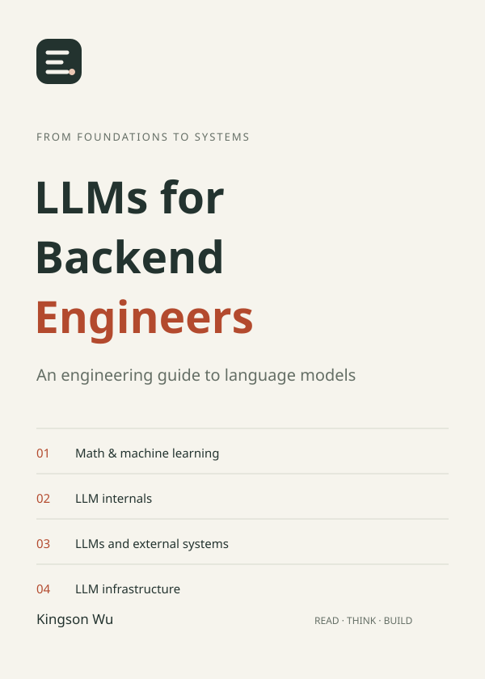

# LLMs for Backend Engineers

[中文 README](README.zh-CN.md)

A principles-first book for backend engineers. It starts with mathematical and machine-learning foundations, explains computation inside an LLM, shows how an application connects it to the outside world, and follows one model call into reliable service delivery.

**[Read online](https://kingson4wu.github.io/LLMs-for-Backend-Engineers/en/) · [Download PDF / EPUB](https://kingson4wu.github.io/LLMs-for-Backend-Engineers/en/downloads/) · [Learn in dialogue](learning/README.md) · [Report an erratum or question](https://github.com/Kingson4Wu/LLMs-for-Backend-Engineers/issues/new/choose)**

[](https://kingson4wu.github.io/LLMs-for-Backend-Engineers/en/)

**Four parts · 35 articles · Simplified Chinese and English · web, PDF, EPUB**

## What this book explains

An LLM application often conflates four things: how training changes parameters, how a current context affects output, how retrieval and tools connect a model to external systems, and how a service manages latency, capacity, and reliability. This book follows that chain to establish a system view, then enters mechanism-level detail only where it changes engineering judgement.

It is not a model-source tour, a training recipe collection, or a framework tutorial. Its scope is Transformer-centered generative language models and multimodal extensions running in digital information and software systems.

## How to read it

For a first pass, follow the thread: foundations → LLM internals → external systems → infrastructure. Each part landing page explains its groups and reading order; the website’s [introduction](https://kingson4wu.github.io/LLMs-for-Backend-Engineers/en/read/introduction/) gives the complete map.

If you are building an application, start with Part III and return to Part II when you need to explain a model output. Move to Part IV for latency, concurrency, memory, or cost questions. Part I is not a gate: it is a reference for representation, probability, and learning when those ideas become necessary.

| Part | Question answered |
| --- | --- |
| Mathematics and machine-learning foundations | How do discrete information, probability, and error become learnable computation? |
| LLM internals | How do parameters acquire capability, and how does one input become output? |
| LLMs and external systems | How does a model obtain evidence, propose actions, and enter a verifiable task loop? |
| LLM infrastructure | How is one call delivered under latency, capacity, cost, and reliability constraints? |

### Start from your work

- **Building APIs, RAG, or tool use:** start with Part III, then return to Part II for model behaviour and context limits.
- **Investigating latency, memory, concurrency, or cost:** start with Part IV, then revisit Transformer and generation mechanics as needed.
- **Building a complete model:** follow the four parts in order and restate each part's causal chain using a system you know.

## Learn through dialogue

You can also study the book with a local assistant such as Codex or Claude Code. Start in the [dialogue learning space](learning/README.md), which provides a map, reading method, and question principles without binding the experience to one Skill, MCP server, or startup command.

## Reading and publishing

The reader includes search, formulas, light/dark themes, text-size controls, reading progress, and browser-local notes with import and export. It has no account or cloud synchronization. Download pages list only formats present in the build; versioned releases include source provenance and SHA256 checksums.

Chinese is the source edition. English is AI-assisted and agent-reviewed, with human editorial review pending. CI checks English coverage, source hashes, and links; it does not represent machine checks as human review.

## Repository map

```text
book/                  Chinese source, catalog, part landings, and publication assets
book/translations/en/  English mirror, glossary, and translation status
web/                   Astro reader, search, and local notes
learning/              Entry point for dialogue-based learning with local AI assistants
tools/book-kit/        Content validation and HTML, PDF, EPUB publication tools
```

## Local development

The website requires Node.js 22.12+ (CI uses 24) and npm 9.6.5+. Publication tools and tests also require Python 3.11+, Pandoc, and librsvg; PDF additionally needs XeLaTeX and fonts.

```bash
npm --prefix web ci
npm --prefix web run dev
```

See the [local development guide](LOCAL_DEVELOPMENT.md) for complete builds, both deployment bases, and PDF / EPUB prerequisites.

## Contributing

Corrections, English editorial review, examples, and reader improvements are welcome. Use the [erratum and question forms](https://github.com/Kingson4Wu/LLMs-for-Backend-Engineers/issues/new/choose), which request the article URL, language, quoted passage, and evidence. See the [contribution guide](CONTRIBUTING.md).

## License

The book content and source code are released under the [MIT License](LICENSE).
