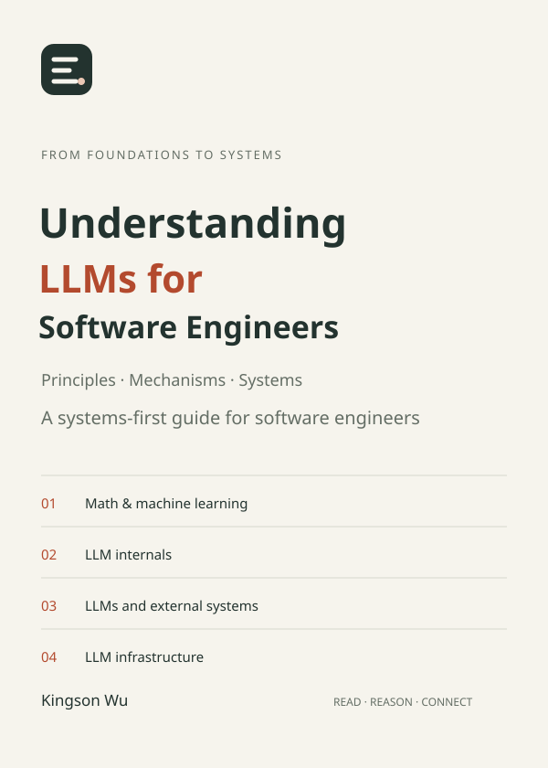

# Understanding LLMs for Software Engineers

[简体中文](README.zh-CN.md) · [Read online](https://kingson4wu.github.io/Understanding-LLMs/en/) · [Download editions](https://kingson4wu.github.io/Understanding-LLMs/en/downloads/) · [Report an erratum](https://github.com/Kingson4Wu/Understanding-LLMs/issues/new/choose)

> A systems-first guide for software engineers—especially backend, AI application, and platform engineers—to understand LLM principles, mechanisms, and system boundaries.

[](https://kingson4wu.github.io/Understanding-LLMs/en/)

**Four core parts · 36 chapters · Simplified Chinese source and English mirror · online, Markdown, PDF, EPUB**

## Start here

**Recommended: [learn with AI](https://kingson4wu.github.io/Understanding-LLMs/en/read/ai-learning-guide/).** This book is an evidence base for a learning conversation, not merely a document to summarize. Copy the starter prompt on the guide page: it directs an AI to download the complete English PDF, build the shortest path for your goal, name the relevant chapters, formulas, and figures, and test your understanding one concept at a time.

| Route | Best for | What to do |
| --- | --- | --- |
| Chat AI | ChatGPT, Claude, DeepSeek, or another assistant that can access a URL | Open the [learning guide](https://kingson4wu.github.io/Understanding-LLMs/en/read/ai-learning-guide/), copy its prompt, and send it to the assistant. |
| Local AI | Codex, Claude Code, and other terminal assistants | Clone the repository so the assistant can inspect the Markdown source, SVG figures, bilingual mapping, and learning index. |
| Independent reading | A continuous read, lookup, or offline use | Use the [web reader](https://kingson4wu.github.io/Understanding-LLMs/en/) or choose an edition from the [downloads page](https://kingson4wu.github.io/Understanding-LLMs/en/downloads/). |

```bash
git clone https://github.com/Kingson4Wu/Understanding-LLMs.git
cd Understanding-LLMs
codex
```

For local-source discussion, ask the assistant to read [the learning guide](learning/README.en.md) and [the learning index](learning/index.json) before beginning.

## Who this book is for

Backend engineers are the primary audience: experience with functions, data structures, caches, interfaces, and services is enough to begin; a completed machine-learning course is not required. It also fits AI application and platform engineers who need to understand the mechanisms behind RAG, tool use, agents, evaluation, or inference services, and other software engineers who want to connect model mechanisms to system boundaries.

Its purpose is to understand LLM principles, causal chains, and system boundaries rather than instruct application development. This is not a framework or vendor-API tutorial, a model-source tour, a training-recipe collection, or a specialist reference on GPU kernels and distributed training. Use it to reason about mechanisms, boundaries, and trade-offs, then consult current tool documentation for implementation detail.

## What this book covers

An LLM application combines several different mechanisms: training changes parameters; context changes a current output; retrieval and tools connect the model to external systems; and serving infrastructure governs latency, capacity, cost, and reliability. This book follows those dependencies in order, then enters mechanism-level detail only when it changes an engineering decision.

It is not a framework manual, model-source tour, or collection of training recipes. Its scope is Transformer-centered generative language models and multimodal extensions operating in digital-information and software systems.

| Part | Engineering question |
| --- | --- |
| I. Mathematics and machine-learning foundations | How do discrete information, probability, and error become learnable computation? |
| II. LLM internals | How do parameters acquire capability, and how does one input become output? |
| III. LLMs and external systems | How does a model obtain evidence, propose actions, and enter a verifiable task loop? |
| IV. LLM infrastructure | How is one call delivered under latency, capacity, cost, and reliability constraints? |

## Find your path

- **Building APIs, RAG, or tool use:** begin with Part III; return to Part II when you need to reason about model behaviour and context limits.
- **Investigating latency, memory, concurrency, or cost:** begin with Part IV; trace back through Transformer and generation mechanics as needed.
- **Building a complete mental model:** read the four parts in order and restate each part’s causal chain using a system you know.

Part I is reference material, not an entrance exam. Visit it when representation, probability, or learning becomes relevant to the system question in front of you. The [introduction](https://kingson4wu.github.io/Understanding-LLMs/en/read/introduction/) provides the full map and the part pages give their internal order.

## Choose an edition

| Edition | Use it when |
| --- | --- |
| [Online reader](https://kingson4wu.github.io/Understanding-LLMs/en/) | You want search, responsive typography, formulas, light/dark themes, browser-local notes, and reading progress. |
| [Markdown](https://kingson4wu.github.io/Understanding-LLMs/exported/en/Understanding-LLMs.md) | You want an AI assistant or text tool to read the complete book as structured source. |
| [PDF](https://kingson4wu.github.io/Understanding-LLMs/exported/en/Understanding-LLMs.pdf) | You want a fixed, print-oriented layout with formulas and figures. |
| [EPUB](https://kingson4wu.github.io/Understanding-LLMs/exported/en/Understanding-LLMs.epub) | You want reflowable reading on an e-reader or mobile device. |

The downloads page shows only files present in the current build. Versioned releases include source provenance and SHA256 checksums. Simplified Chinese is the source edition; the English mirror is maintained as its reviewed counterpart.

## Repository map

```text
book/                  Chinese source, catalog, part landings, and publication assets
book/translations/en/  English mirror, glossary, and translation status
web/                   Astro reader, search, and browser-local notes
learning/              Dialogue-learning contracts, prompts, and local-assistant guidance
tools/book-kit/        Validation and Markdown, HTML, PDF, EPUB publication tools
```

## Build locally

The website requires Node.js 22.12+ (CI uses 24) and npm 9.6.5+. Publication tools and tests also require Python 3.11+, Pandoc, and librsvg; PDF generation additionally needs XeLaTeX and fonts.

```bash
npm --prefix web ci
npm --prefix web run dev
```

See the [local development guide](LOCAL_DEVELOPMENT.md) for full builds, both deployment bases, and publication prerequisites.

## Contribute

Corrections, English editorial review, examples, and reader improvements are welcome. Use the [erratum and question forms](https://github.com/Kingson4Wu/Understanding-LLMs/issues/new/choose): include the article URL, language, quoted passage, and supporting evidence. See the [contribution guide](CONTRIBUTING.md) before sending a change.

## License

The book content and source code are released under the [MIT License](LICENSE).
