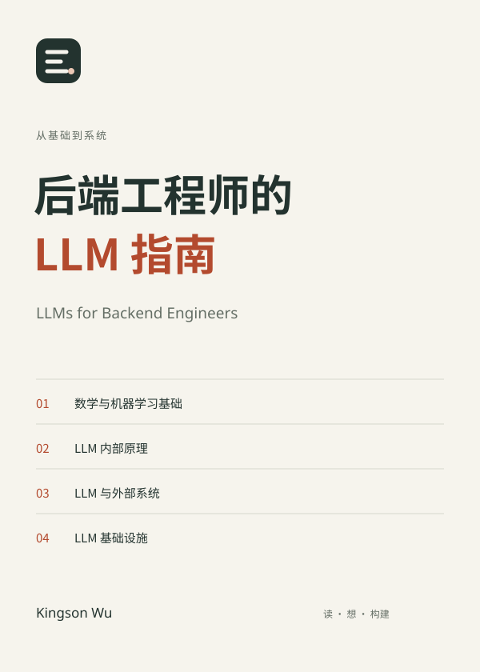

# LLMs for Backend Engineers / 后端工程师的 LLM 指南

[English README](README.md)

一本面向后端工程师的 LLM 原理书。它从数学与机器学习基础出发，解释模型内部计算、应用怎样连接外部世界，以及一次模型调用怎样成为可靠服务。

**[在线阅读](https://kingson4wu.github.io/LLMs-for-Backend-Engineers/zh-Hans/) · [下载 PDF / EPUB](https://kingson4wu.github.io/LLMs-for-Backend-Engineers/zh-Hans/downloads/) · [对话学习](learning/README.md) · [提交勘误或问题](https://github.com/Kingson4Wu/LLMs-for-Backend-Engineers/issues/new/choose)**

[](https://kingson4wu.github.io/LLMs-for-Backend-Engineers/zh-Hans/)

**四个部分 · 35 篇文章 · 简体中文与英文 · 网页、PDF、EPUB**

## 这本书解决什么问题

LLM 应用中常被混淆的几件事是：训练怎样改变参数，当前上下文怎样影响输出，检索和工具怎样把模型接入外部系统，以及服务怎样处理延迟、容量与可靠性。本书沿这条链路建立全局认识，并在影响工程判断的地方进入必要细节。

它不讲模型源码、训练配方或单一框架的操作手册，也不试图覆盖所有 AI 方向。重点是以 Transformer 为主的生成式语言模型及其多模态扩展，及其在数字信息与软件系统中的运行方式。

## 怎样阅读

第一次阅读可以沿主线走：数学基础 → 模型内部 → 外部系统 → 基础设施。每部分首页说明其内部小分类与阅读顺序；可从网站的[导读](https://kingson4wu.github.io/LLMs-for-Backend-Engineers/zh-Hans/read/introduction/)查看全书地图。

如果正在做应用，可先读第三部分，在需要解释模型输出时回到第二部分；遇到延迟、并发、显存或成本问题时进入第四部分。数学部分不是门槛，而是理解表示、概率与训练时可按需回看的基础。

| 部分 | 回答的问题 |
| --- | --- |
| 数学与机器学习基础 | 离散信息、概率和误差怎样成为可学习计算？ |
| LLM 内部原理 | 参数怎样形成能力，一次输入怎样生成输出？ |
| LLM 与外部系统 | 模型怎样获得证据、提出动作并进入可验证的任务循环？ |
| LLM 基础设施 | 一次调用怎样在延迟、容量、成本与可靠性约束下被交付？ |

### 按正在做的工作切入

- **做 API、RAG 或工具调用**：从第三部分开始；遇到输出行为或上下文限制时回到第二部分。
- **排查延迟、显存、并发或成本**：从第四部分开始，再回看 Transformer 与生成机制。
- **希望建立完整模型**：按四部分顺序阅读，并在每一部分结束时用自己的系统场景复述因果链。

## 以对话方式学习

也可以在本地用 Codex、Claude Code 等助手围绕书稿学习：进入[对话式学习空间](learning/README.md)，从全书地图、阅读方式和提问原则开始。这里不绑定特定 Skill、MCP 或启动命令，保留对话对不同问题的适应能力。

## 阅读与发布

阅读站提供搜索、公式、明暗主题、字号、阅读进度和浏览器本地笔记；笔记可导入导出，不需要账号，也不上传云端。下载页只列出本次构建实际包含的格式；正式发行包含来源清单与 SHA256 校验和。

中文是源版本。英文为 AI 辅助翻译，已进行代理审阅，仍待人工编辑审校；CI 检查英文覆盖范围、原文哈希和链接，但不把机器检查误称为人工审校。

## 仓库结构

```text
book/                  中文书稿、目录、部分前言与出版资源
book/translations/en/  英文镜像、术语表与翻译状态
web/                   Astro 阅读站、搜索与本地笔记
learning/              供本地 AI 助手进行对话式学习的入口
tools/book-kit/        内容校验及 HTML、PDF、EPUB 出版工具
```

## 本地开发

网站需要 Node.js 22.12+（CI 使用 24）和 npm 9.6.5+。出版工具及测试还需要 Python 3.11+、Pandoc 和 librsvg；PDF 另需 XeLaTeX 与字体。

```bash
npm --prefix web ci
npm --prefix web run dev
```

完整网站构建、双部署路径、PDF / EPUB 前提条件和旧 Honkit 构建见[本地开发指南](LOCAL_DEVELOPMENT.md)。

## 参与改进

欢迎勘误、英文审校、示例与阅读体验改进。可直接[提交勘误或问题](https://github.com/Kingson4Wu/LLMs-for-Backend-Engineers/issues/new/choose)；模板会要求文章 URL、语言、原文片段与依据。贡献流程见[贡献指南](CONTRIBUTING.md)。

## 许可证

书籍内容与源码均按 [MIT License](LICENSE) 发布。
