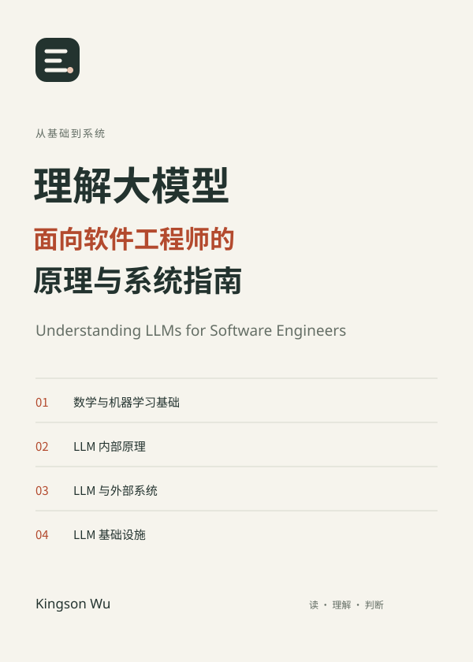

# 理解大模型：面向软件工程师的原理与系统指南

[English](README.md) · [在线阅读](https://kingson4wu.github.io/Understanding-LLMs/zh-Hans/) · [下载电子书](https://kingson4wu.github.io/Understanding-LLMs/zh-Hans/downloads/) · [提交勘误](https://github.com/Kingson4Wu/Understanding-LLMs/issues/new/choose)

> 一本面向有编程经验的软件工程师，尤其是后端、AI 应用与平台工程师，从系统视角理解大语言模型及相关技术的原理、机制与边界的书。

[](https://kingson4wu.github.io/Understanding-LLMs/zh-Hans/)

**四个核心部分 · 36 章 · 严格对齐的简体中文与英文版本 · 网页、Markdown、PDF、EPUB**

## 从这里开始

**推荐：[AI 辅助学习](https://kingson4wu.github.io/Understanding-LLMs/zh-Hans/read/ai-learning-guide/)。** 这本书是学习对话的证据底座，而不只是可被一次性总结的文档。在学习指南页复制启动提示词：它会要求 AI 下载完整中文 PDF，按你的目标给出最短路径，标注相关章节、公式和图，并以一次一个概念的方式检查你的理解。

按你的工具选择路径：

| 路径 | 适合场景 | 怎么开始 |
| --- | --- | --- |
| 聊天式 AI | ChatGPT、Claude、DeepSeek 或其他可访问 URL 的助手 | 打开[学习指南](https://kingson4wu.github.io/Understanding-LLMs/zh-Hans/read/ai-learning-guide/)，复制提示词并发送给助手。 |
| 本地 AI | Codex、Claude Code 等终端助手 | 克隆仓库，让助手直接检查 Markdown 原稿、SVG 图、双语映射与学习索引。 |
| 独立阅读 | 连续阅读、查阅或离线使用 | 使用[在线阅读器](https://kingson4wu.github.io/Understanding-LLMs/zh-Hans/)，或在[下载页](https://kingson4wu.github.io/Understanding-LLMs/zh-Hans/downloads/)选择格式。 |

```bash
git clone https://github.com/Kingson4Wu/Understanding-LLMs.git
cd Understanding-LLMs
codex
```

若要以本地原稿进行讨论，请先要求助手阅读[学习说明](learning/README.md)和[学习索引](learning/index.json)。

## 适合谁读

后端工程师是本书的首要读者：函数、数据结构、缓存、接口和服务运行经验足以进入全书，不要求先完成机器学习课程。它同样适合需要理解 RAG、工具调用、Agent、评测或推理服务背后机制的 AI 应用与平台工程师，以及希望把模型机制和软件系统边界连起来的其他软件工程师。

本书的重点是理解 LLM 及相关技术的原理、因果链与系统边界，而不是指导开发应用。它不是框架或厂商 API 的操作教程，也不是模型源码、训练配方、GPU 内核优化或分布式训练的专著。需要这些实践细节时，本书应作为判断机制、边界和取舍的基础，再结合相应工具的当前文档。

## 这本书解释什么

一个 LLM 应用包含几种常被混淆的机制：训练改变参数，当前上下文影响输出，检索和工具把模型连接到外部系统，服务基础设施则约束延迟、容量、成本和可靠性。本书沿这些依赖关系逐层建立理解，只在会改变工程判断的地方进入机制细节。

它不是框架操作手册、模型源码导览或训练配方合集。重点是以 Transformer 为主的生成式语言模型及其多模态扩展，及其在数字信息与软件系统中的运行方式。

| 部分 | 工程问题 |
| --- | --- |
| 一、数学与机器学习基础 | 离散信息、概率和误差怎样成为可学习计算？ |
| 二、LLM 内部原理 | 参数怎样形成能力，一次输入怎样生成输出？ |
| 三、LLM 与外部系统 | 模型怎样获得证据、提出动作并进入可验证的任务循环？ |
| 四、LLM 基础设施 | 一次调用怎样在延迟、容量、成本与可靠性约束下被交付？ |

## 按你的工作切入

- **做 API、RAG 或工具调用：** 从第三部分开始；需要理解模型行为或上下文限制时回到第二部分。
- **排查延迟、显存、并发或成本：** 从第四部分开始；按需回溯到 Transformer 与生成机制。
- **希望建立完整心智模型：** 按四个部分顺序阅读，并用你熟悉的系统复述每部分的因果链。

第一部分是随用随查的基础，不是入门考试。面对系统问题时，如果涉及表示、概率或学习，再回到它即可。完整地图见网站的[导读](https://kingson4wu.github.io/Understanding-LLMs/zh-Hans/read/introduction/)；各部分首页说明了内部阅读顺序。

## 选择阅读格式

| 格式 | 适合场景 |
| --- | --- |
| [在线阅读器](https://kingson4wu.github.io/Understanding-LLMs/zh-Hans/) | 需要搜索、响应式排版、公式、明暗主题、浏览器本地笔记和阅读进度。 |
| [Markdown](https://kingson4wu.github.io/Understanding-LLMs/exported/zh-Hans/Understanding-LLMs.md) | 希望让 AI 或文本工具以结构化原稿读取全书。 |
| [PDF](https://kingson4wu.github.io/Understanding-LLMs/exported/zh-Hans/Understanding-LLMs.pdf) | 需要公式和图完整的固定版式，或打印阅读。 |
| [EPUB](https://kingson4wu.github.io/Understanding-LLMs/exported/zh-Hans/Understanding-LLMs.epub) | 在电子书阅读器或手机上使用可重排版式。 |

下载页只展示当前构建中实际存在的文件；版本发布包含来源清单和 SHA256 校验和。简体中文与英文作为严格对齐的对应版本发布。

## 仓库结构

```text
book/                  简体中文版、目录、部分首页与出版资源
book/translations/en/  英文对应版、术语表与对齐状态
web/                   Astro 阅读站、搜索与浏览器本地笔记
learning/              对话式学习契约、提示词与本地助手指南
tools/book-kit/        内容校验及 Markdown、HTML、PDF、EPUB 出版工具
```

## 本地构建

网站需要 Node.js 22.12+（CI 使用 24）和 npm 9.6.5+。出版工具及测试还需要 Python 3.11+、Pandoc 和 librsvg；PDF 生成另需 XeLaTeX 与字体。

```bash
npm --prefix web ci
npm --prefix web run dev
```

完整构建、两种部署路径与出版前提见[本地开发指南](LOCAL_DEVELOPMENT.md)。

## 参与改进

欢迎提交勘误、双语对齐复核、示例与阅读体验改进。通过[勘误和问题表单](https://github.com/Kingson4Wu/Understanding-LLMs/issues/new/choose)提交时，请附上文章 URL、语言、原文片段与依据；提交变更前请阅读[贡献指南](CONTRIBUTING.md)。
