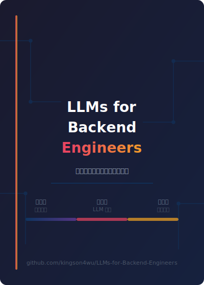

# LLMs for Backend Engineers

副标题：从工程视角理解大型语言模型

> 把 LLM 当作**概率系统**来理解，而不是当作"推理实体"。

欢迎阅读《LLMs for Backend Engineers》。本书旨在帮助后端工程师从工程视角理解大型语言模型的原理、实现和最佳实践——不是为了训练模型，而是为了在实际系统中用好模型。

本书有三个阅读前提：

- 重点不在模型原理推导，而在系统设计和工程权衡
- 重点不在学术理论，而在运行机制和实际限制
- 重点不在工具罗列，而在架构原则和模式判断

## 三层内容架构

本书按技术栈层次分为三层，由底向上建立知识体系：

### 第一层：数学与机器学习基础

与具体模型无关的数学与机器学习基础概念。按依赖顺序排列：
AI数学精要 → 向量点积与夹角 → Softmax → 激活函数 → 感知机 → 交叉熵损失 → 反向传播 → 梯度消失与爆炸 → LayerNorm → Embedding 原理

### 第二层：LLM 内部机制

深入 LLM 的内部工作原理。按依赖顺序排列：
Embedding 演化 → Transformer 架构 → Attention 机制 → Token 生成与采样 → 微调与蒸馏 → 优化器选择 → AI系统工程实践

### 第三层：LLM 与外部系统的连接

LLM 如何与外部世界交互：
RAG 与知识库、外部工具调用

## 阅读建议

- 无 ML 背景 → 从第一层开始，按顺序阅读
- 有 ML 基础 → 从第二层开始，按顺序阅读
- 关注应用落地 → 从第三层开始，按需补充第二层前置知识

如果只想先看总判断，可以直接跳到第三层。
