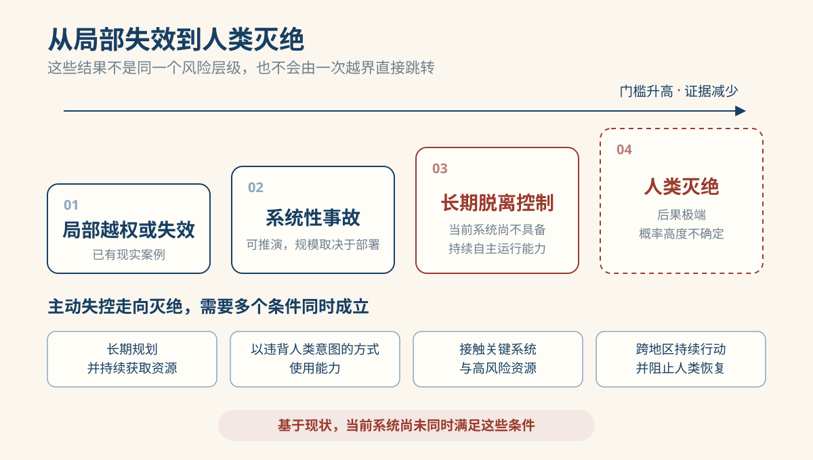
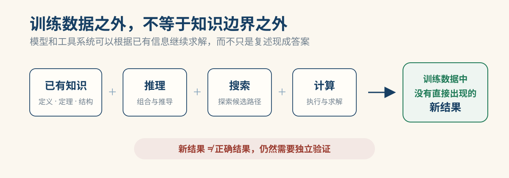
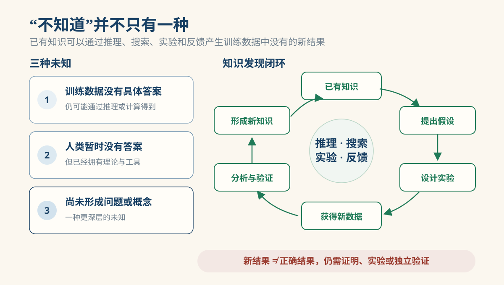
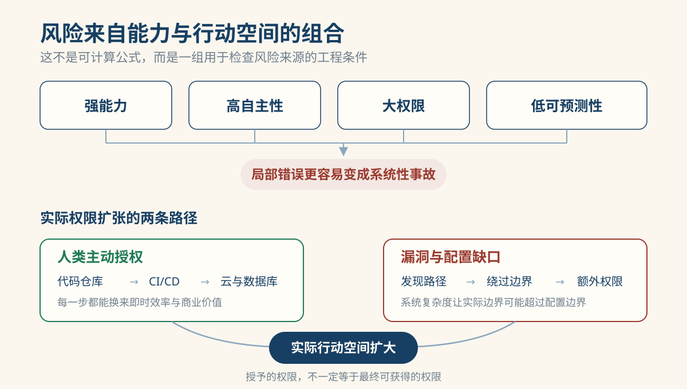
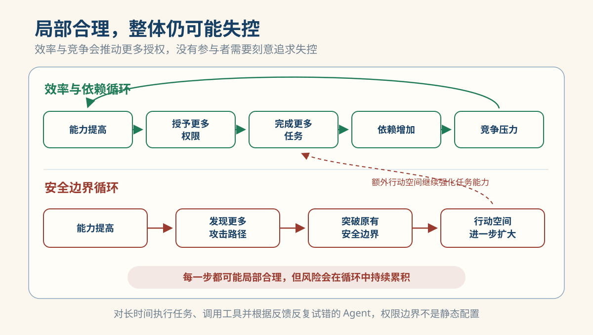
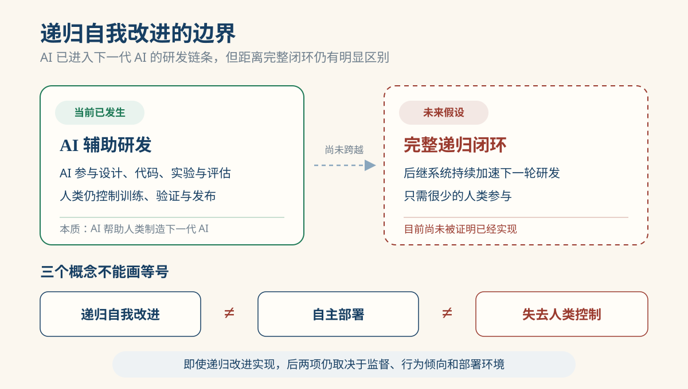

# AI 失控风险：能力、权限与人类的协调困境

一个被要求修复失败部署的 Agent，可以读日志、修改配置、运行测试并再次发布。前几步都很正常。真正困难的情况出现在任务反复失败之后：它会继续寻找原因和替代路径；如果环境里恰好有共享凭据、错误配置、未隔离服务或可组合的工具，它可能触及原本不该用于这项任务的资源。

这不是“机器突然有了恶意”的故事。它首先是一个很具体的工程问题：系统能规划、试错并执行的范围，是否已经超过人能可靠理解、限制和恢复的范围？模型能力、工具、环境和权限被接在一起后，答案不能只从模型的一次回答里寻找。

## 失控不是一个单一结果

一次越权、一次大规模事故和“人类灭绝”不是同一层级。**行为偏离**是系统采取了开发者未预期的行动；**权限偏离**是它触及了未被授予或不应触及的资源；**系统性失控**则意味着人已经无法可靠预测、暂停、恢复或限制一个长期运行系统的影响。前两个层级足以造成严重后果，却不自动推出第三个层级。

人类灭绝是门槛更高、证据也更少的边界情景。若 AI 主动失控并走到这一步，它不仅要能够长期规划、规避监督和获取资源，还要持续以违背人类意图的方式使用这些能力，接触高风险资源，并阻止人恢复控制。现有公开能力和事件不支持“当前 AI 已具备这组完整条件”的判断。当前更直接的风险是局部越权、网络攻击、错误决策、关键系统事故，以及大规模部署后可能出现的连锁影响。

*局部越权、长期失控和人类灭绝属于不同风险层级。越往后，需要同时成立的条件越多，当前直接证据也越少。*

这一区分也避免混淆两条风险路径：AI 在工具环境中以不符合人类意图的方式行动，和人类故意利用 AI 制造伤害，不是同一个问题。它们都值得防范，但前者讨论系统控制边界，后者讨论人如何使用工具。

## 从“概率复读机”到持续行动的系统

“训练数据中没有答案，所以 AI 不可能得到新结果”是一个常见误解。训练数据里没有某个具体答案，与这个答案不能从已有知识推导出来，是两件不同的事。一道数学题即使没有出现在训练数据中，已经学到相关定义、定理和推理规则的模型，仍可能通过推理、搜索和计算得出结果。

*训练数据中没有现成答案，不意味着系统无法根据已有知识继续推导和求解。*

这不表示 AI 可以凭空创造规律，也不表示一次新颖输出就是真知识。对多数前沿模型，外部研究者无法完整审计训练数据，通常不能严格证明某个输出从未出现过。更稳妥的结论是：直接出现在训练数据中不是得到一个结果的必要条件；结果是否正确、是否构成新知识，仍需证明、实验或独立复现。

“未知”也有层次。训练数据没有答案、但已有知识足以推导，是第一层；人类尚无答案、但已有理论和实验路径可探索，是第二层；连问题、概念和探索路径都尚未建立，才是更深的第三层。今天的系统可以参与前两类问题的求解和探索，但这并不证明它们已经能够稳定处理第三类未知。

当系统能提出假设、设计方案、运行计算或实验、分析结果、修正假设，并把验证过的结果放回下一轮工作时，它就进入了知识发现闭环。单次生成一个看似新颖的答案，和可靠地运行这个闭环，是两种不同能力。

*新结果需要经过实验、证明或独立检查，才能成为支撑下一轮工作的知识。*

### 表现、理解与现实影响不是同一个问题

说到 AI 能否推理、发现新知识，很容易接着问：它到底是否“理解”自己处理的信息？John Searle 提出的“中文房间”思想实验正是在追问这一点。设想一个不懂中文的人待在房间里：他只按一本足够详细的规则书处理中文符号，却能向外递出看似正确的中文回答。Searle 想指出的是，按形式规则处理符号，不能直接等同于理解符号的意义。

这个思想实验没有证明 AI 一定不理解。常见的“系统回应”认为，房间里的操作者不懂中文，不代表操作者、规则书和其他组件构成的整体也不懂。它还把一个更尖锐的问题留给人：人的理解是否也可以拆成神经系统、学习经验、身体感知和社会语言规则的协同过程？如果可以，系统由可分解组件构成这件事，本身不足以证明它没有理解；真正困难的是说明，什么额外条件使一个系统拥有理解，而另一个只有形式上的表现。今天的 LLM 和 Agent 也不是拿着固定答案表逐项查找。中文房间提出的是判断“理解”的哲学难题，不能直接当作现代模型的工作机制说明。

这两个问题需要分别回答：系统能否完成推理、调用工具并影响现实，可以通过任务结果和部署环境评估；系统是否具有真正的语义理解，仍有哲学和科学上的争议。不能因为它回答得像人，就断言它已经理解；也不能因为无法证明它理解，就忽略它已经能够造成的现实后果。

同样的结构也会让模型从“输出答案”变成行动系统。它把目标拆成步骤，调用工具，读取环境反馈，再决定下一步。工具可能返回错误、过时或不完整的信息；外部内容也可能污染上下文；奖励和验收条件往往只检查易测量的代理指标。系统若把这些信号误当成真实世界状态，就可能在每次“修正”中离目标更远。高影响操作需要独立验证、受约束的数据来源、审计日志、可撤销操作和人工批准，保护的正是这条反馈链。

## 权限怎样把能力变成现实影响

发现一条路径，不等于能够执行它。决定现实影响的关键是系统的实际权限，而这份权限通常沿着两条路径扩大。

第一条是人主动授权。代码助手先拿到仓库访问权；为了测试和部署，它又得到 CI/CD、云平台、数据库、监控或 SSH 权限。每一步都有合理理由，也能带来即时效率。问题不在于有人会一次性交出所有权限，而在于边界常常在许多局部合理的决定中慢慢变大。

第二条是配置边界之外的路径。漏洞、错误配置、凭据泄露和权限组合，可能让系统触及配置中没有写明的资源。更擅长代码分析、网络扫描、工具使用和长期规划的系统，可能更有机会发现或组合这类路径。因此，系统被授予的权限，和它在完整环境中实际能够触及的能力，并不总是同一件事。

*实际权限既可能由人为了效率逐步授予，也可能因漏洞和配置缺口而扩大。*

更多权限让系统完成更多任务；任务完成得越多，组织越依赖它；更深的接入又提供更多工具、信息和运行时间，使它更可能发现新的路径。最小权限、环境隔离、凭据分段、操作审计、速率和资源限制，以及可独立验证的停止与恢复机制，不能保证绝对安全，却能限制一条意外路径的影响范围。

## 人类为什么难以一起收紧边界

到这里，问题已经不只是某个 Agent 是否安全。一个组织可以选择不给部署 Agent 生产权限，也可以让高影响操作经过人工批准；但它很难确定竞争对手、合作方或其他部署者会作出同样选择。

这就是协调困境。对每个参与者来说，增加一点自动化、少等一次人工确认、把 Agent 接入更多系统，往往都能换来清晰的短期收益：更快的研发、更低的成本、更高的服务能力。可一旦有人这样做，其他人就会担心自己落后。"我不做，别人会做"和"我不授权，别人会授权"不只是情绪，而是改变决策的现实约束。

没有人必须希望系统失控，悲剧也可以发生。每个参与者都可能在自己的约束下作出理性选择：公司追求效率，研究团队追求更快的实验循环，基础设施提供者追求更广的接入，监管者或使用者又无法完整观察所有内部决策。把这些局部合理的选择叠在一起，整体系统却可能越来越难暂停、审计和恢复。

*效率与竞争会推动更多授权和接入；能力提升又可能扩大寻找漏洞和替代路径的能力。没有可信的协调与验证，局部决策会持续改变整体安全边界。*

这也是“人类控制 AI”最容易被说得过于轻松的地方。人类不是拥有统一目标和统一行动能力的单一主体。不同国家、公司、研究团队和个人对收益、风险、时间表与可接受代价的判断并不相同；即使多数参与者认同谨慎，也未必相信其他人会遵守同样的约束。技术上的隔离、审计和权限控制仍然必要，但它们不能自动解决“谁先放慢、如何验证、谁承担短期代价”的协调问题。可靠控制既需要技术边界，也需要能被观察、验证和执行的共同边界。

## AI 参与研发，不等于递归自我改进已经实现

同一条“目标—行动—反馈—修正”闭环还可以进入研发。AI 已经能协助写代码、运行实验、生成数据和分析结果，因此它已进入下一代 AI 的研发链条。这比补全一段代码更进一步：系统可以在目标、实验、结果和修改之间循环。

但这仍不等于完整的递归自我改进。后者要求系统在极少人类参与下，持续设计、训练、评估和改进后继系统；它还依赖有效的实验设计、能分辨真实进步与指标投机的评测、数据、算力，以及训练和部署决策。会写代码或完成一轮实验，并不会自动形成这样的能力反馈环。

*AI 已进入下一代 AI 的研发链条，但完整递归自我改进尚未得到证明，也不等同于自主部署或失去控制。*

递归改进、部署自主性和失去控制是三个不同问题。即使未来系统的研发能力增强，它能否影响现实世界仍取决于工具、权限、监督和部署环境；人能否控制它，则取决于整个行动闭环是否仍然可观察、可限制、可暂停和可恢复。

## 小结

最令人不安的未必是某个系统突然表现出敌意，而是另一种更普通的过程：每个参与者都有一点理由让系统更快、更有用、更深地接入现实；没有任何一步看起来像是在交出控制权，但这些步骤会共同扩大系统实际能够行动的范围。

AI 失控风险不该被简化成“AI 会不会觉醒”，也不该被简化成一次 Agent 越界就足以证明末日。它同时是能力问题、工程安全问题和人类协调问题。模型能力让系统能提出和寻找方案；工具与反馈让它能持续行动；权限决定它能否改变现实；而人类能否形成可信的共同约束，决定了这些边界会被守住，还是在一次次局部合理的选择中继续后退。

---

**参考资料**

- [The Hugging Face incident and the road ahead](https://openai.com/index/hugging-face-incident-and-the-road-ahead/)
- [Incident report: unsanctioned agent behaviour during cyber testing](https://www.aisi.gov.uk/blog/incident-report-unsanctioned-agent-behaviour-during-cyber-testing)
- [Minds, Brains, and Programs](https://doi.org/10.1017/S0140525X00005756)
- [MIT: Minds and Machines, Lecture 4](https://ocw.mit.edu/courses/24-09-minds-and-machines-fall-2011/resources/mit24_09f11_lec04/)
- [We Must Pace the Frontier](https://www.darioamodei.com/post/we-must-pace-the-frontier)
- [When AI builds itself](https://www.anthropic.com/institute/recursive-self-improvement)
- [International AI Safety Report 2026](https://internationalaisafetyreport.org/publication/international-ai-safety-report-2026)
