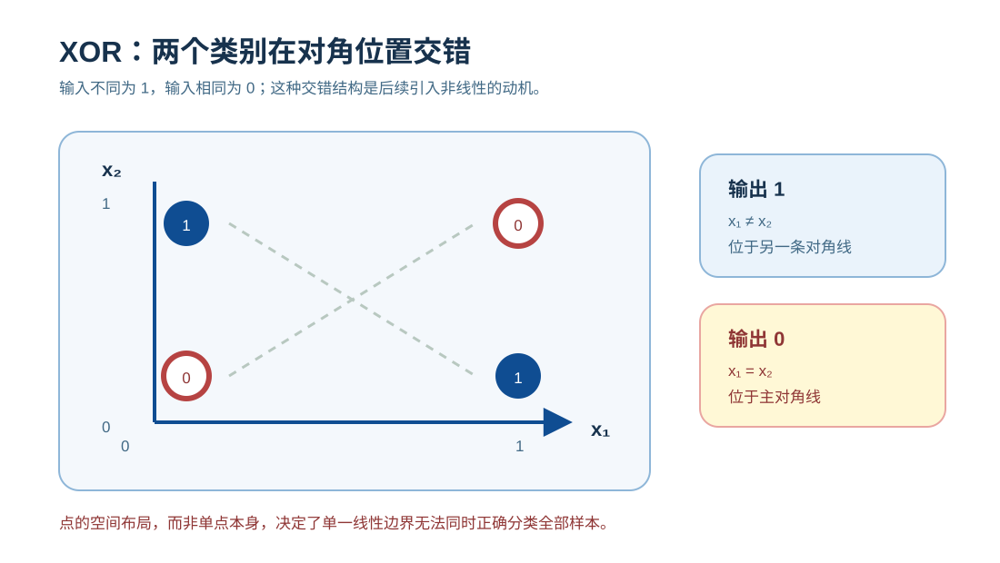
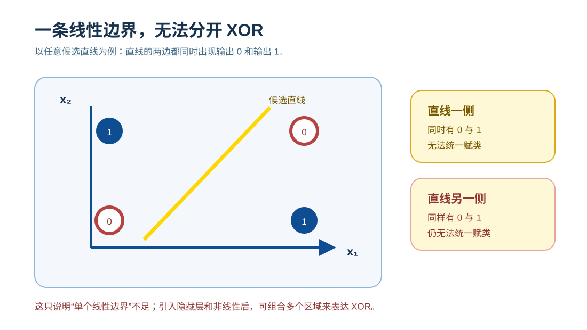
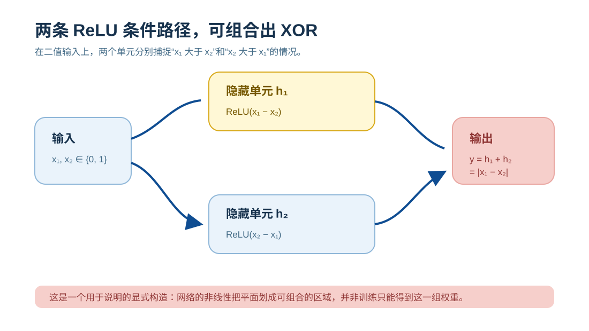
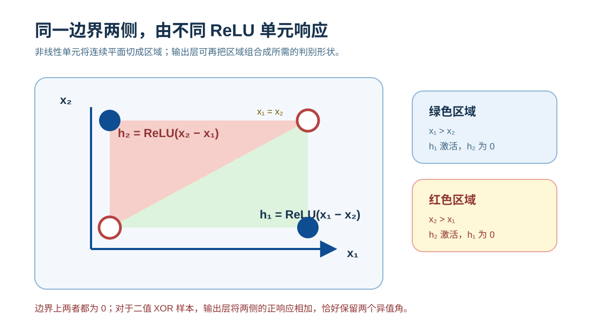
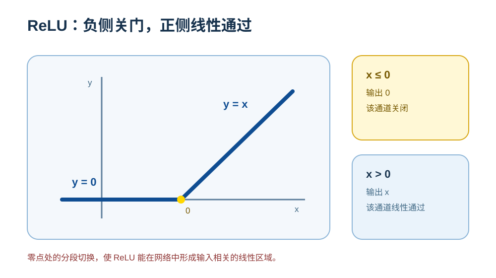
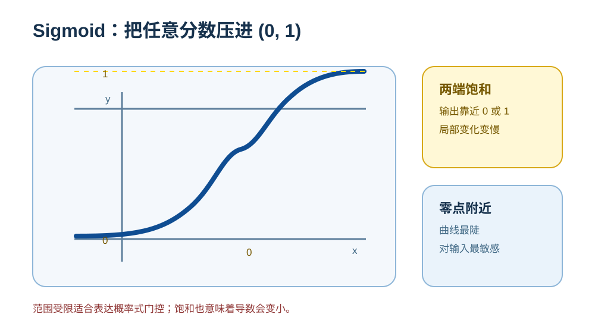
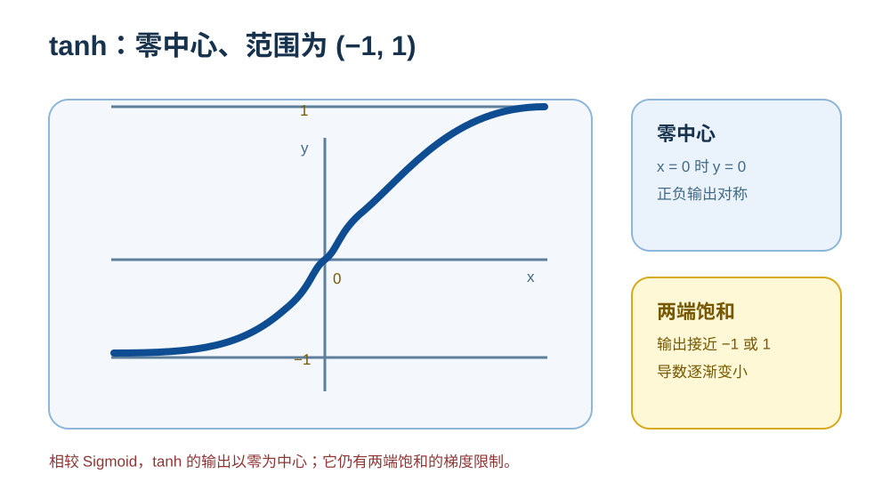

# 激活函数：非线性从哪里来

神经网络会反复把输入按权重加总，再作变换。激活函数位于这些线性变换之间；如果拿掉它，无论堆叠多少层，网络仍可合并为一次仿射变换。XOR 是看清这条限制的最小例子，也说明“能表示复杂关系”和“能通过训练学到它”是两件不同的事。

## XOR：线性模型的表达边界

### XOR 的定义

XOR（异或）的规则如下：

| x₁ | x₂ | XOR |
| -- | -- | --- |
| 0  | 0  | 0   |
| 0  | 1  | 1   |
| 1  | 0  | 1   |
| 1  | 1  | 0   |

在二维平面中表示为:

正类与负类分布在对角位置。

### 为什么线性模型无法解决 XOR

任何不包含非线性激活的网络，无论堆叠多少层，其整体形式都可合并为一次仿射变换：

$$
y = Wx + b
$$

在二维空间中,这意味着其决策边界只能是一条直线:

无论如何调整这条直线,都无法将 XOR 的正负样本完全分开。

线性（更准确地说，仿射）变换在复合下仍是仿射变换，因此多层线性网络在表达能力上等价于单层线性模型。

---

## ReLU 怎样表示 XOR

ReLU 使不同输入走过不同的计算路径，线性模型的限制由此被打破。

### 一个最小的两层 ReLU 网络

其中:

$$
\text{ReLU}(x) = \max(0, x)
$$

### 逐点计算

* (0,0): h₁ = 0, h₂ = 0 → y = 0
* (1,1): h₁ = 0, h₂ = 0 → y = 0
* (1,0): h₁ = 1, h₂ = 0 → y = 1
* (0,1): h₁ = 0, h₂ = 1 → y = 1

XOR 被完全正确地区分。

### 空间怎样被切分并重组

* (x₁ - x₂ = 0)、(x₂ - x₁ = 0) 是两条对角线
* ReLU 在这条直线处将空间分成两个半平面
* 一侧被整体压缩为 0，另一侧保持线性结构

叠加后，两个单元分别在这两个半平面中响应：

这组单元并不是形成两条交叉的边界，而是在同一条边界两侧启用不同单元；输出层再把这两种条件结果合并起来。真实任务不需要手工写出这些权重，训练会学习它们。

---

## 激活函数改变了什么

### 它不是简单地“画曲线”

一个常见但不准确的说法是：
*激活函数把线性模型变成了曲线模型*。

以 ReLU 为代表的现代激活函数并不会直接生成光滑曲线。

它们做的是：

* 用线性超平面切分空间
* 对部分区域进行门控（压缩、屏蔽）
* 将多个线性区域以条件方式组合

因此，ReLU 网络是**分段线性模型**。固定每个 ReLU 的开关状态后，整张网络仍是仿射的；输入越过零点，开关状态才改变。非线性来自多次切分与重组的叠加。

### 为什么需要非线性

非线性激活首先解决的是：

> **打破仿射变换在复合下的封闭性，使深度网络能够表示非线性函数。**

---

## 表达能力不等于训练结果
**表达能力与表达准确性并不是同一个概念。**

* **表达能力**：模型是否具备表示复杂函数的可能性。
* **训练结果**：优化过程是否从数据中找到合适的函数。

激活函数主要解决前者。数据、损失、优化器、初始化和正则化共同影响后者；换一种激活函数不会自动带来更高准确率。

---

## 常见函数承担的不同职责

虽然这些函数都会进行非线性变换，但它们在模型中的职责并不相同。

---

### ReLU：隐藏层中的分段门控

$$
\text{ReLU}(x) = \max(0, x)
$$

函数形态：

ReLU 的主要特性是：

* **分段线性**：将复杂函数拆解为可组合的局部线性结构。
* **稀疏激活**：部分神经元在给定输入下完全关闭。
* **正半轴不饱和**：正区间的导数为 1，有利于深层网络传播梯度。

因此，ReLU 及其变体长期是深度网络隐藏层的常用选择。许多 Transformer 的前馈层则常用 GELU、SiLU 或 SwiGLU 等平滑或门控变体；共同点是为线性变换之间引入非线性。

---

### Sigmoid：独立二分类概率与门控

$$
\sigma(x) = \frac{1}{1 + e^{-x}}
$$

函数形态:

Sigmoid 的作用在于：

* 将实数映射到 $(0,1)$。
* 可表示一个独立二分类事件的概率。

它在两端会饱和、梯度容易变小，因此：

* **不适合深层隐藏层**
* 主要用于 **二分类输出层** 或 **门控结构**（如 LSTM 的门）。

---

### Tanh：有界的零中心信号

$$
\tanh(x) = \frac{e^x - e^{-x}}{e^x + e^{-x}} \in (-1, 1)
$$

函数形态:

Tanh 可以视为 Sigmoid 的零中心版本：

* 输出对称，值域为 $(-1, 1)$。
* 可以输出正、负两种信号。

但它仍然存在饱和问题。
在现代深度网络中，Tanh 多出现在：

* 早期 RNN
* 少数需要对称连续状态建模的场景

---

### Softmax：候选项之间的归一化竞争

$$
\text{softmax}(z_i) = \frac{e^{z_i}}{\sum_j e^{z_j}}
$$

以三分类为例，输入向量到概率分布的映射：

![Softmax 分布：logits [2.0, 1.0, 0.1] 映射为和为 1 的概率 [0.659, 0.242, 0.099]；候选之间存在归一化竞争。](../../assets/zh/diagrams/activation-functions/softmax-distribution.svg)

Softmax 作用在**整个向量**上：

* 将一组分数映射为概率分布。
* 每个分数变化都会影响其他候选项的权重。

典型使用场景包括：

* 多分类输出层
* 注意力权重归一化

Softmax 并不承担隐藏层的分段门控职责，而是提供输出概率或注意力权重的归一化竞争机制。

---

## 如何把这些函数放回模型中理解

激活函数应按它在网络中的位置和职责来理解：

> **在线性变换之间引入可训练的条件变化，使网络具有表示复杂函数的能力，同时尽量保持可优化性。**

在这个表达前提之上：

* 通过数据、损失函数与优化算法学习参数；
* 以更小的预测误差和更好的泛化为目标。

ReLU、Sigmoid、Tanh 和 Softmax 都是非线性函数，却服务于不同环节。不能仅因它们都被称为“激活函数”，就把它们在隐藏层、输出层和注意力中的职责混为一谈。

Transformer 的前馈网络常使用 GELU、SiLU 或 SwiGLU 等变体；它们以更平滑或门控的方式调制表示，但没有改变这里的基本分工。[梯度消失与爆炸](vanishing-exploding-gradients.md)解释饱和与梯度传播的关系，[Transformer 架构](../part2-llm-internal/transformer-architecture.md)说明前馈网络位于一层计算的什么位置。
