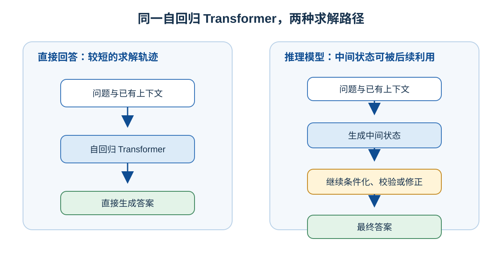
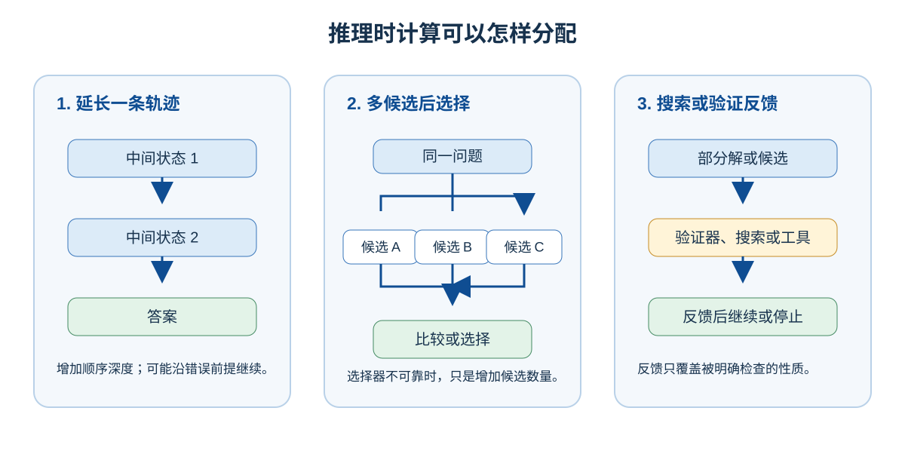
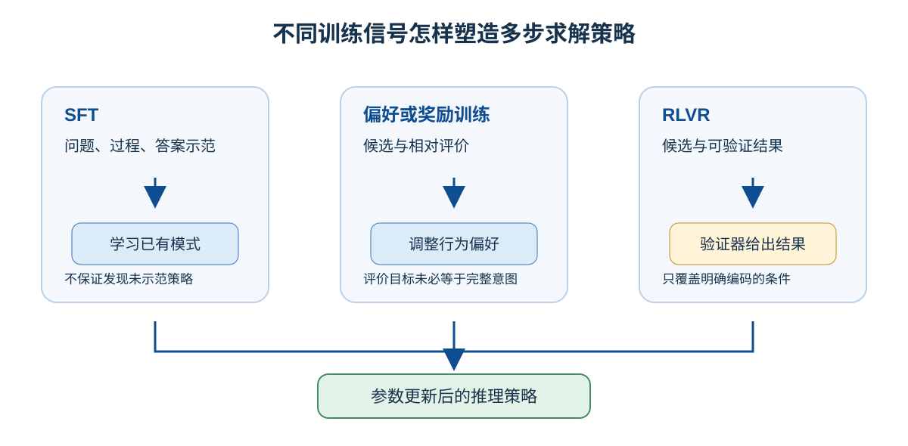

# 推理模型：多步推理过程怎样提高复杂任务的成功率

同一套 Transformer 面对复杂问题时，既可以很快续写一个答案，也可以先分解条件、尝试路径、检查结果，再决定怎样继续。后者不是多了一种网络结构，而是训练使模型更善于利用中间过程，运行时系统再为当前问题提供额外的推理预算。这类在困难任务中更倾向于生成和利用中间过程的语言模型，通常称为**推理模型**（reasoning model）。

推理模型解决的不是“怎样让模型说得更长”，而是“怎样把一次预测变成可以检查和修正的求解过程”。这里讨论模型生成、训练和推理时计算如何共同形成这种能力；当模型开始调用外部工具并改变环境时，问题会延伸到第三部分的 Agent 系统。

## 推理模型仍是自回归 Transformer

大多数推理模型仍按下式逐个生成 token：

$$
P_\theta(x_t \mid x_{<t})
$$

其中 $x_{<t}$ 是当前问题和此前已生成的全部 token。每生成一个 token，它就会进入下一步的上下文；同一组 Transformer 参数再次处理这个更长的上下文，预测下一个 token。多步过程因此不需要在模型旁边再加一个独立的“思考模块”。

“推理模型”和“普通模型”也不是绝对二分。普通模型在合适的提示下可以写出步骤，推理模型遇到简单问题也可能直接作答。更准确的区别是训练目标和运行策略：推理模型更常在困难任务上选择分解、比较、校验和修正，并为这些步骤预留计算预算。

## 中间 token 怎样变成工作空间

复杂问题往往不能可靠地从题目一步跳到答案。若模型先把条件、子问题或候选结论写入上下文，下一步预测就可以显式地以这些中间状态为条件。例如，在一个有多个约束的问题中，轨迹可以依次写下“条件 A、B”→“候选解 C”→“C 不满足 B”→“改用候选解 D”。每一步都让下一步能读取已经建立的条件和检查结果。中间 token 在这里充当可被后续计算读取的、序列化的工作空间。

这条机制同时带来收益和风险：正确的中间状态会减少后续步骤的不确定性；错误前提也会被保留下来并继续影响生成。因此，生成过程的价值不在于“有步骤”本身，而在于步骤是否帮助模型建立、检验或修正有用的状态。

Chain of Thought（CoT，思维链）是解答中可观察到的一类中间轨迹。[原始 CoT 研究](https://arxiv.org/abs/2201.11903)发现，给出带中间步骤的示范能够提升大模型在部分算术、常识和符号推理任务上的表现。它不是推理能力的定义：要求模型输出 `<thinking>` 标签不会自动产生有效策略；一段通顺的文字也不能证明每个步骤正确，或完整呈现模型内部计算。Attention、MLP 等层内表示变换仍是实际神经网络计算发生的地方。

## 推理时计算怎样换取更高成功率

推理模型的一个显著特征是愿意为单个问题投入更多**推理时计算**（inference-time compute，也称 test-time compute）。这不等于临时增加 Transformer 的层数：延长轨迹通常会增加 decode 阶段的前向计算、等待时间和成本；多候选选择、验证器或工具反馈还会增加相应的选择、验证或外部环境计算。已生成的前缀可以通过 KV Cache 复用 Key、Value；每个新位置仍要计算并读取可访问的历史状态。完整的运行时路径见《[LLM 生成机制：从输入到下一个 Token](llm-generation.md)》。

额外计算可以有不同的用途，不能只用输出 token 数衡量：

| 分配方式 | 模型实际多做了什么 | 主要失败方式 |
| --- | --- | --- |
| 延长一条轨迹 | 继续维护和变换同一串中间状态 | 沿着错误前提走得更远，或产生冗余步骤 |
| 生成多个候选再选择 | 增加覆盖面，并比较不同答案或路径 | 选择器不可靠时，只是增加了候选数量 |
| 搜索、验证或工具反馈 | 检验部分路径，或从环境取得新信息 | 验证器和工具只能保证它们实际覆盖的性质 |

因此，“想得更久”只有在额外计算被有效分配时才可能提高成功率。问题难度、模型已有能力、候选质量、验证方式和停止条件都会改变最合适的策略。[关于最优分配 test-time compute 的研究](https://arxiv.org/abs/2408.03314)比较的正是不同提示难度下的搜索与自适应策略，而不是把生成长度直接等同于能力。

## 训练怎样让模型学会使用这些步骤

更长的生成空间不会自行变成求解能力。训练必须让“怎样生成中间过程”与“任务是否完成”建立稳定联系。三类常见信号承担不同职责：

| 训练信号 | 给模型的反馈 | 它主要教会什么 | 边界 |
| --- | --- | --- | --- |
| SFT | 问题、过程和答案的高质量示范 | 已有的分解方式、格式和基本步骤 | 不能保证模型会发现未出现过的有效策略 |
| 偏好或奖励训练 | 候选之间的相对偏好或分数 | 更符合评价目标的输出行为 | 评价目标不等于人类的完整意图 |
| RLVR | 数值、测试或证明检查等可验证结果 | 用结果信号强化完成任务的路径 | 未被验证器编码的性质没有保证 |

强化学习（RL）不要求模型写出某个固定标签。它根据候选轨迹得到的分数更新参数：若分解、检查或换一种方法在训练分布中更常得到高分，这些行为就会被强化。RLVR 是 Reinforcement Learning with Verifiable Rewards 的简称；数学答案、代码测试和形式化证明检查能提供相对明确的结果信号，因此特别适合这一方向。

结果可验证不等于过程完全正确。测试可能漏掉边界条件，模型也可能找到“通过检查”却不满足真实意图的捷径。这是奖励函数和真实目标之间的差距，而不是模型是否写出推理过程的问题。[DeepSeek-R1](https://arxiv.org/abs/2501.12948)展示了强化学习可以激励验证、反思和策略调整等模式；它是一个训练实例，不是所有推理模型必须复刻的配方。

## 可见 CoT、蒸馏和 Agent 分别处在哪一层

可见的 CoT 是语言化的中间轨迹，不是模型内部激活的完整转录。产品可以展示完整过程、经过处理的摘要，或只展示答案；这些界面选择不改变上面的 token 生成机制。

推理轨迹也可以用作蒸馏信号，但蒸馏不等于复制完整 CoT。教师模型还可以提供最终答案、简化过程、多个候选、验证结果、工具轨迹或奖励；学生模型学习自己容量和训练分布所能表示的行为。《[微调与蒸馏的本质：函数逼近视角](fine-tuning-and-distillation.md)》说明了这种近似关系。

推理模型主要在文本、候选和验证空间内投入额外计算。只有当系统还会调用工具、观察外部结果、更新状态并继续执行时，才进入 Agent 的问题范围。此时可靠性不只取决于模型的推理过程，还取决于权限、环境隔离、停止条件和外部结果验证。关于这一闭环，继续阅读《[LLM 怎样与外部世界交互：从生成到行动](../part3-llm-external/llm-external-interaction.md)》和《[Harness、Agent Runtime 与 Skill：怎样让多轮任务可靠运行](../part3-llm-external/harness-runtime-skills.md)》。

## 小结

推理模型通常仍是自回归 Transformer。它通过把中间 token 留在上下文中，让同一模型能把复杂任务拆成可继续计算和检查的状态；再通过训练学会在何时分解、比较、验证或修正。推理时投入更多计算可以提高复杂任务的成功率，但长度本身不是能力，验证器也只保证其覆盖的条件。理解这三点，就能把推理模型看成一种受训练策略和计算预算约束的求解方式，而不是神秘的独立“思考器官”。

## 延伸阅读

- [LLM 生成机制：从输入到下一个 Token](llm-generation.md)
- [模型的能力是怎样训练出来的](model-training-lifecycle.md)
- [微调与蒸馏的本质：函数逼近视角](fine-tuning-and-distillation.md)
- [LLM 怎样与外部世界交互：从生成到行动](../part3-llm-external/llm-external-interaction.md)
- [Chain-of-Thought Prompting](https://arxiv.org/abs/2201.11903)
