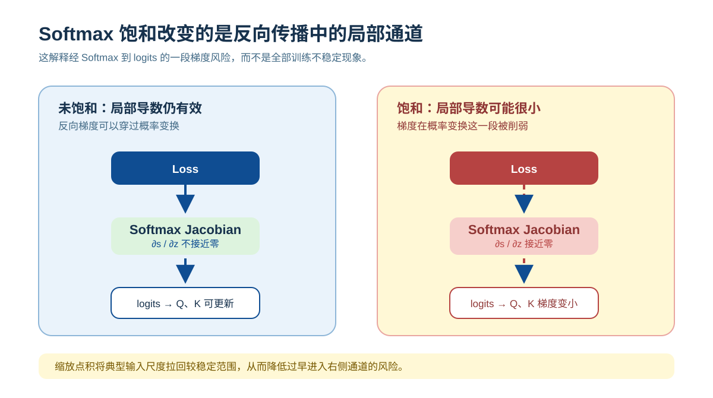
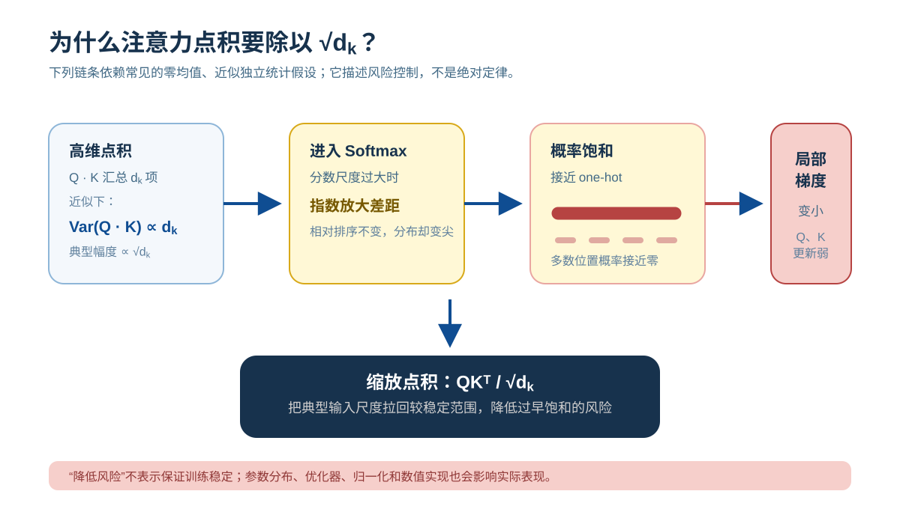

# 缩放点积：Softmax 的梯度为什么会变得极端

## 问题背景：注意力分数为什么需要缩放

在 Transformer 的注意力机制中，有一个非常经典的公式：

$$
\text{Attention}(Q,K,V) = \text{softmax}\left(\frac{QK^\top}{\sqrt{d_k}}\right)V
$$

很多人在第一次看到这个公式时都会产生疑问：

* 为什么注意力机制使用点积来计算相关性？
* 为什么点积之后要接一个 softmax？
* **最关键的是：为什么通常要除以 $\sqrt{d_k}$？**

如果只是把它当成论文中的经验公式，那么对注意力机制的理解仍然停留在表面。这个缩放项控制了点积随维度增大而扩大的典型尺度，避免 Softmax 在训练早期过早进入过度集中的区域。

---

## Softmax 的作用与尺度敏感性

softmax 的定义如下：

$$
s_i = \frac{e^{z_i}}{\sum_j e^{z_j}}
$$

它的作用是把一组实数打分映射为一个概率分布。但 softmax 有一个非常重要的性质：

> **softmax 对输入的整体尺度极其敏感**

当输入数值较为温和时，softmax 会产生一个相对平滑的分布；而当输入整体变大时，softmax 的输出会迅速变得极端。

### 一个简单的数值例子

**情况一：输入尺度适中**

```
输入: z = [1, 0]
输出: softmax(z) ≈ [0.73, 0.27]
```

两个位置都有明显概率，模型仍然保留不确定性。

---

**情况二：输入尺度变大**

```
输入: z = [10, 0]
输出: softmax(z) ≈ [0.9999, 0.0001]
```

此时 softmax 的输出已经几乎等同于 **one-hot 分布** `[1, 0]`。

这是因为指数函数会将线性差距放大为指数级差距，只要输入的整体尺度变大，softmax 的输出就会迅速向极端塌缩。

---

## 点积为什么会使注意力分数变大

在注意力机制中，softmax 的输入来自查询向量和键向量的点积：

$$
z = QK^\top
$$

对于单个 query-key 对，这个分数可以写成：

$$
z = \sum_{i=1}^{d_k} q_i k_i
$$

为解释缩放的统计动机，常使用一个初始化阶段的理想化近似：

* 各维度的 $q_i, k_i$ 相互独立
* 均值为 0
* 方差为 1

### 点积方差的数学推导

在上述假设下，对于每一项 $q_i k_i$：

* 均值：$\mathbb{E}[q_i k_i] = \mathbb{E}[q_i] \cdot \mathbb{E}[k_i] = 0$
* 方差：$\text{Var}(q_i k_i) = \mathbb{E}[(q_i k_i)^2] \approx 1$

当 $d_k$ 项独立相加时：

$$
\text{Var}(z) = \text{Var}\left(\sum_{i=1}^{d_k} q_i k_i\right) = \sum_{i=1}^{d_k} \text{Var}(q_i k_i) = d_k
$$

因此标准差为：

$$
\sigma(z) = \sqrt{d_k}
$$

> **关键结论：点积的典型数值规模与 $\sqrt{d_k}$ 成正比**

在这些假设下，这不是实现细节或偶然现象，而是高维点积的统计结果。训练后的 Q/K 分布会受投影权重、相关性和模型结构影响，未必严格满足这些条件。

### 具体数值示例

| 维度 $d_k$ | 点积标准差 $\sqrt{d_k}$ | 典型点积范围 |
|-----------|------------------------|------------|
| 64        | 8                      | [-16, 16]  |
| 128       | 11.3                   | [-23, 23]  |
| 512       | 22.6                   | [-45, 45]  |

当 $d_k = 512$ 时，点积值可能达到 ±45，这会让 softmax 严重饱和。

---

## Softmax 的梯度结构

softmax 是一个**向量到向量**的函数：

* 输入：$z = [z_1, z_2, \ldots, z_n]$
* 输出：$s = [s_1, s_2, \ldots, s_n]$

当输入和输出都是向量时，需要描述这样一件事：

> **某一个输入分量发生微小变化，会如何影响所有输出分量**

所有这些“偏导关系”组成的一整张表，称为 **Jacobian 矩阵**：

$$
J_{ij} = \frac{\partial s_i}{\partial z_j}
$$

### softmax 的 Jacobian 具体形式

对于 softmax，其 Jacobian 有明确的数学形式：

$$
\frac{\partial s_i}{\partial z_j} = \begin{cases}
s_i(1 - s_i) & \text{if } i = j \\
-s_i s_j & \text{if } i \neq j
\end{cases}
$$

**关键观察：**

* 当 $s_i \approx 1$（饱和状态）时，$s_i(1-s_i) \approx 0$
* 当 $s_i \approx 0$ 时，$s_i s_j \approx 0$

> **梯度大小直接由输出概率本身控制**

---

## Softmax 饱和：输出分布怎样变化

### 对比：适中尺度 vs 大尺度

**输入尺度适中时（例如 $z = [2, 1, 0, -1]$）：**

![适中尺度下的 Softmax：logits [2, 1, 0, −1] 产生仍分散在四个位置的概率 [0.52, 0.28, 0.14, 0.06]。](../../assets/zh/diagrams/softmax-gradient-scaling/saturation-comparison.svg)

在这种状态下，多个位置都具有非零概率，输出对输入变化是敏感的。

---

**输入尺度变大时（例如 $z = [20, 10, 0, -10]$）：**

![大尺度下的 Softmax：logits [20, 10, 0, −10] 使概率几乎全部集中到第一个位置，形成饱和。](../../assets/zh/diagrams/softmax-gradient-scaling/saturation-comparison.svg)

此时，几乎所有概率质量都集中在单一位置，其余位置的概率被压缩到接近零。

这种从“平滑分布”到“极端分布”的转变，称为 **softmax 饱和（saturation）**。

---

## 梯度怎样在 Softmax 处变小

在反向传播中，梯度的传递遵循链式法则：

$$
\frac{\partial L}{\partial z} = \frac{\partial L}{\partial s} \cdot \frac{\partial s}{\partial z}
$$

### 未饱和状态：梯度正常传播



---

### 饱和状态：梯度被截断


> **Softmax 饱和会在这一局部操作显著削弱梯度；它不是深层网络中唯一的梯度衰减来源。**

这是一种发生位置非常明确的梯度消失问题。

---

## 从点积到梯度变小的因果链

将前面的所有环节串联起来，可以得到一条完整因果链：



**问题的本质是：点积让 softmax 过早进入了饱和区间，从而导致梯度消失。**

---

## 为什么这不是梯度爆炸

这一现象有时会被误认为是梯度爆炸，但两者在机制上完全不同。

### 梯度爆炸 vs 梯度消失对比

| 特征 | 梯度爆炸 | 本文讨论的问题 |
|------|---------|--------------|
| 梯度大小 | 趋向无穷大 | 趋向零 |
| 发生原因 | 导数累乘 > 1 | softmax 饱和导致 ∂s/∂z ≈ 0 |
| 数值稳定性 | 数值溢出 | 数值下溢 |
| 训练表现 | 参数震荡、NaN | 参数停止更新 |

**关键区别：**

softmax 的梯度由其输出概率控制，具体形式为 $s_i(1-s_i)$ 和 $s_i s_j$。由于概率值 $s_i \in [0,1]$，这些局部 Jacobian 项在数值上有上界；增大输入尺度不会让这一局部导数任意增大。

Softmax 的 Jacobian 在 $\ell_2$ 范数下不扩张；这里关心的是输入尺度变大时它会趋近于零。由于 Jacobian 会混合各个分量，不能把这句话理解为每个梯度分量都绝不会变大。

因此，这里出现的问题不是梯度失控增大，而是梯度被系统性压缩并最终消失。

---

## 缩放点积注意力：解决方案

既然问题的根源在于点积的方差与维度成正比（$\text{Var}(z) = d_k$），那么最直接的解决方式就是对点积进行缩放：

$$
z = \frac{QK^\top}{\sqrt{d_k}}
$$

### 缩放后的统计性质

缩放后，点积的方差变为：

$$
\text{Var}\left(\frac{QK^\top}{\sqrt{d_k}}\right) = \frac{\text{Var}(QK^\top)}{d_k} = \frac{d_k}{d_k} = 1
$$

**效果：**

* 控制点积的典型尺度稳定在常数级别（与维度无关）
* 防止 softmax 过早进入饱和区
* 保持输出对输入变化的敏感性
* 让梯度能够持续传回 Q 和 K

这一步的本质是**方差归一化（variance normalization）**。

---

## 为什么按 Key 维度的平方根缩放

### 三种缩放方式的对比

| 缩放方式 | 点积方差 | softmax 行为 | 问题 |
|---------|---------|-------------|------|
| 不做缩放 | $d_k$ | 很快饱和 | 梯度消失 |
| 除以 $d_k$ | $1/d_k$ | 过于均匀 | 区分能力不足，所有位置概率接近 |
| 除以 $\sqrt{d_k}$ | $1$ | 典型尺度稳定，便于学习 | 标准选择 |

### 直观解释

* **不做缩放**：点积方差随 $d_k$ 线性增长，softmax 很快饱和
* **除以 $d_k$**：矫枉过正，点积方差变成 $1/d_k$，当 $d_k$ 很大时会让所有注意力权重过于平均，失去了“注意”的意义
* **除以 $\sqrt{d_k}$**：在上述近似下让方差归一化到 1，避免因维度增长而系统性推高典型尺度；实际注意力仍可由学习到的投影变得尖锐或平滑

这一选择与 Xavier 初始化、LayerNorm 等方法背后的统计思想是一致的：**保持信号的方差在网络中稳定传播**。

---

## 小结

点积过大不会使 Softmax 的局部 Jacobian 任意增大，却会使 softmax 过早进入饱和状态。一旦输出分布变得极端，其 Jacobian 中的梯度项会趋近于零，显著削弱经这一操作传向 Q 和 K 的学习信号。

$\sqrt{d_k}$ 的引入，在前述统计近似下会把点积的方差从 $d_k$ 归一化到 1，从而避免维度增长系统性推高 Softmax 的典型输入尺度。

这是一个精心设计的数学解决方案，背后的统计原理清晰明确。
