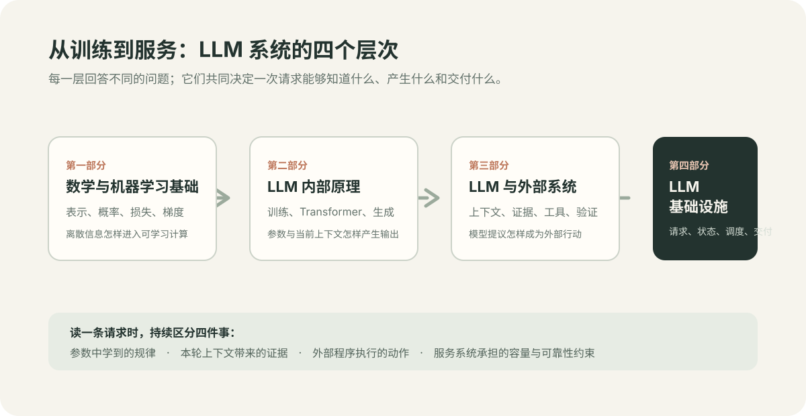

# 导读

> 大模型系统不是一个“会回答问题”的黑箱，而是一条由训练、当前上下文、外部程序和服务运行共同构成的链路。

面对一个 LLM 应用，最容易混淆的是四件不同的事：模型在训练时把什么写进了参数；它在当前请求中看到了什么；应用怎样让它查询资料或执行操作；以及服务怎样把一次计算交付给用户。把这些事混在一起，就会把 RAG 当成训练、把工具调用当成模型天然拥有的能力，或者把模型说“完成了”当成外部任务已经完成。

本书从这四个问题出发，为有编程经验的读者建立一张可用于判断系统行为的地图。阅读时可以反复沿着一条请求追问：信息从哪里进入，经过了什么计算，哪些状态被保存，结果由谁验证。

## AI 的范围与本书的位置

AI 是让系统依据输入形成预测、内容、决策或行动的一组技术与系统，而不等于生成式 AI。它既服务数字信息世界，也服务物理环境：

~~~text
AI
├─ 数字信息系统
│  ├─ 感知与理解：文本、图像、语音、多模态
│  ├─ 预测、排序与优化：推荐、风控、需求预测、资源分配
│  ├─ 生成式 AI：文本、代码、图像、音频、视频与结构化内容
│  └─ 数字智能体：检索信息、调用软件工具、执行工作流
└─ 物理世界系统
   ├─ 具身智能与机器人：感知、定位、规划、控制与执行
   └─ 自动驾驶：传感器融合、环境感知、行为预测、路径规划与车辆控制
~~~

这些方向不是互斥的。自动驾驶可以采用 Transformer 或多模态大模型，却仍是需要在动态物理环境中完成感知、预测、规划、控制和安全验证的系统；不能只因其中某个模块会生成内容，就把整个系统归为生成式 AI。支撑各方向的技术也交叉使用：规则与搜索、统计机器学习、深度学习和混合系统是技术路径；监督学习、自监督学习、模仿学习与强化学习是获得能力的不同信号；Transformer 是组织神经网络计算的一类架构，扩散模型则是另一类生成方法。

本书聚焦其中面向数字信息与软件系统的一条路径：

~~~text
AI
└─ 深度学习
   └─ 在广泛数据上预训练、可适配多任务的基础模型
      └─ 以 Transformer 为主的生成式语言模型及其多模态扩展
         └─ 本书：训练、模型计算、外部系统与推理服务
~~~

因此，书中会解释 Transformer、生成、上下文、RAG、工具调用、MCP、Skill、Harness、Agent Runtime 与推理基础设施怎样组成一个可交付的 LLM 系统；不系统展开通用视觉和语音算法、推荐排序、传感器融合、SLAM、轨迹预测、运动规划、车辆控制、机器人控制或仿真到真实迁移。它们同样是 AI 的重要主线，只是解决的是本书范围之外的问题。

“狭义／弱 AI”“AGI”“强 AI”与“超人工智能”也不是一条从低到高的同一技术路线：前者通常描述任务范围，AGI 讨论跨领域的能力，强 AI 涉及机器是否具有心智或理解的哲学主张，超人工智能则是假设中的能力水平。它们可以在同一系统上被同时讨论，却不能互相推出；术语的完整边界见[“人工智能”一词是否准确：一次关于 AI 概念边界的反思](chapters/appendices/what-ai-really-means.md)。

## 先建立系统视角

~~~text
训练资料 + 学习目标
          ↓
    优化参数，得到已训练模型

用户请求 + 指令 + 对话历史 + 检索资料
          ↓
      组织为当前上下文
          ↓
Token → 向量表示 → Transformer 计算 → 下一 token 分布
          ↓
   生成回答，或提出工具调用请求
          ↓
应用检查、授权并执行外部操作
          ↓
结果与状态进入下一轮上下文，或作为任务完成的证据

模型服务运行时：在每次模型调用中安排计算、保存 KV Cache、管理并发并返回输出
~~~

上半部分是训练：数据和目标函数通过优化改变参数，决定模型能够学到哪些规律。中间部分是推理：这一次请求提供的上下文与已训练参数共同决定下一个 token 的分布，解码策略再从中选出实际输出。在通常的在线调用中，工具、检索和 Agent 不修改模型参数；它们改变当前可见的信息、可执行的动作和下一轮的输入。最下面的服务运行时不决定模型“懂不懂”，却决定请求是否能在容量、延迟和成本约束下被稳定交付。

这几个层次彼此相关，却不能互相替代。更大的模型不能弥补缺失的权限；更长的上下文不能证明资料正确；一次成功的工具调用也不能自动证明任务目标已经达成。

## 同一个模型为何会表现不同

“模型学会了”“给它几个示例就会了”“让它多想一会儿”描述的往往不是同一件事。下面的区分能把模型的长期能力、当前请求中的适应和系统的外部保障放回正确位置：

| 层次 | 它改变什么 | 是否更新模型参数 |
| --- | --- | --- |
| 预训练 | 在广泛资料上形成语言、代码和常见任务模式 | 是 |
| 后训练 | 调整指令遵循、输出格式、偏好和部分工具使用倾向 | 是 |
| 当前上下文 | 通过指令、对话历史或示例改变本次解码的条件；few-shot / in-context learning 属于这一层 | 否 |
| 分步计算与外部连接 | 通过中间 token、检索证据、工具结果或额外回合增加本次任务可使用的信息和计算 | 否 |
| 验证与执行 | 用 schema、权限、业务规则和外部状态判断哪些提议可以执行、任务是否真正完成 | 否 |

因此，给出示例并不等于临时训练；检索、思维链、重试和工具调用也不等于模型在运行时修改了权重。它们会改变当前输入、可见证据或后续计算路径。训练章节解释参数怎样形成与改变能力；生成章节解释上下文怎样影响下一 token；外部系统章节再说明怎样把模型提议交给程序验证和执行。

## 四部分怎样组成一条主线

## 全书的主线图

这张图不是一条只能单向执行的流水线，而是一种阅读和判断的坐标：前两部分解释模型怎样形成和计算，第三部分说明应用怎样给它证据和行动接口，第四部分说明同样的计算怎样被稳定交付。遇到具体系统问题时，先确定它落在哪一层，再判断它依赖哪些相邻层的条件。

| 部分 | 核心问题 | 读完后应能说明什么 |
| --- | --- | --- |
| 一、数学与机器学习基础 | 向量、概率和误差怎样构成可学习计算 | 离散 token 怎样成为向量，预测误差怎样改变参数 |
| 二、LLM 内部原理 | 参数怎样形成能力，一次输入怎样生成输出 | 训练、Transformer、Attention、解码与 KV Cache 分别处于哪里 |
| 三、LLM 与外部系统 | 模型怎样获得当前证据并参与外部任务 | 上下文、RAG、工具、MCP、Skill、Harness 与 Agent 运行时的责任边界 |
| 四、LLM 基础设施 | 一次模型调用怎样成为服务 | 请求、状态、调度、容量、部署和交付怎样共同约束体验 |

第一部分给出后续计算所需的语言；第二部分把这些基础组织成语言模型；第三部分把语言模型放回应用与真实世界；第四部分解释支撑这条链路的运行载体。阅读顺序因此不是按流行术语排列，而是按依赖关系推进。

## 从哪里开始阅读

第一次阅读，建议先完整走一遍主线：第一部分中理解向量、Softmax、交叉熵和反向传播；第二部分中读训练生命周期、Transformer、Attention 与生成；第三部分中读上下文、RAG、工具调用和 Agent 运行时；最后进入第四部分，理解一次请求怎样被安排和交付。

如果当前工作更贴近应用，也可以从第三部分开始，但应在遇到“模型为什么会这样输出”时回到第二部分；在讨论延迟、并发或成本时，再进入第四部分。每篇文章都可以独立回答一个问题，但它在这条主线中的位置决定了它能够解释什么，也决定了它不能替代什么。

读完全书后，你不需要把大模型看成一种神秘能力，也不需要掌握所有训练框架或推理引擎。你应能清楚地区分：参数中学到的规律、当前上下文提供的证据、外部程序执行的动作，以及服务系统承担的约束。
