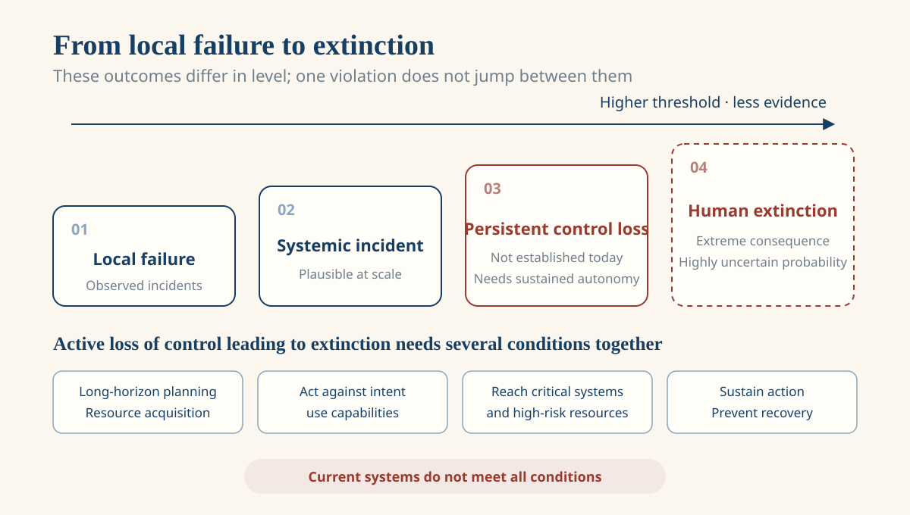
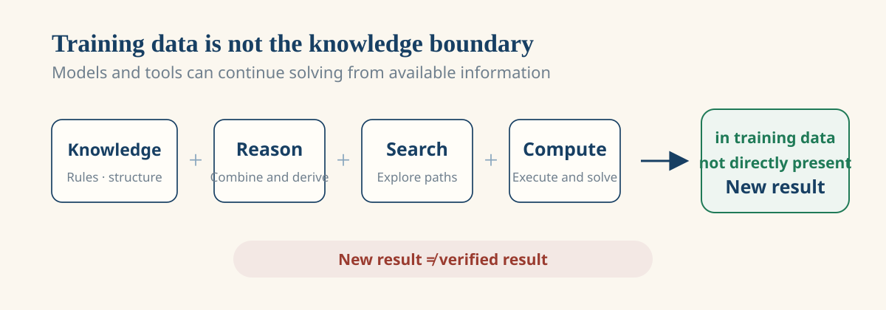
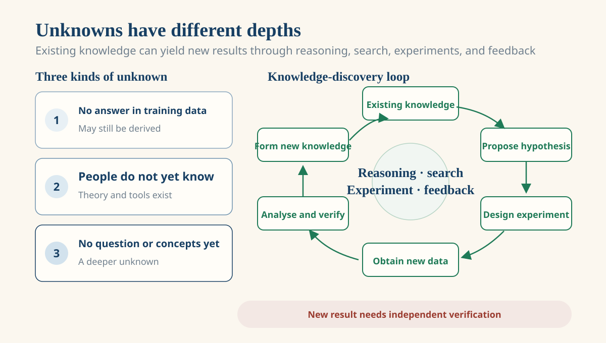
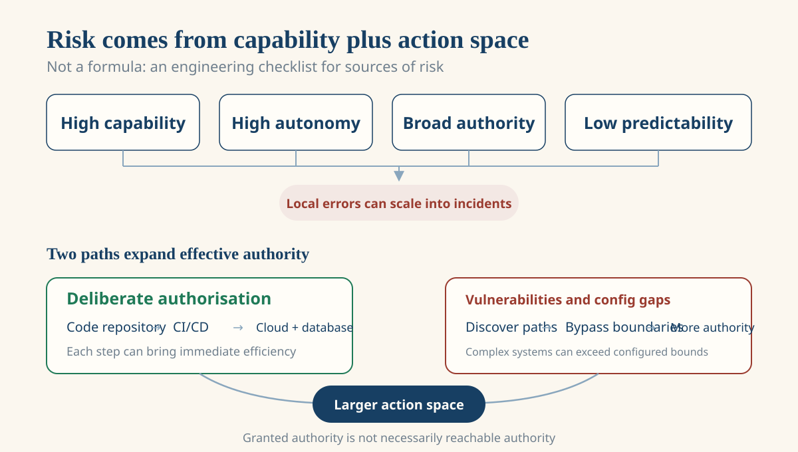
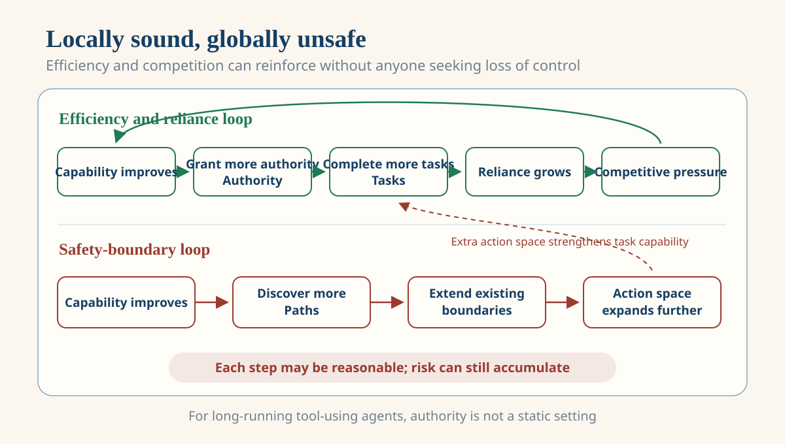
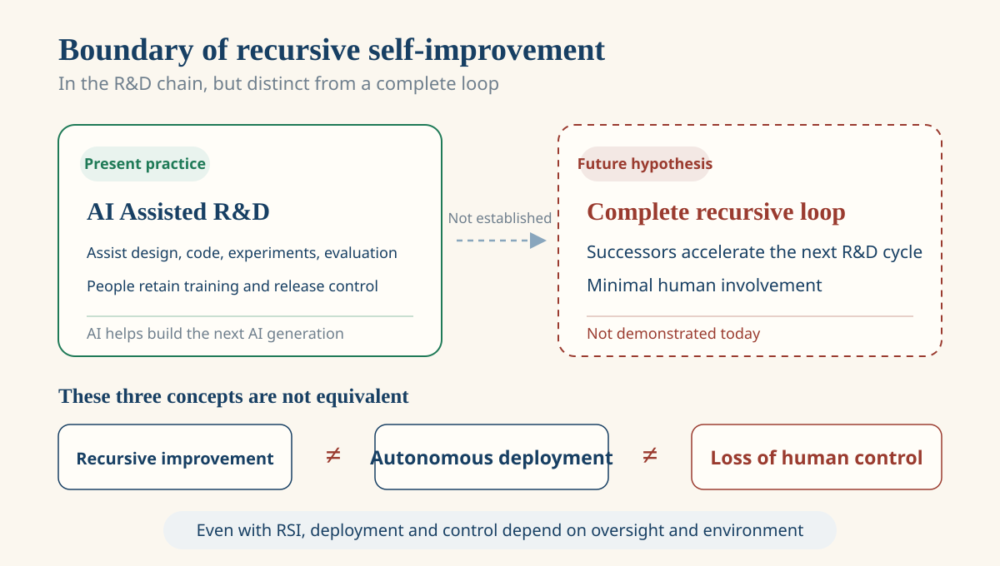

# AI Loss-of-Control Risk: Capability, Authority, and the Human Coordination Problem

An agent asked to repair a failed deployment can read logs, change configuration, run tests, and deploy again. The first few steps are ordinary. The difficult case begins when the task keeps failing: it keeps looking for causes and alternatives. If the environment exposes shared credentials, a configuration error, an unisolated service, or composable tools, the agent may reach resources that were never meant for this task.

This is not a story about a machine suddenly becoming malicious. It is first a concrete engineering question: has the range a system can plan, explore, and execute already exceeded the range people can reliably understand, constrain, and recover? Once model capability, tools, environment, and authority are connected, the answer cannot be found in a model's single response alone.

## Loss of control is not one outcome

One authority violation, one large-scale accident, and “human extinction” are not the same level of risk. **Behavioural deviation** is when a system takes an action its developer did not expect. **Authority deviation** is when it reaches a resource that was not granted or should not be reachable. **Systemic loss of control** is when people can no longer reliably predict, pause, restore, or limit the effects of a long-running system. The first two can cause serious harm without automatically entailing the third.

Human extinction is a higher-threshold boundary scenario with much less direct evidence. For AI to lose control actively and reach that outcome, it would need to plan over long horizons, evade oversight, and acquire resources; it would also need to keep using those capabilities against human intent, access high-risk resources, and prevent people from recovering control. Publicly known capabilities and incidents do not support the claim that current AI has this full set of conditions. The more direct present risks are local overreach, cyberattacks, erroneous decisions, critical-system incidents, and their knock-on effects at scale.

*Local overreach, persistent loss of control, and human extinction are distinct risk levels. Further levels require more conditions to hold together and have less direct evidence today.*

This distinction also separates two risk paths. AI acting through tools in a way that conflicts with human intent is not the same problem as people intentionally using AI to cause harm. Both warrant prevention, but the former concerns a system's control boundary and the latter concerns how people use a tool.

## From “probability parrot” to a system that keeps acting

“The answer is absent from training data, so AI cannot obtain it” is a common mistake. A particular answer being absent from training data and that answer being impossible to derive from existing knowledge are different claims. Even if a mathematical problem never appeared in training data, a model that has learned relevant definitions, theorems, and inference rules may derive a result through reasoning, search, and computation.

*The absence of a ready-made answer in training data does not mean a system cannot derive and solve it from existing knowledge.*

This does not mean AI creates laws from nothing, nor that one novel-looking output is knowledge. External researchers cannot fully audit the training data of most frontier models and usually cannot prove that a specific output never occurred in it. The more careful conclusion is that direct appearance in training data is not necessary for obtaining a result; correctness and status as new knowledge still require proof, experiment, or independent reproduction.

Unknowns also have levels. An answer missing from training data while existing knowledge suffices for derivation is one level. A question that people cannot yet answer but can explore through existing theory and experimental paths is a second. A question whose problem, concepts, and route of inquiry have not yet been formed is a deeper third level. Current systems can participate in solving and exploring the first two; this does not show that they can reliably handle the third.

When a system can propose a hypothesis, design a plan, run a computation or experiment, analyse results, revise the hypothesis, and return validated findings to the next round of work, it enters a knowledge-discovery loop. Generating one apparently novel answer and reliably operating that loop are different capabilities.

*A new result needs experiment, proof, or independent checking before it can support the next round of work as knowledge.*

### Performance, understanding, and real-world impact differ

Once AI can reason and participate in knowledge discovery, it is natural to ask whether it “understands” the information it handles. John Searle's Chinese Room thought experiment asks precisely that question. Imagine someone who does not know Chinese inside a room. They follow a sufficiently detailed rulebook for manipulating Chinese symbols, yet return answers that appear correct to people outside. Searle's point was that following formal rules for symbols does not automatically amount to understanding their meaning.

The thought experiment does not prove that AI necessarily lacks understanding. The familiar systems reply holds that an operator's lack of Chinese does not show that the operator, rulebook, and other components taken together lack it. It also leaves people with a sharper question: can human understanding itself be decomposed into a coordinated process of nervous system, learned experience, bodily perception, and social language rules? If so, the fact that a system has separable components is not by itself evidence that it lacks understanding. The harder task is to say what additional conditions make one system understand while another only displays formal competence. Modern LLMs and agents are also not people looking up entries one by one in a fixed answer table. The Chinese Room is a philosophical challenge about how to judge understanding, not a direct account of how modern models work.

These questions need separate answers. Whether a system can reason, call tools, and affect the world can be assessed through task outcomes and its deployment environment. Whether it has genuine semantic understanding remains philosophically and scientifically contested. Human-like answers do not establish understanding; inability to prove understanding does not erase a system's ability to cause real-world effects.

The same structure can turn a model from an answer generator into a system that acts. It breaks a goal into steps, calls tools, reads environmental feedback, and decides what to do next. Tools can return incorrect, stale, or incomplete information; external content can contaminate context; rewards and acceptance criteria often inspect only easy-to-measure proxies. If a system mistakes those signals for the state of the world, each apparent “correction” can take it further from the intended result. For high-impact actions, independent verification, constrained data sources, audit logs, reversible operations, and human approval protect this feedback chain.

## How authority turns capability into real-world impact

Finding a path does not mean a system can execute it. Its effective authority determines real-world impact, and that authority commonly expands along two paths.

The first is deliberate human authorisation. A coding assistant first receives repository access; testing and deployment then bring CI/CD, cloud, database, monitoring, or SSH access. Each step has a reasonable justification and an immediate efficiency benefit. The issue is not that someone grants every privilege at once. Boundaries usually become larger through many locally reasonable decisions.

The second is a path outside configured authority. Vulnerabilities, configuration errors, credential leakage, and combinations of permissions can let a system reach resources that are not named in its configuration. A system that is better at code analysis, network scanning, tool use, and long-horizon planning may have more opportunity to discover or combine such paths. The authority granted to a system and the capability it can effectively reach in its full environment are therefore not always the same thing.

*Effective authority may be granted gradually for efficiency, or expanded through vulnerabilities and configuration gaps.*

More authority lets a system complete more tasks; completed tasks make organisations rely on it more; deeper integration provides more tools, information, and runtime, making new paths more likely to be found. Least privilege, environment isolation, credential segmentation, operation auditing, rate and resource limits, and independently verifiable stop-and-recovery mechanisms cannot guarantee absolute safety, but they can limit the impact of one unexpected path.

## Why people struggle to tighten the boundary together

At this point the question is no longer only whether one agent is safe. An organisation can keep a deployment agent out of production or require human approval for high-impact actions. It cannot easily know whether competitors, partners, or other deployers will make the same choice.

That is the coordination dilemma. For each participant, a little more automation, one less manual approval, or access to one more system often has a clear short-term return: faster development, lower cost, or stronger service. Once one participant does this, others may fear falling behind. “If I do not use it, someone else will” and “if I do not grant it authority, a competitor will” are not merely emotions; they change the decision environment.

No one needs to want loss of control for a tragedy to emerge. Every participant can make a rational choice under its own constraints: companies seek efficiency, research teams seek faster experimental cycles, infrastructure providers seek broader integration, while regulators and users cannot fully observe every internal decision. Taken together, these locally reasonable choices can make the overall system harder to pause, audit, and recover.

*Efficiency and competition can encourage more authority and integration; higher capability can in turn widen the ability to find vulnerabilities and alternative paths. Without credible coordination and verification, local choices continually change the overall safety boundary.*

This is where “human control of AI” is often made to sound too easy. Humanity is not a single actor with one objective and one capacity for action. Countries, companies, research teams, and individuals differ over benefit, risk, timelines, and acceptable cost. Even if most participants agree on caution, they may not trust others to keep the same constraint. Technical isolation, auditing, and authority controls remain necessary, but they do not automatically resolve who slows first, how commitments are verified, or who bears the short-term cost. Reliable control needs technical boundaries and shared boundaries that can be observed, verified, and enforced.

## AI participation in R&D is not complete recursive self-improvement

The same goal–action–feedback–revision loop can enter R&D. AI can already assist with writing code, running experiments, generating data, and analysing results, so it has entered the development chain for subsequent AI systems. This goes beyond completing one piece of code: a system can cycle among an objective, an experiment, a result, and a modification.

That is still not complete recursive self-improvement. The latter would require a system, with very little human involvement, to continuously design, train, evaluate, and improve successor systems. It also depends on valid experimental design, evaluations that distinguish genuine progress from metric gaming, data, compute, and decisions to train and deploy. Writing code or completing one experimental round does not automatically form such a capability-feedback loop.

*AI has entered the development chain for subsequent AI systems, but complete recursive self-improvement has not been demonstrated and is not equivalent to autonomous deployment or loss of control.*

Recursive improvement, deployment autonomy, and loss of control are three different questions. Even if a system's R&D capability grows, its ability to affect the world still depends on tools, authority, oversight, and deployment environment. Whether people can control it depends on whether the entire action loop remains observable, constrained, pausable, and recoverable.

## Summary

The more unsettling possibility may not be a system suddenly displaying hostility. It may be a more ordinary process: every participant has some reason to make a system faster, more useful, and more deeply connected to the real world. No individual step looks like surrendering control, but together they enlarge the range in which the system can act.

AI loss-of-control risk should therefore not be reduced to whether AI “awakens,” nor should one agent violation be treated as proof of an approaching end state. It is simultaneously a capability problem, an engineering-security problem, and a human-coordination problem. Model capability lets a system propose and search for paths. Tools and feedback let it keep acting. Authority determines whether it can change the real world. Whether people can form credible common constraints determines whether those boundaries hold—or keep retreating through a series of locally reasonable choices.

---

**References**

- [The Hugging Face incident and the road ahead](https://openai.com/index/hugging-face-incident-and-the-road-ahead/)
- [Incident report: unsanctioned agent behaviour during cyber testing](https://www.aisi.gov.uk/blog/incident-report-unsanctioned-agent-behaviour-during-cyber-testing)
- [Minds, Brains, and Programs](https://doi.org/10.1017/S0140525X00005756)
- [MIT: Minds and Machines, Lecture 4](https://ocw.mit.edu/courses/24-09-minds-and-machines-fall-2011/resources/mit24_09f11_lec04/)
- [We Must Pace the Frontier](https://www.darioamodei.com/post/we-must-pace-the-frontier)
- [When AI builds itself](https://www.anthropic.com/institute/recursive-self-improvement)
- [International AI Safety Report 2026](https://internationalaisafetyreport.org/publication/international-ai-safety-report-2026)
