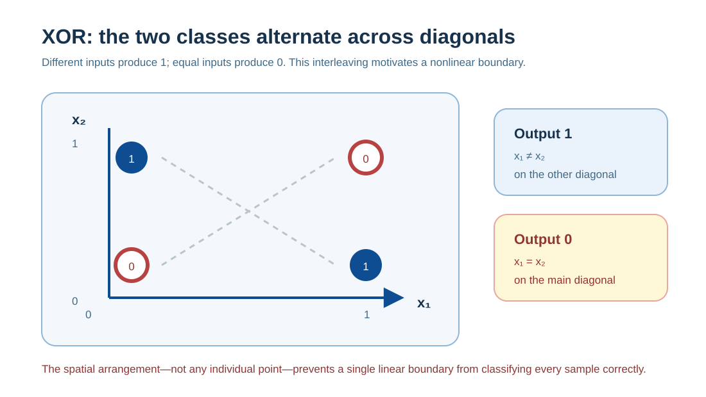
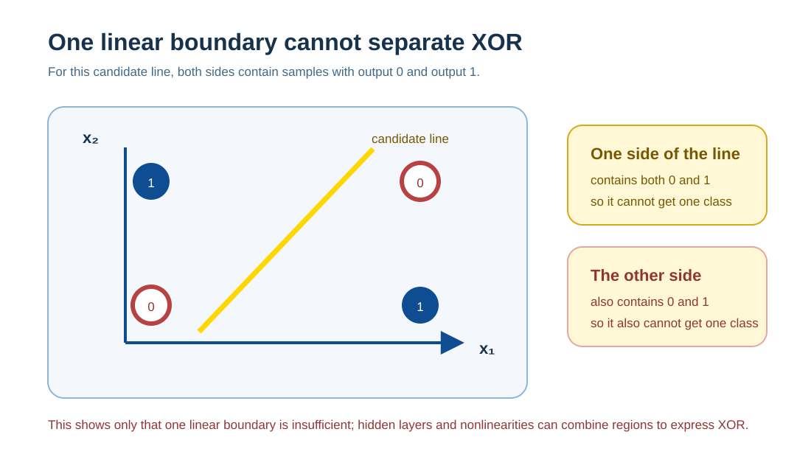
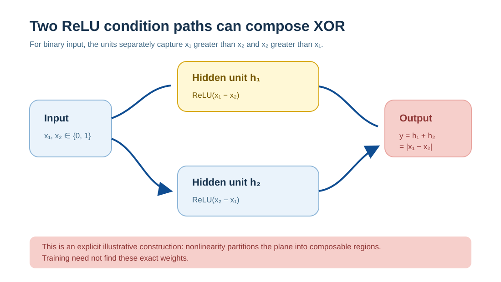
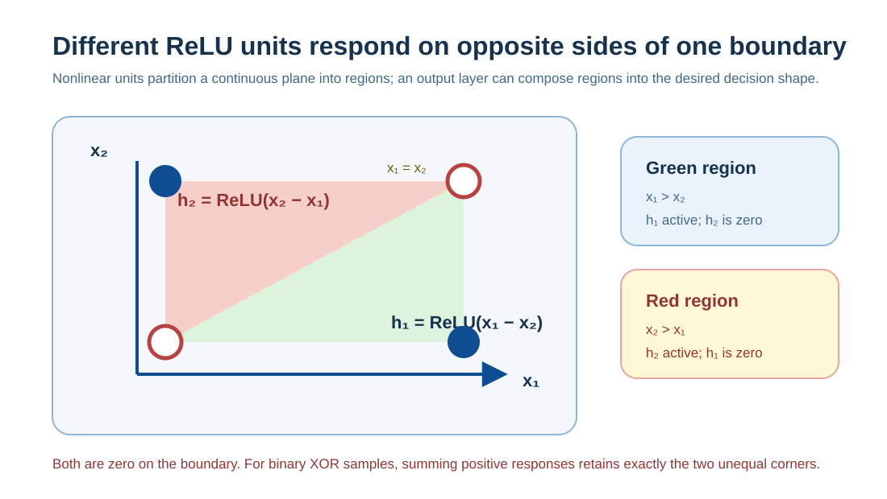
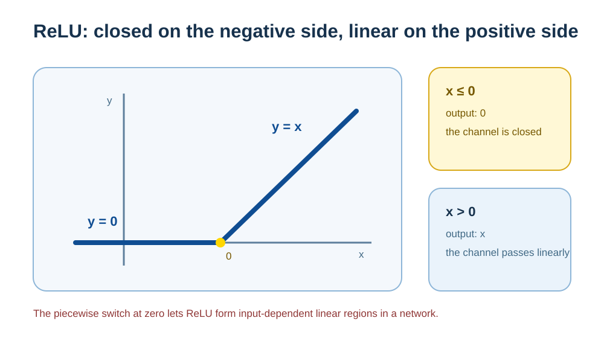
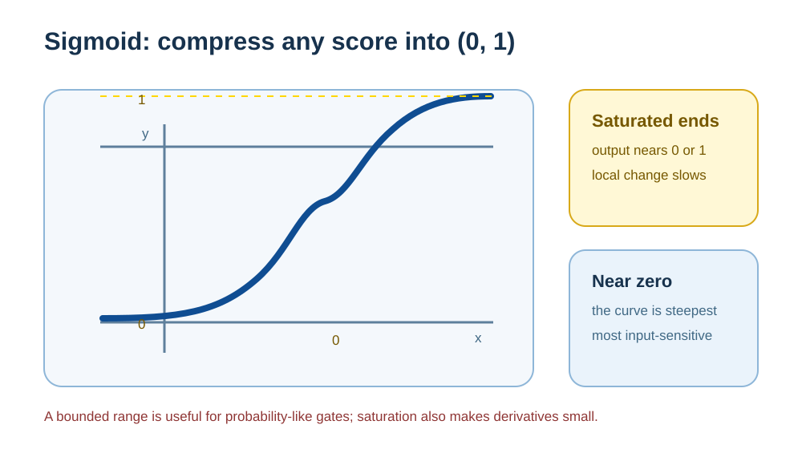
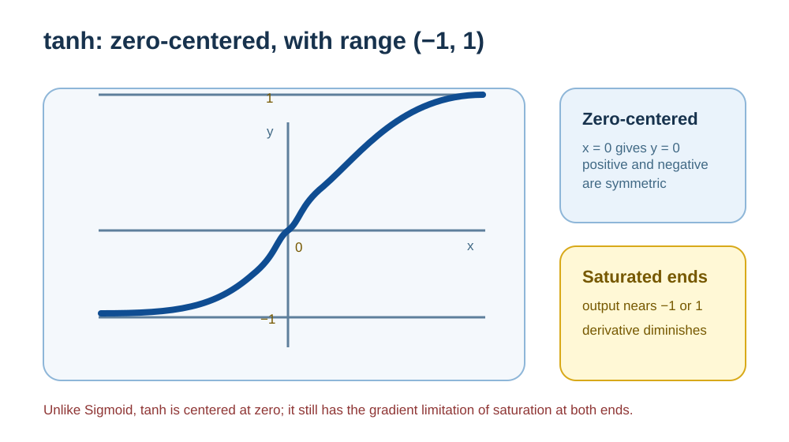

# Activation Functions: Where Nonlinearity Comes From

Neural networks repeatedly sum inputs according to weights and then transform them. Activation functions sit between these linear transformations. Without them, no matter how many layers are stacked, the network can still be combined into a single affine transformation. XOR is the smallest example that makes this limitation clear. It also shows that being able to represent a complex relationship and being able to learn it through training are different things.

## XOR: The Expressive Boundary of Linear Models

### Definition of XOR

XOR (exclusive OR) follows this rule:

| x₁ | x₂ | XOR |
| -- | -- | --- |
| 0  | 0  | 0   |
| 0  | 1  | 1   |
| 1  | 0  | 1   |
| 1  | 1  | 0   |

In a two-dimensional plane, it is represented as:

The positive and negative classes occupy diagonal positions.

### Why Linear Models Cannot Solve XOR

Any network without nonlinear activations, no matter how many layers it stacks, can be combined into a single affine transformation:

$$
y = Wx + b
$$

In a two-dimensional space, this means that its decision boundary can only be a straight line:

No adjustment of this line can completely separate the positive and negative XOR samples.

Linear, or more precisely affine, transformations remain affine under composition. Therefore, a multilayer linear network is equivalent in expressive power to a single-layer linear model.

---

## How ReLU Represents XOR

ReLU makes different inputs travel through different computational paths, breaking the limitation of a linear model.

### A Minimal Two-Layer ReLU Network

Where:

$$
\text{ReLU}(x) = \max(0, x)
$$

### Point-by-Point Calculation

* (0,0): h₁ = 0, h₂ = 0 → y = 0
* (1,1): h₁ = 0, h₂ = 0 → y = 0
* (1,0): h₁ = 1, h₂ = 0 → y = 1
* (0,1): h₁ = 0, h₂ = 1 → y = 1

XOR is separated completely and correctly.

### How Space Is Split and Recombined

* (x₁ - x₂ = 0) and (x₂ - x₁ = 0) are the same diagonal line
* ReLU divides space into two half-planes at this line
* One side is compressed entirely to 0, while the other preserves a linear structure

Together, the two units respond in these two half-planes:

These units do not create two intersecting boundaries. Instead, they enable different units on the two sides of the same boundary, and the output layer combines the two conditional results. In real tasks, these weights do not need to be written by hand; training learns them.

---

## What Activation Functions Change

### They Do Not Simply “Draw Curves”

A common but inaccurate statement is:
*Activation functions turn linear models into curve models.*

Modern activation functions represented by ReLU do not directly produce smooth curves.

What they do is:

* Split space with linear hyperplanes
* Gate part of each region by compressing or masking it
* Combine multiple linear regions conditionally

Therefore, a ReLU network is a **piecewise-linear model**. Once the on/off state of every ReLU is fixed, the whole network remains affine. The on/off state changes only when the input crosses zero. Nonlinearity comes from the accumulation of repeated splitting and recombination.

### Why Nonlinearity Is Needed

Nonlinear activations first solve this problem:

> **They break the closure of affine transformations under composition, enabling deep networks to represent nonlinear functions.**

---

## Expressive Power Is Not the Same as Training Results

**Expressive power and accuracy of expression are not the same thing.**

* **Expressive power**: whether a model has the capacity to represent a complex function.
* **Training result**: whether the optimization process finds a suitable function from data.

Activation functions primarily address the former. Data, loss functions, optimizers, initialization, and regularization together affect the latter. Changing an activation function does not automatically produce higher accuracy.

---

## Common Functions Have Different Responsibilities

Although these functions all perform nonlinear transformations, their responsibilities in a model are not the same.

---

### ReLU: Piecewise Gating in Hidden Layers

$$
\text{ReLU}(x) = \max(0, x)
$$

Function shape:

The main properties of ReLU are:

* **Piecewise linearity**: it breaks a complex function into composable local linear structures.
* **Sparse activation**: some neurons are fully switched off for a given input.
* **No saturation on the positive half-axis**: the derivative is 1 in the positive region, which helps gradients propagate in deep networks.

For this reason, ReLU and its variants have long been common choices for hidden layers in deep networks. The feed-forward layers of many Transformers instead use smooth or gated variants such as GELU, SiLU, or SwiGLU. Their common purpose is to introduce nonlinearity between linear transformations.

---

### Sigmoid: Independent Binary Probabilities and Gating

$$
\sigma(x) = \frac{1}{1 + e^{-x}}
$$

Function shape:

Sigmoid serves to:

* Map real numbers to $(0,1)$.
* Represent the probability of an independent binary event.

It saturates at both ends and its gradients can easily become small. Therefore:

* **It is not suitable for deep hidden layers.**
* It is mainly used in **binary classification output layers** or **gating structures** such as LSTM gates.

---

### Tanh: Bounded, Zero-Centered Signals

$$
\tanh(x) = \frac{e^x - e^{-x}}{e^x + e^{-x}} \in (-1, 1)
$$

Function shape:

Tanh can be regarded as a zero-centered version of Sigmoid:

* Its output is symmetric, with range $(-1, 1)$.
* It can emit both positive and negative signals.

But it still has a saturation problem.
In modern deep networks, Tanh appears mostly in:

* Early RNNs
* A few settings that need symmetric continuous-state modeling

---

### Softmax: Normalized Competition Among Candidates

$$
\text{softmax}(z_i) = \frac{e^{z_i}}{\sum_j e^{z_j}}
$$

For a three-class example, the input vector is mapped to a probability distribution:

![Softmax distribution: logits [2.0, 1.0, 0.1] map to probabilities [0.659, 0.242, 0.099], which sum to 1; candidates compete through normalization.](../../../../assets/en/diagrams/activation-functions/softmax-distribution.svg)

Softmax acts on the **whole vector**:

* It maps a group of scores to a probability distribution.
* Changing any score affects the weights of the other candidates.

Typical uses include:

* Multiclass output layers
* Attention-weight normalization

Softmax does not perform the piecewise gating role of hidden layers. Instead, it provides a normalized competition mechanism for output probabilities or attention weights.

---

## How to Understand These Functions in Their Place in a Model

Activation functions should be understood by their position and responsibility in a network:

> **They introduce trainable conditional changes between linear transformations, giving a network the ability to represent complex functions while retaining as much optimizability as possible.**

On the basis of that expressive capability:

* Parameters are learned through data, loss functions, and optimization algorithms.
* The goal is lower prediction error and better generalization.

ReLU, Sigmoid, Tanh, and Softmax are all nonlinear functions, but they serve different stages. They should not be conflated in their responsibilities in hidden layers, output layers, and attention merely because they are all called “activation functions.”

Transformer feed-forward networks often use variants such as GELU, SiLU, or SwiGLU. They modulate representations in smoother or gated ways, but do not change the basic division of responsibilities described here. [Vanishing and Exploding Gradients](vanishing-exploding-gradients.md) explains the relationship between saturation and gradient propagation, and [Transformer Architecture](../part2-llm-internal/transformer-architecture.md) explains where feed-forward networks sit in a layer's computation.
