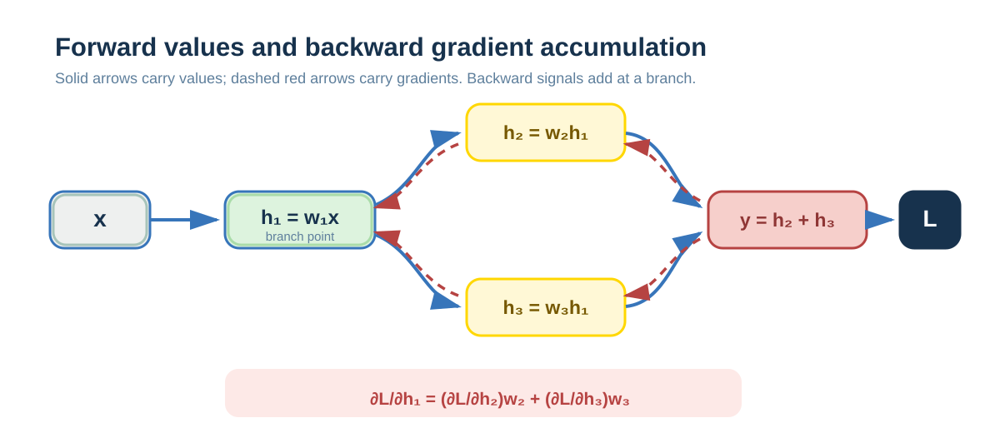

# Backpropagation: How Error Reaches Each Parameter

Training needs to know how a small change in every parameter affects final error. Backpropagation does not “calculate the network backward.” After forward computation ends, it reuses the chain rule backward along the computational graph to obtain every parameter's gradient efficiently. This chapter builds that causal chain from derivatives, the chain rule, and a computational graph with branches.

---

## Derivatives: rates of change

A derivative describes how variables change in relation to one another:

when one quantity changes slightly, how much does another quantity change with it?

It is usually written as:

$$\frac{dy}{dx}$$

Intuitively:

when $x$ increases a little, how much does $y$ roughly increase or decrease?

In machine learning, derivatives are not used to solve a mathematical exercise. They are used to decide how parameters should be adjusted so the result moves in a better direction.

---

## Multivariable functions and partial derivatives

In real problems, a function often depends on many variables, for example:

$$L = f(w, b, x)$$

Here one derivative is not enough to describe how different variables affect the result. A partial derivative means:

while holding all other variables fixed, examine only the effect on the result caused by changing one variable.

For example:

$$L = w^2 + b^2$$

then:

$$\frac{\partial L}{\partial w} = 2w,\quad \frac{\partial L}{\partial b} = 2b$$

Even within the same loss function, different parameters affect it to different degrees.

---

## Multi-step computation and the chain rule

When the change in one quantity must travel through intermediate variables, there is a multi-step dependency.

Let:

$$y = f(u),\quad u = g(x)$$

then:

$$\frac{dy}{dx} = \frac{dy}{du} \cdot \frac{du}{dx}$$

This is the chain rule.

Its intuitive statement is:

the rate of change in a multi-step computation can be decomposed into the product of the rate of change at every step.

The chain rule is the core mathematical rule of backpropagation, but not the only one. In a branching structure, the addition rule for partial derivatives is also needed to accumulate gradients arriving from different paths.

---

## A neural network is a parameterized function

Mathematically, a neural network is simply a function with many parameters and a complex structure:

$$L = f(w_1, w_2, \dots, w_n)$$

The training objective can be summarized in one sentence:

adjust parameters to make loss $L$ as small as possible.

The key question therefore becomes:

if every parameter changes a little, how much does the loss change?

That is, compute:

$$\frac{\partial L}{\partial w_i}$$

---

## The division of work between forward propagation and backpropagation

Forward propagation computes numerical values.

During a forward pass, input data moves forward through the computational graph:

$$x \rightarrow \text{intermediate variables} \rightarrow y \rightarrow L$$

After one forward pass, loss $L$ is a definite numerical value.

Backpropagation does not compute the function in reverse. Instead:

after forward computation finishes, it begins at the loss function and systematically applies the chain rule in the reverse direction of the computational graph, computing the partial derivative of loss with respect to every intermediate variable and parameter.

What propagates during backpropagation is not the loss function itself, but:

$$\frac{\partial L}{\partial(\text{current variable})}$$

That is, if the current position changes by one unit, how much will final loss change?

---

## Gradient descent: where parameter updates occur

Backpropagation produces the gradient for each parameter, but does not itself modify any parameter.

Gradient descent performs the update:

$$w \leftarrow w - \eta \frac{\partial L}{\partial w}$$

Here, $\eta$ is the learning rate, which controls the size of each update.

The sign of the gradient determines the update direction, and its magnitude determines the step size. As a gradient approaches zero, parameters progressively approach a minimum of the loss function.

---

## Why gradients propagate backward along a computational graph

In a linear chain, every node has only one gradient path, so the advantage of backpropagation is less obvious.

The real difference comes from structures with branches and joins.

In a branching structure, one node can affect several downstream nodes at once. During backpropagation, the effects of those downstream nodes on loss must all be accumulated back into the upstream node. A simple forward calculation cannot do this.

Backpropagation is therefore indispensable in engineering practice.

---

## A numerical example with branches

### Computational-graph structure

*Solid green lines show forward numerical flow; dashed red lines show backward gradient flow.*

Its mathematical definition is:

$$
\begin{cases}
h_1 = w_1 x \\
h_2 = w_2 h_1 \\
h_3 = w_3 h_1 \\
y = h_2 + h_3 \\
L = \frac{1}{2}(y - t)^2
\end{cases}
$$

Set concrete values:

$$x = 2,\quad t = 12$$

$$w_1 = 1,\quad w_2 = 2,\quad w_3 = 3$$

---

### Forward-propagation calculation

$$h_1 = 1 \cdot 2 = 2$$

$$h_2 = 2 \cdot 2 = 4,\quad h_3 = 3 \cdot 2 = 6$$

$$y = 4 + 6 = 10$$

$$L = \frac{1}{2}(10 - 12)^2 = 2$$

At this point, the loss is a definite numerical value.

---

### Backpropagation calculation

Now begin at loss $L$ and calculate the gradient of every variable step by step.

**Step 1: calculate $\frac{\partial L}{\partial y}$**

$$\frac{\partial L}{\partial y} = y - t = 10 - 12 = -2$$

**Step 2: distribute the gradient to two branches**

Because $y = h_2 + h_3$, the gradient propagates to both branches:

$$\frac{\partial L}{\partial h_2} = \frac{\partial L}{\partial y} \cdot \frac{\partial y}{\partial h_2} = -2 \cdot 1 = -2$$

$$\frac{\partial L}{\partial h_3} = \frac{\partial L}{\partial y} \cdot \frac{\partial y}{\partial h_3} = -2 \cdot 1 = -2$$

**Step 3: calculate $\frac{\partial L}{\partial w_2}$ and $\frac{\partial L}{\partial w_3}$**

$$\frac{\partial L}{\partial w_2} = \frac{\partial L}{\partial h_2} \cdot \frac{\partial h_2}{\partial w_2} = -2 \cdot h_1 = -2 \cdot 2 = -4$$

$$\frac{\partial L}{\partial w_3} = \frac{\partial L}{\partial h_3} \cdot \frac{\partial h_3}{\partial w_3} = -2 \cdot h_1 = -2 \cdot 2 = -4$$

**Step 4: accumulate the gradient at $h_1$**

This is the key step. Because $h_1$ affects both $h_2$ and $h_3$, gradients from both branches must be added:

$$\frac{\partial L}{\partial h_1} = \frac{\partial L}{\partial h_2} \cdot \frac{\partial h_2}{\partial h_1} + \frac{\partial L}{\partial h_3} \cdot \frac{\partial h_3}{\partial h_1}$$

$$= -2 \cdot w_2 + (-2) \cdot w_3 = -2 \cdot 2 + (-2) \cdot 3 = -4 - 6 = -10$$

**Step 5: calculate $\frac{\partial L}{\partial w_1}$**

$$\frac{\partial L}{\partial w_1} = \frac{\partial L}{\partial h_1} \cdot \frac{\partial h_1}{\partial w_1} = -10 \cdot x = -10 \cdot 2 = -20$$

We have now obtained all parameter gradients:

$$\frac{\partial L}{\partial w_1} = -20,\quad \frac{\partial L}{\partial w_2} = -4,\quad \frac{\partial L}{\partial w_3} = -4$$

---

## How branching structures accumulate gradients

Backpropagation still follows the chain rule completely. The difference is not the mathematical rule itself, but the structure of the computational graph.

In the branching structure above:

Output $y$ depends on both $h_2$ and $h_3$, so the loss gradient at $y$ is passed to both branches. This is **gradient distribution**.

Intermediate node $h_1$ affects both $h_2$ and $h_3$, so during backpropagation gradients from different branches must be added at $h_1$. This is **gradient accumulation**, following the addition rule for partial derivatives.

In addition, intermediate values computed in the forward pass (such as $h_1 = 2$) are reused many times during backpropagation: calculating both $\frac{\partial L}{\partial w_2}$ and $\frac{\partial L}{\partial w_3}$ uses it. This avoids repeated computation. This is **gradient reuse**.

These effects are not extra rules. They are natural consequences of the chain rule and the addition rule for partial derivatives in a branching computational graph.

---

## Summary

Derivatives describe rates of change between variables, and partial derivatives distinguish the influence of different variables in a multivariable function. The chain rule handles multi-step dependencies, while the addition rule for partial derivatives handles gradient accumulation. Backpropagation systematically organizes these mathematical rules on a computational graph beginning at the loss function. Gradient descent uses the resulting gradients to update parameters. In networks with branches, backpropagation naturally includes gradient distribution, reuse, and accumulation.

The chapter can be summarized in one sentence:

**Backpropagation is not new mathematics; it is the efficient organization and implementation of the chain rule and the addition rule for partial derivatives on a complex computational graph.**
