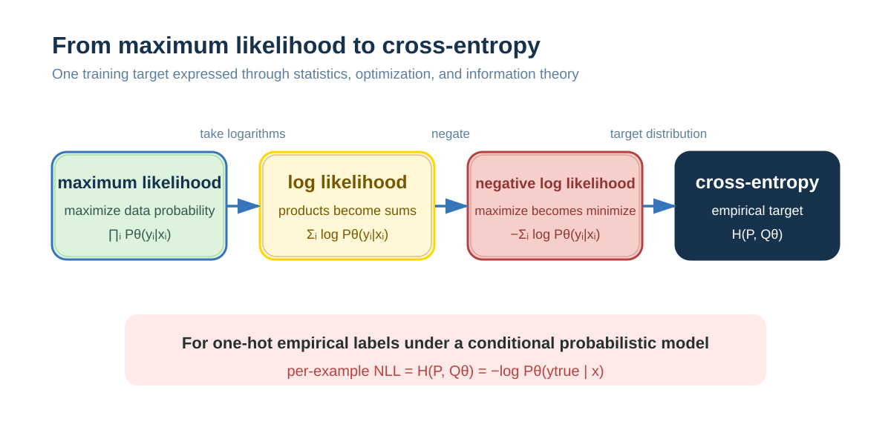

# Cross-Entropy: How to Measure Prediction Error

A classification model outputs scores or probabilities for candidates, while training must decide how far a prediction is from the true result and how to pass that deviation to parameters. Cross-entropy connects the two: it penalizes a model for not assigning enough probability to the true class, and naturally connects to Softmax and maximum likelihood.

## Start with the Problem of Prediction Error

### How Does a Model Express a Prediction?

Suppose you are training an image classifier.

**Task**: decide whether an image is a cat or a dog.

The model does not give a hard answer. It outputs a **probability distribution**:
- “The probability of cat is 0.8 and of dog is 0.2.”

👉 **Core idea**: a model outputs confidence, or probability, rather than a certain answer.

### How Do We Evaluate a Model Prediction?

If the true answer is cat, predictions differ in quality:

| Model probability for cat p | Evaluation | Desired loss |
|--------------|------|-----------|
| 0.99 | Very accurate | Should be very small |
| 0.8 | Fairly good | Moderate |
| 0.51 | Barely correct | Large |
| 0.1 | Completely wrong | Should be very large |

We need a **loss function**:
- **A larger probability for the correct answer → smaller loss.**
- **A smaller probability for the correct answer → larger loss.**

### Why Choose a Logarithm?

Observe loss = -log(p):

| Correct-class probability p | -log(p) | Meaning |
|-------------|---------|------|
| 0.99 | 0.01 | Nearly perfect |
| 0.9 | 0.10 | Very good |
| 0.5 | 0.69 | Random-guess level |
| 0.1 | 2.30 | Very poor |
| 0.01 | 4.60 | Completely wrong |

**Key properties**:
1. p close to 1 → loss close to 0, rewarding correct predictions.
2. p close to 0 → loss tends to infinity, severely penalizing mistakes.
3. **Nonlinear growth**: from p=0.9 to p=0.1, loss increases by more than twenty times.

Why is the logarithm suitable? This follows from **maximum likelihood estimation**, explained later.

### The Simplest Form of Cross-Entropy

For one prediction:
- The true answer is class A.
- The model assigns probability p to A.

**Loss function**:

$$
\text{loss} = -\log(p)
$$

This is the core of cross-entropy.

---

## Why Is It Called “Cross-Entropy”?

### First Understand Entropy

**Entropy** is a central information-theory concept that measures **uncertainty**.

#### Two Examples

**Example 1: Complete certainty**
- It will rain tomorrow with 100% probability.
- **Entropy = 0**, so there is no uncertainty.

**Example 2: Complete randomness**
- A coin toss has heads and tails at 50% each.
- **Entropy is maximal**, so uncertainty is maximal.

#### Mathematical Definition

For probability distribution P:

$$
H(P) = -\sum_x P(x)\log P(x)
$$

**Meaning**: the average information required to describe what happens. Base-2 logarithms measure bits; this book usually uses natural logarithms, whose unit is nats.

### What Is “Cross”?

In reality:

- **The true world** follows distribution P.
- **Your belief** instead treats it as distribution Q.

Using the wrong distribution Q to understand true distribution P creates an additional information cost.

#### Definition of Cross-Entropy

$$
H(P,Q) = -\sum_x P(x)\log Q(x)
$$

### Why Is It Called “Cross”?

The formula has this structure:

| Formula part | Source | Meaning |
|---------|------|------|
| P(x) | True distribution P | Actual event frequency, or weight |
| log Q(x) | Model distribution Q | Encoding in the model's way |

**The meaning of “cross”**: two different distributions are used together.
- Weights come from P.
- Encoding comes from Q.

**Comparison**:
- **Entropy H(P)**: encode oneself with oneself.
- **Cross-entropy H(P,Q)**: encode oneself with another distribution.

### Application in Machine Learning

**True label** (one-hot): P = [0, 0, 1, 0] — class 3 is correct.

**Model output** (Softmax): Q = [0.1, 0.2, 0.6, 0.1].

**Compute cross-entropy**:

$$
\begin{aligned}
H(P,Q) &= -\sum_y P(y)\log Q(y) \\
&= -(0 \times \log(0.1) + 0 \times \log(0.2) + 1 \times \log(0.6) + 0 \times \log(0.1)) \\
&= -\log(0.6) \\
&\approx 0.51
\end{aligned}
$$

### Why Does It Simplify to -log(p)?

For classification, the true label is **one-hot**: only the correct class is 1 and every other class is 0.

Substitution leaves **only the correct-class term**:

$$
H(P,Q) = -\log Q_{\text{correct class}}
$$

**This is why practical code uses**:

~~~python
loss = -log(Q[y_true])
~~~

---

## Forms for Binary and Multiclass Classification

### Binary Cross-Entropy

**Setup**:
- Model output: p = P(y=1|x), obtained with Sigmoid.
- True label: y ∈ {0, 1}.

**Loss function**:

$$
L = -[y \cdot \log(p) + (1-y) \cdot \log(1-p)]
$$

**Interpretation**: this is a concise form of a piecewise function.

| True label y | Actual calculation |
|-----------|---------|
| y = 1 | -log(p) |
| y = 0 | -log(1-p) |

**Concrete example**:

~~~text
True label y = 1, model prediction p = 0.9
loss = -log(0.9) ≈ 0.105

True label y = 1, model prediction p = 0.1
loss = -log(0.1) ≈ 2.303
~~~

### Categorical Cross-Entropy

**Complete process**:

**Step 1: Model outputs logits**

~~~text
z = [2.0, 1.0, 0.1]
~~~

**Step 2: Softmax normalization**

$$
p_i = \frac{e^{z_i}}{\sum_j e^{z_j}}
$$

The result is p₁ ≈ 0.659, p₂ ≈ 0.242, p₃ ≈ 0.099.

**Step 3: Compute cross-entropy**

The true label is y = [0, 1, 0], so class 2 is correct.

$$
L = -\sum_i y_i \cdot \log(p_i) = -\log(0.242) \approx 1.418
$$

**Simplified form** using one-hot labels:

$$
L = -\log(p_{y_{\text{true}}})
$$

---

## Understanding Cross-Entropy Through Maximum Likelihood Estimation

### A Detective Problem

You find a coin and its toss record:

~~~text
Results: heads, heads, tails, heads, heads
~~~

**Task**: determine the probability that the coin lands heads.

**Reasoning**:

| Assumed probability θ | Probability of this sequence |
|-------------|------------------|
| θ = 0.5 | 0.5⁴ × 0.5¹ = 0.03125 |
| θ = 0.8 | 0.8⁴ × 0.2¹ ≈ 0.0819 |
| θ = 0.9 | 0.9⁴ × 0.1¹ ≈ 0.0656 |

**Conclusion**: θ = 0.8 best explains the observations.

This is the core idea of **maximum likelihood estimation (MLE)**.

### Probability vs. Likelihood: The Key Difference

#### Probability

- **Known**: parameter θ.
- **Find**: the probability that data occurs.
- **Direction**: from cause to outcome.

~~~text
P(data|θ) = “given the coin's properties, the probability of an outcome”
~~~

#### Likelihood

- **Known**: data that has already occurred.
- **Find**: the most plausible parameter.
- **Direction**: from outcome to cause.

~~~text
L(θ|data) = “given the observations, which parameter is most reasonable”
~~~

**Mathematical relation**: L(θ|data) = P(data|θ).

Their numbers are the same, but their meanings are opposite.

### Formalizing the Coin Problem

**Step 1: Build a probability model**

~~~text
P(x=1|θ) = θ      # heads
P(x=0|θ) = 1-θ    # tails
~~~

**Step 2: Compute the joint probability**

Observation: heads, heads, tails, heads, heads.

Assuming independence:

$$
P(\text{data}|\theta) = \theta \times \theta \times (1-\theta) \times \theta \times \theta = \theta^4(1-\theta)
$$

**Step 3: Likelihood function**

$$
L(\theta) = \theta^4(1-\theta)
$$

**Question**: for which θ is L(θ) largest?

### Why Take a Logarithm?

This is the **key step** connecting MLE and cross-entropy.

#### Reason 1: Products Become Sums

For $N$ examples, $L(\theta) = \prod_i P(x_i \mid \theta)$.

When N is large:
- **Numerical underflow**: multiplying many numbers below 1 tends to 0.
- **Computational difficulty**: floating-point precision becomes a problem.

After taking logs:

$$
\log L(\theta) = \sum_{i=1}^N \log P(x_i|\theta)
$$

**Products become sums, improving numerical stability.**

#### Reason 2: The Optimum Does Not Change

log is strictly increasing:

$$
\arg\max_\theta L(\theta) = \arg\max_\theta \log L(\theta)
$$

#### Reason 3: Differentiation Is Simpler

- **Original function**: L(θ) = θ⁴(1-θ).
- **Log function**: ℓ(θ) = 4log θ + log(1-θ).

Differentiating gives dℓ/dθ = 4/θ - 1/(1-θ) = 0.

The solution is **θ = 0.8**.

### General Form of MLE

**Given**:
- Data: x₁, x₂, ..., xₙ.
- Parameters: θ.
- Model: P(x|θ).

**Three steps**:

1. **Likelihood**: $L(\theta) = \prod_i P(x_i \mid \theta)$.
2. **Log likelihood**: $\ell(\theta) = \sum_i \log P(x_i \mid \theta)$.
3. **Maximize**: $\hat{\theta} = \arg\max \sum_i \log P(x_i \mid \theta)$.

**Core idea**:
> Find parameter θ that makes the data that already occurred most probable under the model.

### From MLE to Machine Learning

**In supervised learning**:
- Data: (x₁,y₁), (x₂,y₂), ..., (xₙ,yₙ).
- Model: P_θ(y|x).

**MLE objective**:

$$
\hat{\theta} = \arg\max_\theta \sum_i \log P_\theta(y_i|x_i)
$$

**From maximization to minimization**:

Deep-learning frameworks minimize with gradient descent:

$$
\max_\theta \sum_i \log P_\theta(y_i|x_i) \quad \Longleftrightarrow \quad \min_\theta \left(-\sum_i \log P_\theta(y_i|x_i)\right)
$$

The expression on the right is **negative log-likelihood (NLL)**.

The loss per example is:

$$
L_i = -\log P_\theta(y_i|x_i)
$$

**This is exactly cross-entropy loss.**

---

## The Relationship Among Maximum Likelihood, NLL, and Cross-Entropy

### The Complete Equivalence Chain

### Step-by-Step Derivation

**Step 1: Original MLE form**

$$
\max_\theta \prod_i P_\theta(y_i|x_i)
$$

**Step 2: Take logs**

$$
\max_\theta \sum_i \log P_\theta(y_i|x_i)
$$

This is **log likelihood**.

**Step 3: Negate**

$$
\min_\theta \left(-\sum_i \log P_\theta(y_i|x_i)\right)
$$

This is **negative log-likelihood (NLL)**.

**Step 4: Rewrite with distributions**

True distribution P is one-hot: P(y|x) = 1 when y=y_true, otherwise 0.

Model distribution: Q_θ(y|x) = P_θ(y|x).

Cross-entropy is:

$$
H(P,Q_\theta) = -\sum_y P(y|x)\log Q_\theta(y|x)
$$

With one-hot labels:

$$
H(P,Q_\theta) = -\log P_\theta(y_{\text{true}}|x)
$$

**For one-hot classification labels, it is exactly NLL.**

### Core Equivalence

$$
\text{cross-entropy with one-hot classification labels} = \text{negative log-likelihood (NLL)}
$$

Therefore:

$$
\min \text{ cross-entropy} \quad \Longleftrightarrow \quad \max \text{ log likelihood} \quad \Longleftrightarrow \quad \text{maximum likelihood estimation}
$$

### Why Are There Different Names?

| Perspective | Term | Source | What it emphasizes |
|------|------|---------|---------|
| Statistics | Maximum likelihood/log likelihood | Statistics | Parameter estimation |
| Information theory | Cross-entropy | Information theory | Distribution difference |
| Engineering | NLL/CrossEntropyLoss | Deep learning | Loss function |

For the classification conditions discussed here, they describe the same optimization objective. For more general continuous distributions, label smoothing, weighted losses, or objectives with regularization, the three terms should not be treated as item-by-item identities.

### Numerical Example: Agreement of the Three

**A three-class problem with three examples**:

**Data**:
- Example 1: y₁=0, predicted P_θ(0|x₁) = 0.7.
- Example 2: y₂=1, predicted P_θ(1|x₂) = 0.8.
- Example 3: y₃=2, predicted P_θ(2|x₃) = 0.5.

**Method 1: MLE, maximizing likelihood**

~~~text
L(θ) = 0.7 × 0.8 × 0.5 = 0.28
log L(θ) = log(0.7) + log(0.8) + log(0.5) = -1.273
~~~

**Method 2: NLL, minimizing negative log likelihood**

~~~text
NLL = -log L(θ) = 1.273
~~~

**Method 3: Cross-entropy**

~~~text
L₁ = -log(0.7) ≈ 0.357
L₂ = -log(0.8) ≈ 0.223
L₃ = -log(0.5) ≈ 0.693
sum = 1.273
~~~

**The three methods give exactly the same result.**

---

## Why Is This Design Reasonable?

### Theoretical Basis: Statistics

A classification model represents conditional probability P(y|x).

**Statistics tells us**:
- MLE is a common parameter-estimation method for probabilistic models.
- Under conditions such as model identifiability and regular samples, MLE can have consistency and asymptotic-normality properties.
- For one-hot classification labels, MLE is equivalent to minimizing cross-entropy.

**Conclusion**:
> For probabilistic classifiers, cross-entropy follows from maximum likelihood; it is not an arbitrarily chosen penalty.

### Engineering Advantage: A Simple Gradient

The gradient of **Softmax + Cross Entropy** is:

$$
\frac{\partial L}{\partial z_i} = p_i - y_i
$$

**Characteristics**:
1. Its form is minimal: predicted value minus true value.
2. Chain-rule differentiation of Softmax and cross-entropy simplifies to this form at logits.
3. The simplification avoids multiplying in Softmax saturation derivatives separately; the whole network can still have vanishing or exploding gradients or numerical instability, and implementations should compute the loss directly from logits.
4. It is computationally efficient.

This is why deep-learning frameworks provide CrossEntropyLoss directly.

### Information-Theoretic View: Minimizing Distribution Difference

Cross-entropy decomposes as:

$$
H(P,Q) = H(P) + \text{KL}(P\|Q)
$$

Where:
- H(P): the entropy of the true distribution, a constant.
- KL(P‖Q): KL divergence, or the difference between distributions.

Therefore, minimizing cross-entropy ⟺ minimizing KL divergence ⟺ making the model distribution approach the true distribution.

---

## Summary

### Core Understanding

**Cross-entropy loss = -log(the probability of the correct answer)**
- = negative log-likelihood.
- = the optimization objective of maximum likelihood estimation.

### Three Ways to Understand It

**Intuition**:
> “The lower the probability you assign to the correct answer, the more severely I penalize you.”

**Statistics**:
> “Make the data that occurred as probable as possible under the current model.”

**Information theory**:
> “The cost of using the model's distribution to understand the true distribution.”

### Key Equivalence

$$
\max \log P(y|x) \quad = \quad \min [-\log P(y|x)] \quad = \quad \min H(P,Q)
$$

$$
\text{(maximum likelihood)} \qquad \text{(negative log likelihood)} \qquad \text{(cross-entropy)}
$$

### Path to Understanding

### Smallest Unit to Remember

If you remember only one thing:

> **Cross-entropy = -log(the correct-class probability)**
>
> It comes from maximum likelihood estimation: make the model assign maximum probability to the true answer.

---

## Further Thoughts

The apparently simple cross-entropy loss, **-log(p)**, is:

- **From statistics**: a natural result of maximum likelihood estimation.
- **From information theory**: a measure of distribution difference.
- **Good engineering**: simple gradients and numerical stability.

Understanding the relationship between cross-entropy and maximum likelihood means understanding:
- **Why** this loss function is designed this way.
- **Why** deep learning can work.
- **How** to reason from principles.
