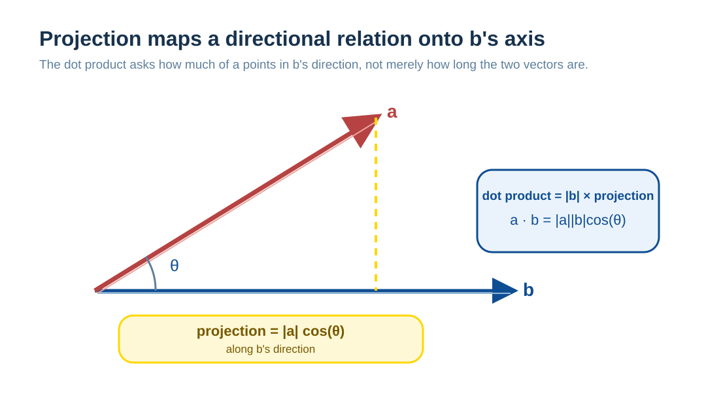
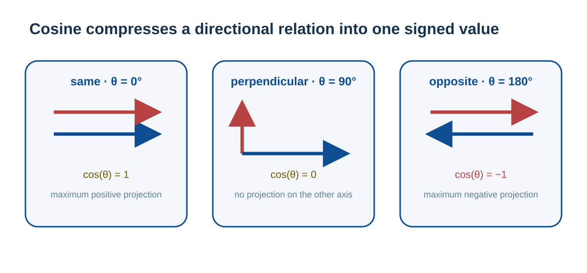
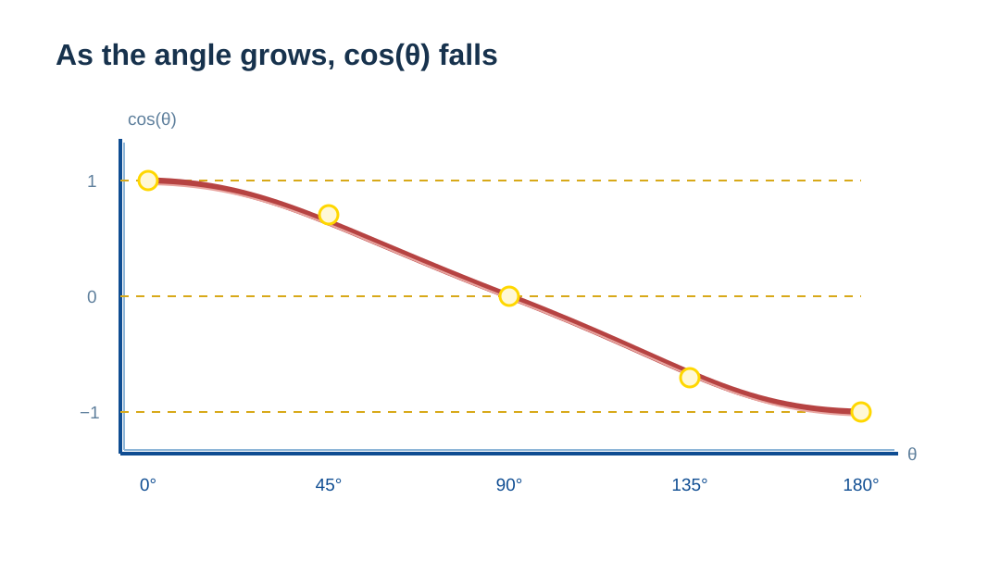
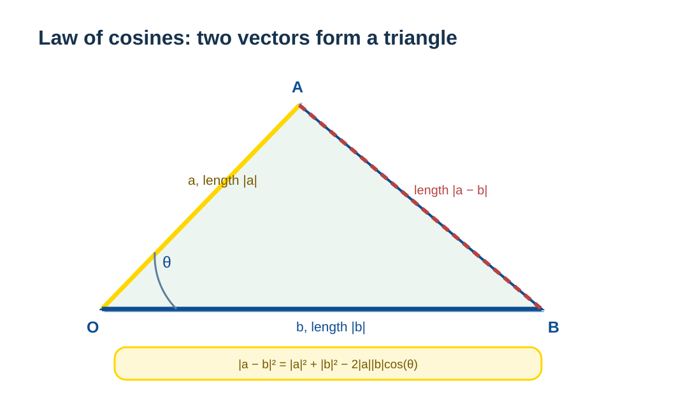

# Dot Products and Cosine Similarity: How Vectors Express Relationships

Embeddings, attention, and retrieval all compare vectors. “Close” can mean similar direction, or it can also be affected by vector length. A dot product combines these two factors; cosine similarity removes length and retains direction. This chapter builds the relationship from projection, then explains when it is useful in a model and when it is insufficient.

## Understanding Directional Relationships Through Projection

### The Geometric Meaning of Projection

Consider this diagram:

**The projection length of a onto the direction of b = |a|cos(θ)**

### Why Can Projection Reflect Similarity?

Imagine two vectors representing different directions:

**Case 1: Exactly the same direction (θ=0°)**
Projection = the full length; cos(0°) = 1; the projection is largest.

**Case 2: Perpendicular directions (θ=90°)**
Projection = 0; cos(90°) = 0; there is no shared component.

**Case 3: Opposite directions (θ=180°)**
The projection is negative; cos(180°) = -1; the directions are completely opposite.

**Key insight**:
- **A smaller angle** → larger cos(θ) → **a longer projection** → greater directional alignment.
- **An angle of 90°** → cos(90°) = 0 → **a zero projection** → no shared projection under the current geometric metric.
- **An angle of 180°** → cos(180°) = -1 → **a negative projection** → completely opposite directions.

This is why cos(θ) can reflect directional similarity.

### Properties of the cos Function

Over [0°, 180°]:

cos(θ) decreases monotonically as the angle increases, which is a basic property of the cosine function.

Smaller angle → larger cosine → larger dot product, when vector lengths are equal.

## The Definition and Geometric Meaning of the Dot Product

### The Algebraic Definition of the Dot Product

The original, algebraic definition of a dot product is:

**a · b = a₁b₁ + a₂b₂ + ... + aₙbₙ**

It multiplies corresponding coordinates and adds them.

### The Geometric Meaning of the Dot Product

The dot product also has a geometric interpretation:

**a · b = |b| × (|a|cos(θ))**
= the length of b × the projection of a onto the direction of b.

Or, conversely:

**a · b = |a| × (|b|cos(θ))**
= the length of a × the projection of b onto the direction of a.

### Why Does the Projection Also Need to Be Multiplied by the Length of b?

**For example**:

~~~text
a = [3, 4]
b = [2, 0]  (pure x direction, length 2)

dot product = 3×2 + 4×0 = 6
~~~

Where does this 6 come from?
- The component of a in the x direction is 3.
- The component of b in the x direction is 2 (which includes b's length).
- Their product is 3 × 2 = 6.

**What if b is a unit vector?**

~~~text
b' = [1, 0]  (length 1)

dot product = 3×1 + 4×0 = 3
~~~

The dot product is then exactly the projection of a.

**The underlying reason: products of coordinate components**

Each term in the dot product is **aᵢbᵢ**, not **aᵢ × 1**.

~~~text
a = [a₁, a₂]
b = [b₁, b₂]

dot product = a₁b₁ + a₂b₂
~~~

b₁ and b₂ themselves contain b's length information.

Polar coordinates make this clearer:

$$
\begin{aligned}
b_1 &= |b|\cos(\beta), & b_2 &= |b|\sin(\beta) \\
a\cdot b &= a_1(|b|\cos\beta) + a_2(|b|\sin\beta) \\
&= |b|(a_1\cos\beta + a_2\sin\beta)
\end{aligned}
$$

Therefore $b_1$ and $b_2$ already include $|b|$; this is the source of that length factor in a dot product.

**Conclusion**:
- If b is a **unit vector** (|b|=1), the dot product = the projection of a.
- If b is not a unit vector, the dot product = the projection of a × |b|.

### What If We Want Only the Projection?

If all that is wanted is the projection of a onto the direction of b, use:

**projection = (a · b) / |b|**

Or first convert b to a unit vector:

**$\hat{b} = b / |b|$** (unit vector)

**projection = $a \cdot \hat{b} = (a \cdot b) / |b|$**

Cosine similarity does this by dividing by the lengths of both vectors.

## Why Can a Dot Product Compute an Angle?

### Summing Products of Coordinate Components

Let us look at what **a₁b₁ + a₂b₂** calculates:

**Suppose**:

~~~text
a = [3, 4]
b = [5, 0]  (pure x direction)

dot product = 3×5 + 4×0 = 15
~~~

What is this calculating?

Because b is purely in the x direction, the dot product retains only the x component of a:
- The x component of a is 3.
- The length of b is 5.
- The result = 3×5 = 15.

**Essence**: every dot-product term **aᵢbᵢ** calculates the product of the two vectors' components on coordinate axis i. Their sum gives the total shared component.

### Two More Examples

**Example 1**:

~~~text
a = [1, 1]    // points at 45°
b = [1, 0]    // points at 0°
θ = 45°

dot product = 1×1 + 1×0 = 1
|a| = √2
|b| = 1

formula check: |a||b|cos(45°) = √2 × 1 × 0.707 ≈ 1 ✓
~~~

**Example 2**:

~~~text
a = [0, 1]    // points at 90°
b = [1, 0]    // points at 0°
θ = 90°

dot product = 0×1 + 1×0 = 0

check: |a||b|cos(90°) = 1 × 1 × 0 = 0 ✓
~~~

## Deriving the Dot Product and Angle Relationship

We now derive rigorously that the algebraic and geometric definitions of a dot product are equivalent.

### Method 1: Start in Two Dimensions (Most Intuitive)

**Step 1: Represent vectors in polar coordinates**

Suppose two two-dimensional vectors are:

~~~text
a = [a₁, a₂]
b = [b₁, b₂]
~~~

Their polar-coordinate forms are:

~~~text
a = [|a|cos(α), |a|sin(α)]  // α is a's angle with the x axis
b = [|b|cos(β), |b|sin(β)]  // β is b's angle with the x axis
~~~

Here **θ = β - α** is the angle between the two vectors.

**Step 2: Compute the dot product**

~~~text
a · b = a₁b₁ + a₂b₂
     = |a|cos(α) × |b|cos(β) + |a|sin(α) × |b|sin(β)
     = |a||b| [cos(α)cos(β) + sin(α)sin(β)]
~~~

**Step 3: Use a trigonometric identity**

The key identity is:

**cos(α)cos(β) + sin(α)sin(β) = cos(β - α) = cos(θ)**

Therefore:

**a · b = |a||b|cos(θ)**

This is not a definition; it is a derived conclusion.

### Method 2: The Law of Cosines (Applicable in Any Dimension)

Consider the triangle formed by the origin O, the endpoint A of vector a, and the endpoint B of vector b:

The three side lengths are:
- OA = |a|.
- OB = |b|.
- AB = |a - b|.

**Law of cosines**:

**|a - b|² = |a|² + |b|² - 2|a||b|cos(θ)**

**Expand the left side**:

~~~text
|a - b|² = (a - b)·(a - b)
         = a·a - 2a·b + b·b
         = |a|² - 2a·b + |b|²
~~~

**Set the two expressions equal**:

~~~text
|a|² - 2a·b + |b|² = |a|² + |b|² - 2|a||b|cos(θ)

⇒ -2a·b = -2|a||b|cos(θ)

⇒ a·b = |a||b|cos(θ)
~~~

This proof holds in any dimension.

### Extension to Three and Higher Dimensions

**Three dimensions**: spherical coordinates and more complex trigonometric identities yield the same result:

**a · b = |a||b|cos(θ)**

**Higher dimensions**: the law-of-cosines method gives the following for **any n-dimensional vectors**:

**a · b = |a||b|cos(θ)**

Cosine similarity therefore applies in any dimension.

## Cosine Similarity: Removing Length and Keeping Direction

### Deriving the Cosine-Similarity Formula

We now know:

**a · b = |a| |b| cos(θ)**

Divide both sides by **|a||b|**:

**cos(θ) = (a · b) / (|a| × |b|)**

This is the formula for cosine similarity.

### The Full Chain of Derivation

~~~text
1. Express a vector in polar coordinates: a = |a|[cos(α), sin(α)]

2. Compute the dot product: a·b = |a||b|[cos(α)cos(β) + sin(α)sin(β)]

3. Trigonometric identity: cos(α)cos(β) + sin(α)sin(β) = cos(β-α) = cos(θ)

4. Obtain: a·b = |a||b|cos(θ)

5. Rearrange: cos(θ) = (a·b)/(|a||b|)
~~~

### Verification with Concrete Numbers

**Example 1: Two vectors with a 45° angle**

~~~text
a = [1, 0]     // on the x axis, α = 0°
b = [1, 1]     // in the 45° direction, β = 45°
θ = 45°

calculation:
|a| = √(1² + 0²) = 1
|b| = √(1² + 1²) = √2
a · b = 1×1 + 0×1 = 1

cosine similarity = 1 / (1 × √2) = 1/√2 ≈ 0.707

check: cos(45°) = √2/2 ≈ 0.707 ✓
~~~

**Example 2: Two perpendicular vectors**

~~~text
a = [1, 0]     // x axis
b = [0, 1]     // y axis
θ = 90°

calculation:
|a| = 1
|b| = 1
a · b = 1×0 + 0×1 = 0

cosine similarity = 0 / (1 × 1) = 0

check: cos(90°) = 0 ✓
~~~

**Example 3: Two vectors in the same direction with different lengths**

~~~text
a = [3, 4]     // length 5
b = [6, 8]     // length 10, same direction
θ = 0°

calculation:
|a| = √(3² + 4²) = 5
|b| = √(6² + 8²) = 10
a · b = 3×6 + 4×8 = 18 + 32 = 50

cosine similarity = 50 / (5 × 10) = 1

check: cos(0°) = 1 ✓
~~~

### Why Use Cosine Similarity?

In some word-vector retrieval tasks, people choose primarily to compare direction and normalize away length. This is a metric choice; it does not mean vector length is always word frequency, or that every semantic task should ignore length.

**For example**:

~~~text
"king" = [0.2, 0.5, 0.8, ...]  length may be 1.2
"queen" = [0.3, 0.6, 0.9, ...]  length may be 1.5
~~~

These two word vectors have similar directions, so their meanings should be similar:
- **Raw dot product**: is affected by length.
- **Cosine similarity**: removes length effects and examines direction only.

### The Standardized Range of Cosine Similarity

**-1 ≤ cos(θ) ≤ 1**

- **cos(θ) = 1**: exactly the same direction (θ = 0°).
- **cos(θ) = 0**: perpendicular (θ = 90°), with no shared projection under this representation and metric; this does not prove two concepts are unrelated in language or reality.
- **cos(θ) = -1**: exactly opposite directions (θ = 180°).

## Summary

### Why Can a Dot Product Reflect an Angle?

**1. Mathematical basis**

The algebraic definition of a dot product (the sum of coordinate-component products) and its geometric definition (length × cosine of the angle) are mathematically equivalent; trigonometric identities derive this rigorously.

**2. Intuitive understanding**

- **Projection view**: dot product = the length of one vector × the projection of the other onto it.
- **Component view**: dot product = the total “shared components” on all coordinate axes.
- **Angle view**: cos(θ) naturally decreases monotonically, perfectly encoding directional differences.

**3. Why does a smaller angle yield a larger dot product?**

Because:
- dot product = |a||b|cos(θ).
- the cos function decreases monotonically on [0°,180°].
- smaller θ → larger cos(θ) → larger dot product, with length unchanged.

This is a necessary consequence of mathematical structure, not an artificial design.

### The Meaning of Cosine Similarity

**cos(θ) = (a · b) / (|a| × |b|)**

- **It removes vector-length effects** by dividing by both vector lengths.
- **It retains only pure directional information**: the result depends only on θ.
- **Its standardized range is [-1, 1]**, making comparison and interpretation easier.
- **It is often used for semantic retrieval and comparison**: it compares directional proximity in the current representation space; suitability depends on embedding training and the task.

Using a dot product to measure directional alignment is therefore natural, because its definition inherently contains angle information. Word-vector techniques merely use this mathematical fact.

---

### Extension: Geometric Properties of Cosine Similarity and Transformer Practice

In deep learning, cosine similarity is a commonly used metric, but its geometric logic and practical engineering use have important differences.

#### 1. Do Not Treat Directional Alignment as Complete Semantic Equivalence

* **Mathematical logic**: if two vectors are collinear and point in the same direction, their cosine similarity is 1.
* **Practical reality**: in an embedding space, even synonyms such as “apple” and “Apple” are unlikely to be exactly collinear. A model uses small angle differences and vector length to distinguish context, frequency, or grammatical features.
* **Conclusion**: cosine similarity measures directional proximity under the current representation and metric. It is commonly a relevance or retrieval signal, not absolute semantic identity.

#### 2. The “Blind Spot” of Cosine Similarity

The key feature of cosine similarity is **invariance to magnitude**.

* **Geometric intuition**: it distinguishes where vectors point, not how far they travel. Two points on the same ray have the same cosine similarity, but later computations can still distinguish their original vectors.
* **Limitation**: it discards information in magnitude. Whether magnitude represents word frequency, confidence, intensity, or something else depends on the model and training method; it cannot be inferred from cosine values alone.

#### 3. Does a Transformer Use Only Cosine Similarity?

This is a common misunderstanding. A model treats length very differently at different stages:

* **Training stage (internal mechanism)**:
The core **Attention mechanism of a Transformer uses dot products**, not cosine similarity. Vector length is retained and participates in computation to regulate attention-weight distributions. **Here, length is an important signal.**
* **Retrieval stage (engineering application)**:
A vector database may use cosine, inner product, or Euclidean distance. Only after **L2 normalization** does the normalized dot product equal cosine similarity. Length is intentionally excluded then; whether that is appropriate must be decided by retrieval evaluation.

#### Key Points of This Section

* **Cosine similarity** is suitable for comparing directional proximity, but discards length information.
* **Inside a model**, Attention uses scaled dot products; **outside a model**, cosine, inner product, or another retrieval metric can be selected for the task.
