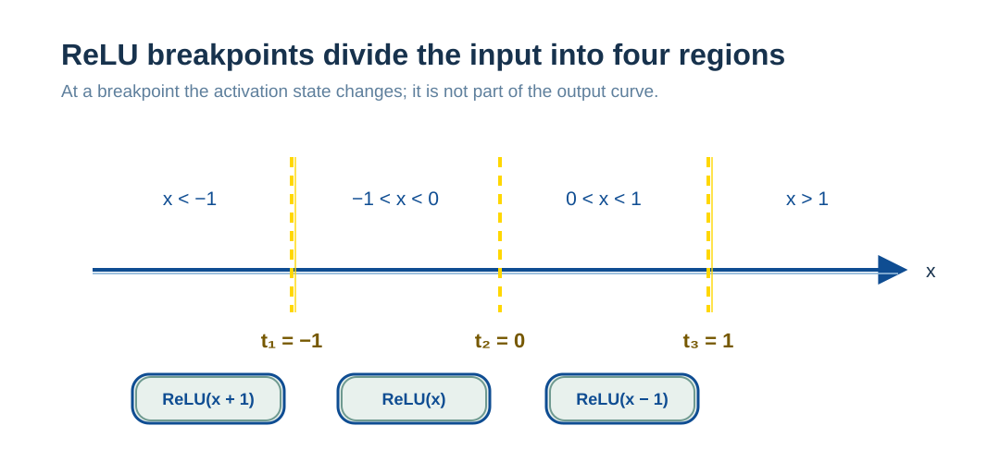
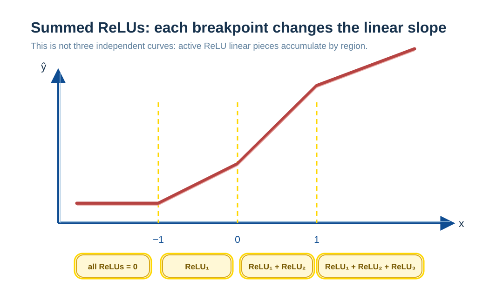

# Perceptrons: How Parameters Update from Error

A perceptron sums weighted inputs and transforms the result; it is the smallest neural-network unit. It distinguishes two related but different matters: model structure determines which functions can be represented, while training adjusts weights through loss gradients. The preceding XOR example showed a single perceptron's expressive boundary. Here the focus is on how error feedback shapes piecewise-linear functions.

## The Basic Functional Form of Perceptrons and Neural Networks

In deep learning, perceptrons and their neural-network extensions do not use a hand-specified polynomial form such as:

$$
y = x_1^2 + x_2^2 + x_3^3
$$

Their basic computation is:

$$
y = f(w_1x_1 + w_2x_2 + \cdots + w_nx_n + b)
$$

Where:

* $x_i$: input features.
* $w_i, b$: learnable parameters.
* $f(\cdot)$: an activation function whose form is fixed by the architecture.

The nonlinear capacity of neural networks **does not come from explicitly writing squared or cubed terms**, but from activation functions and multilayer composition.

---

## Distinguishing Model Structure from Parameter Learning

Neural networks must be understood at two levels:

* **Structural level**:
  number of layers, connection pattern, and activation-function type, designed by people.

* **Parameter level**:
  weights $w$ and biases $b$, learned from data.

A network does not “choose an analytic formula.” Within a fixed structure, it continually adjusts parameters and thereby forms a function shape.

---

## The Expressive Boundary of a Single-Layer Perceptron

When a model has only one layer and no hidden layer:

$$
y = f(w^\top x + b)
$$

Although its activation function introduces nonlinearity, its expressive power remains limited:

* Its decision boundary is linear for classification tasks.
* It cannot represent genuinely complex nonlinear decision regions.

Problems such as XOR and circular boundaries cannot be solved by a single-layer perceptron.
**The ability to express complex functions comes from hidden layers.**

---

## How Complex Functions Are Learned

Learning a complex function is, in essence, continuous numerical optimization:

1. Parameters are randomly initialized and the function shape is unrelated to the target.
2. A forward pass computes the output of the current model function.
3. A loss function is computed and reflects only prediction error.
4. Backpropagation computes gradients of loss with respect to parameters.
5. Gradient descent makes small parameter updates.
6. Repeated iterations gradually adjust the function shape.

The model does not “understand the form of a function”; it continually moves through function space toward lower error.

---

## The Role of Nonlinear Activations: ReLU as an Example

For geometric intuition, consider the ReLU activation:

$$
\text{ReLU}(z) = \max(0, z)
$$

For one-dimensional input:

$$
h(x) = \text{ReLU}(wx + b)
$$

Its geometric characteristics are:

* When $wx + b < 0$, the output is 0.
* When $wx + b > 0$, the output is a straight line.

**For one-dimensional input, a ReLU neuron does only one thing:
after a particular position, it begins to contribute a linear function.**

---

## Definition and Origin of Breakpoints

The ReLU “breakpoint” is defined as:

$$
t = -\frac{b}{w}
$$

It is important to be clear:

* There is no independent parameter named $t$ in the network.
* A breakpoint is the ratio of weight $w$ and bias $b$.
* Training performs gradient descent only on $w, b$.
* The breakpoint location is a natural by-product of parameter learning.

---

## Functional Properties of Multi-ReLU Networks

For a one-dimensional, single-hidden-layer ReLU network:

$$
f(x) = \sum_i a_i \,\text{ReLU}(w_i x + b_i) + c
$$

This function family has strict properties:

* It is linear on every interval.
* Its first derivative jumps at breakpoints.
* The whole function is a **piecewise-linear function**.

Complexity comes from multiple breakpoints and the sum of their linear pieces.

---

## An Example Combining Three ReLUs

Consider this network:

$$
\hat{y} = \text{ReLU}(x+1) + \text{ReLU}(x) + \text{ReLU}(x-1)
$$

### Breakpoints: Vertical Boundaries

This network has three ReLUs, so it **can have only three breakpoints**:

* $t_1 = -1$
* $t_2 = 0$
* $t_3 = 1$

They are three **vertical boundaries** that divide input intervals; they are not part of the function graph:

---

### Interval Division

The breakpoints divide the input axis into four intervals:

1. $x < -1$
2. $-1 < x < 0$
3. $0 < x < 1$
4. $x > 1$

---

### The Source of the Function in Each Interval

#### Interval A: Less Than Negative One

* ReLU(x+1) = 0
* ReLU(x) = 0
* ReLU(x−1) = 0

The output is:

$$
\hat{y} = 0
$$

This is a **constant function**, so its graph is a **horizontal line**.

> This horizontal line does not correspond to any individual ReLU.
> It is the result of all three ReLUs being inactive.

---

#### Interval B: Between Negative One and Zero

* ReLU(x+1) = x+1
* The other two ReLUs = 0

The output is:

$$
\hat{y} = x + 1
$$

> This line segment is contributed by **ReLU₁ alone**.

---

#### Interval C: Between Zero and One

* ReLU(x+1) = x+1
* ReLU(x) = x

The output is:

$$
\hat{y} = (x+1) + x = 2x + 1
$$

> This line segment is the **linear sum of ReLU₁ and ReLU₂**.

---

#### Interval D: Greater Than One

* All three ReLUs are active.

The output is:

$$
\hat{y} = (x+1) + x + (x-1) = 3x
$$

> This line segment is the **sum of the linear parts of all three ReLUs**.

---

### A Polyline View of the Output Function

It must be understood precisely:

* **Vertical lines ($t$)**: ReLU activation boundaries.
* **Polyline**: the sum of linear parts from all currently active ReLUs.
* The polyline is not “drawn” by a single ReLU.

---

## Why This Structure Can Approximate a Parabola

The essential feature of the parabola $y = x^2$ is:

* Its slope increases continuously with $x$.

A ReLU network cannot create continuous curvature, but it can use:

* Enough breakpoints.
* Dense enough slope jumps.

To approximate this behavior on a finite interval.

---

## The Expressive Limit of Finite ReLU Networks

In one dimension:

* A finite ReLU network ⇒ a piecewise-linear function.
* $y = x^2$ ⇒ smooth everywhere, with nonzero second derivative.

Therefore:

* ❌ A finite ReLU network cannot equal $x^2$ exactly over the whole real axis.
* ✅ It can approximate it to arbitrary precision over any finite interval.

---

## How Many ReLUs Are Needed

On $[-M, M]$, approximate with a single-hidden-layer ReLU network:

$$
f(x) = x^2
$$

If the maximum error is $\varepsilon$, the required number of ReLUs satisfies:

$$
N = O\left(\frac{M^2}{\varepsilon}\right)
$$

This means:

* A larger interval → more breakpoints.
* A higher accuracy requirement → more breakpoints.

---

## Summary

* Neural networks do not explicitly construct high-degree polynomials.
* Expressive power comes from the combination of linear transformations and nonlinear activations.
* In one dimension, ReLU fundamentally produces piecewise-linear functions.
* Breakpoints are natural results of parameter learning, not manually specified values.
* A polyline is the sum of linear parts from multiple ReLUs.
* Smooth functions can be approximated by finite ReLU networks, but not exactly equated with them.
