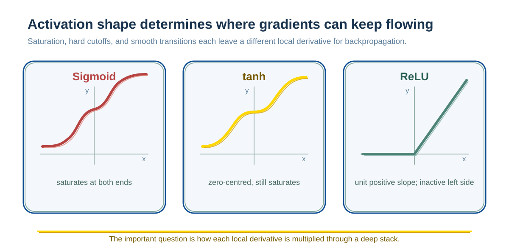

# Vanishing and Exploding Gradients: Why Deep Networks Are Hard to Train

When a deep network trains, its error signal must pass through many local derivatives to reach earlier parameters. If their repeated product remains below 1, the signal decays; if it remains above 1, the signal grows. This produces vanishing and exploding gradients, and explains why initialization, residual connections, normalization, and gradient clipping are parts of a training system.

## What responsibility does a gradient carry when training a neural network?

Training a neural network has one essential task:

**continually fine-tune parameters so that model output comes closer to the true target.**

A gradient provides a local descent direction; learning rate, optimizer, clipping, regularization, and other training rules jointly decide how far to move.

If gradients propagate stably, the model can learn;
if gradients decay or become uncontrolled during propagation, training fails.

---

## What is a gradient?

### An intuition for rate of change

Consider the function:

$$y = x^2$$

When $x$ changes slightly, the change in $y$ depends on the current location.

- Near $x = 1$, increasing $x$ by 0.01 increases $y$ by about 0.02.
- Near $x = 10$, the same increase of 0.01 increases $y$ by about 0.2.

This means:
**the same input change has a different effect on output at different locations.**

---

### The definition of a derivative

This sensitivity to change is the derivative.

Mathematically, a derivative is defined as:

$$\frac{dy}{dx}$$

For $y = x^2$:

$$\frac{dy}{dx} = 2x$$

**Note**: in a single-variable function this is called a derivative; in a multivariable function, the vector formed by all partial derivatives is called the gradient.

---

## How gradients participate in training

### How parameters are updated

Suppose the simplest model is:

$$y = wx$$

Define the loss function:

$$L = (y - y^*)^2$$

Training aims to make loss $L$ smaller.

---

### The gradient-descent rule

The parameter update is:

$$w \leftarrow w - \eta \cdot \frac{\partial L}{\partial w}$$

This means:

- A large gradient produces a large parameter adjustment.
- A small gradient produces a small parameter adjustment.
- A zero gradient means this loss term supplies no update signal; momentum, weight decay, and other terms can still change the parameter.

Gradients determine whether the model can keep learning.

---

## Where gradients in a neural network come from

### A neural network is a composite function

A multilayer neural network can be represented as nested functions:

$$y = f_3(f_2(f_1(x)))$$

The loss function is $L(y)$.

---

### How backpropagation computes gradients

Backpropagation uses the chain rule to compute gradients:

$$\frac{\partial L}{\partial w_1} = \frac{\partial L}{\partial f_3} \cdot \frac{\partial f_3}{\partial f_2} \cdot \frac{\partial f_2}{\partial f_1} \cdot \frac{\partial f_1}{\partial w_1}$$

In other words:

**a gradient is the product of many derivatives.**

---

## Vanishing gradients: why the signal cannot reach earlier layers

### Numerical decay caused by repeated multiplication

Suppose the backpropagation derivative of every layer is about 0.5:

- After 10 layers:
  $0.5^{10} \approx 0.001$

- After 50 layers:
  $0.5^{50} \approx 10^{-15}$

The gradient is almost zero.

---

### Effect on training

- Layers near the output can still update.
- Gradients near the input approach 0.
- Parameters barely change.

This is called **vanishing gradients (Vanishing Gradient)**.

---

## Exploding gradients: the other side of the same repeated-multiplication mechanism

### Numerical growth caused by repeated multiplication

If every layer's derivative is about 1.5:

- After 10 layers: $1.5^{10} \approx 57.7$
- After 50 layers: $1.5^{50} \approx 6.4 \times 10^8$

---

### Effect on training

- Parameter updates become extremely large.
- The loss becomes NaN or inf.
- Numerical overflow causes the model to diverge.

This is called **exploding gradients (Exploding Gradient)**.

---

## Why activation functions affect gradient propagation

### The role of activation functions

If every layer had only a linear transformation:

$$y = Wx$$

then stacking many layers would still be equivalent to one linear transformation, and the model would have limited expressive power.

Neural networks therefore must introduce **nonlinear activation functions**.

---

### The role of activation functions in backpropagation

During backpropagation, each layer's gradient is multiplied by the derivative of its activation function:

$$\text{gradient} \propto \prod f'(x)$$

An activation derivative directly determines whether a gradient is reduced or can propagate stably.

---

### Sigmoid: a typical saturating activation function

Its shape is shown below:

Its shape has these characteristics:

- Its output range is (0, 1).
- Both ends gradually flatten, creating clear saturation regions.
- When the input magnitude is large (for example, $x < -5$ or $x > 5$), the function barely changes.
- In saturation regions, the derivative approaches 0.
- Its maximum derivative occurs at $x = 0$ and equals 0.25.

After multiplication through many layers, even at the best location the derivative is only 0.25. The gradient decays quickly, making vanishing gradients very likely.

---

### ReLU: a non-saturating activation function

Its shape has these characteristics:

- The negative region always outputs 0 ($f(x) = 0$ when $x < 0$).
- The positive region keeps growing linearly ($f(x) = x$ when $x \geq 0$).
- The derivative is always 1 in the positive region.
- The derivative is always 0 in the negative region.

**Advantage**: gradients are not reduced in the positive region, making ReLU better suited to deep networks.

**Disadvantage**: a zero gradient in the negative region can cause the “dead neuron” (Dead ReLU) problem: on the current data and update path, the unit remains inactive and struggles to regain a gradient from the main loss.

---

### GELU: a smooth nonlinear function

Its shape has these characteristics:

- Its overall trend resembles ReLU.
- The negative region transitions smoothly rather than being hard-clipped, allowing small negative values through.
- It is smoothly differentiable near $x = 0$.
- It uses smooth gating instead of hard clipping, reducing cases in which the negative-region derivative is exactly 0.
- It cannot guarantee that every training gradient is stable, and it does not replace initialization, normalization, or optimizer design.

It is therefore widely used in modern deep models such as Transformers.

---

### The overall effect of activation functions on gradients

- **Sigmoid / Tanh**: saturating activation functions. Their maximum derivatives are 0.25 (Sigmoid) and 1 (Tanh); derivatives approach 0 in saturation regions, so vanishing gradients are likely.
- **ReLU**: a non-saturating activation function. Its derivative is always 1 in the positive region but 0 in the negative region, which can cause dead neurons.
- **GELU / Swish**: smooth non-saturating activation functions. They combine ReLU-like benefits with no hard cutoff and often perform better in deep networks.

---

## The common cause of vanishing and exploding gradients

Gradient problems arise from conditions such as the spectral scale of a deep derivative chain and activation saturation; they do not mean that backpropagation inevitably fails:

- Repeatedly multiply numbers below 1 → vanishing gradients.
- Repeatedly multiply numbers above 1 → exploding gradients.

The problem is strongly related to network depth, activation functions, and structural design.

---

## Common responses

### For vanishing gradients

- **Use non-saturating activation functions** (such as ReLU and GELU) instead of Sigmoid and Tanh.
- **Add residual connections** (ResNet) to provide a direct backpropagation path.
- **Use Batch Normalization** or Layer Normalization to stabilize numerical scale.
- **Use suitable weight initialization** (such as Xavier or He initialization) so initial gradients remain within a reasonable range.

### For exploding gradients

- **Gradient clipping** limits the maximum gradient norm.
- **Lower the learning rate.**
- **Use weight regularization** (such as L2 regularization).
- **Batch Normalization** also helps prevent exploding gradients.

---

## Summary

Vanishing gradients are a signal-decay problem;
exploding gradients are a runaway signal-amplification problem.

**The evolution of deep-learning model structures addresses one recurring problem:
how to let gradients propagate through a network at a useful scale.**
