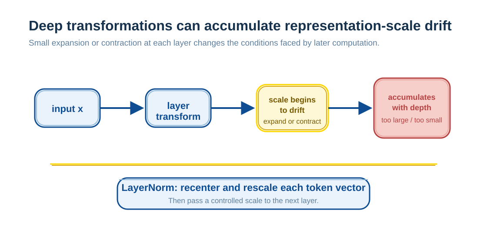
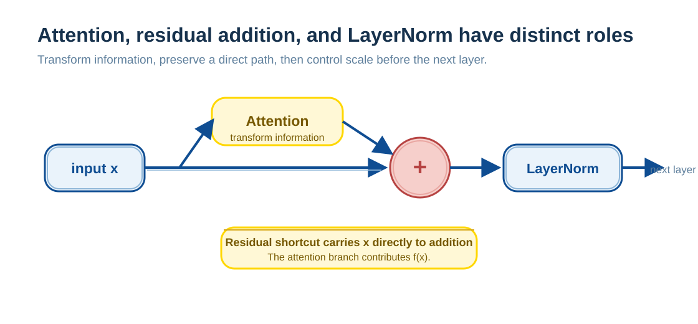

# LayerNorm: Keeping Representations Numerically Stable

Deep neural networks rarely fail because they cannot compute a single layer. They fail because, as layers accumulate, the scale of intermediate numerical values can drift out of control.

At a lower level, a neural network simply passes and transforms numbers layer by layer. The scale and distribution of intermediate values are common causes of unstable training, abnormal gradients, or failure to converge; data, initialization, optimizer choice, learning rate, and numerical precision also affect training.

> **The scale of intermediate values has become uncontrolled.**

LayerNorm exists to address this problem. It is not mainly about making outputs “look prettier”; it keeps each layer's representation in a stable numerical range so that later attention, residual paths, and nonlinear transformations continue to work under manageable conditions.

---

## What Is Normalization?

Start with an everyday example.

Suppose you want to compare scores from two examinations:

- One has a maximum score of 150.
- The other has a maximum score of 100.

You cannot directly compare a score of 120 with a score of 80, because their **scales differ**.

A more reasonable approach is to:

- subtracts the mean;
- then divides by the standard deviation.

The resulting value no longer depends on the original score range; it reflects only **relative level**—the mean is approximately 0 and the amount of variation is approximately 1.

This is the essential idea of normalization:

> **Use statistics from the current sample to recalibrate its scale, so values with different units can be compared.**

---

## Why Neural Networks Need Normalization

Return to neural networks. Their basic operation repeatedly applies a linear transformation:

$$
y = Wx + b
$$

If input $x$ has a slightly excessive scale and weights $W$ are not precisely constrained, output $y$ can readily become larger or smaller than $x$.

As the number of layers keeps increasing:

Even if every layer magnifies or shrinks values only slightly, activations can become:

- progressively larger (numerical explosion); or
- progressively smaller (numerical vanishing).

It resembles repeatedly photocopying an image: after enough copies, the image must distort.

This leads to a simple but important engineering intuition:

> **Can values be pulled back to a “normal range” between layers?**

That is why normalization methods exist in neural networks.

---

## What LayerNorm Normalizes

In a Transformer, each token at a layer is represented by a vector:

$$
x = (x_1, x_2, \dots, x_d)
$$

Together, these $d$ values describe the token's entire state at the current layer.

LayerNorm is explicit about its scope:

- **It does not inspect other tokens.**
- **It does not inspect the batch.**
- **It normalizes only the current token's own vector.**

Specifically, it computes mean and standard deviation across the feature (hidden) dimension:

$$
\mu=\frac{1}{d}\sum_{i=1}^{d}x_i
$$

$$
\sigma=\sqrt{\frac{1}{d}\sum_{i=1}^{d}(x_i-\mu)^2+\epsilon}
$$

It then standardizes and applies learnable per-feature scaling and shifting:

$$
\text{LN}(x)_i=\gamma_i\cdot\frac{x_i-\mu}{\sigma}+\beta_i
$$

The standardized vector has feature-wise mean near 0 and variance near 1. Per-feature $\gamma$ and $\beta$ can then change the output mean and scale again, allowing the model to learn a suitable representational range.

In one sentence:

> **LayerNorm normalizes each token's own vector, with no dependence on other tokens or the batch.**

---

## Why Transformers Can Become Numerically Unstable

Once normalization is understood, Transformer structure makes clear why attention, residual paths, and deep stacking require numerical scale and gradient propagation to be treated explicitly.

Three structural factors combine:

### 1. Attention Output Does Not Aim to Control Feature Scale

Attention output has the form:

$$
y_i=\sum_j \alpha_{ij} v_j
$$

After Softmax, the weights are nonnegative and sum to 1, so they form a weighted average of Value vectors. But the scale of Values, projection matrices, and later residual paths is not guaranteed here. Attention aims to **mix information**, not to adjust each layer's feature scale into a range suitable for the next layer.

### 2. Residual Connections Add Values Layer by Layer

Every Transformer layer has a residual structure:

$$
x_{l+1} = x_l + f(x_l)
$$

Residuals provide direct information and gradient paths, but also add a new transformation to the old representation. Without suitable initialization, normalization, or scaling, the numerical scale can drift with depth.

A common misunderstanding is to treat residuals as “stabilizers.” More precisely:

> **Residuals provide an information path; they do not provide numerical stability.**

### 3. Softmax Is Extremely Sensitive to Scale

The useful operating range of attention’s Softmax depends on its input scale:
- Input too large → nearly one-hot → gradients almost 0.
- Input too small → nearly uniform distribution → attention loses focus.

**Transformers combine attention's information mixing, residual numerical addition, and Softmax scale sensitivity. Normalization is an important means of making these modules work together stably, though not the only condition.**

---

## How LayerNorm Stabilizes Representations

LayerNorm's role can be summarized in one sentence:

> **At every layer, pull each token representation back to one stable statistical coordinate system.**

Its division of responsibilities in a Transformer can be understood in this diagram:

The three responsibilities are:

- **Attention manages information exchange.**
- **Residual manages information inheritance.**
- **LayerNorm manages numerical discipline.**

The diagram shows the classic **Post-LN** path: $\operatorname{LN}(x+F(x))$. Many modern language models use **Pre-LN**, $x+F(\operatorname{LN}(x))$, in which normalization occurs before the sublayer. The three components have the same responsibilities in both arrangements, but normalization placement and gradient-propagation characteristics differ; the diagram's order is not a fixed structure for every Transformer.

Direct effects of LayerNorm include:

- giving each layer a more controllable input scale;
- reducing the risk of representation scale drifting unchecked with depth;
- working with scaled dot products to keep Softmax usefully discriminative;
- improving conditions for gradient propagation in deep networks.

Thus:

> **LayerNorm is not a sufficient condition for a trainable Transformer, but it is a key component for stable deep training in many Transformer structures.**

---

## Why Transformers Usually Do Not Use BatchNorm

BatchNorm is often compared with LayerNorm. They both belong to the normalization family, but their suitable settings differ.

BatchNorm's central idea is:

> **Use statistics from all examples in a batch for normalization.**

This is common in CNNs. For Transformers' variable-length sequences and autoregressive inference, it is usually less convenient than LayerNorm:

**1. The batch itself is unstable**

- Sentences have different lengths.
- Padding is complex.
- Inference often runs with batch = 1.

**2. A token should not be forced to refer to other examples**

BatchNorm statistics make one token's values depend on other samples in the same batch (and on the implementation's statistical scope). This dependence is less natural with small batches, variable-length sequences, and single-request inference. LayerNorm instead computes along one position's feature dimension, using the same form in training and inference.

Typical Transformer LayerNorm neither looks at the batch nor mixes other tokens; it calibrates only the hidden features at the current position.

The difference in one sentence is:

> **BatchNorm finds scale in the “group”; LayerNorm calibrates “itself.”**

Transformers need the latter.

---

## Summary: LayerNorm's Place in a Layer

LayerNorm is not an added Transformer trick, but **a precise application of normalization to sequence modeling**:

- it uses the token as its basic unit;
- it does not depend on the batch;
- it does not confuse semantic interaction with numerical calibration.

It lets Transformers keep numerical values controllable, gradients transmissible, and attention learnable in very deep structures.
