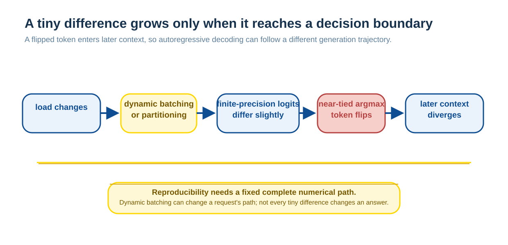
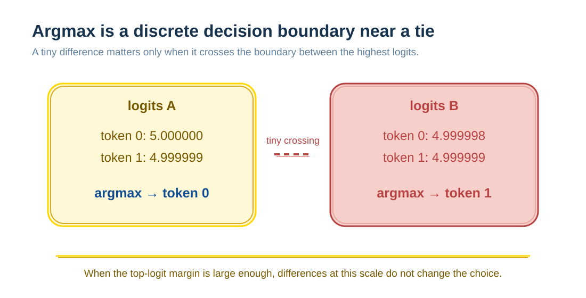

# Why LLM Inference Is Not Fully Deterministic

The same prompt, weights, and `temperature=0` can sometimes produce different output. To understand why, separate three questions: whether decoding samples randomly, whether one forward pass is deterministic, and whether an online service gives one request the same computational conditions each time.

This is usually not a model changing its mind. A throughput-oriented service can place a request in different batches, choose kernels for different shapes, or split a sequence differently. Finite-precision arithmetic can then move very close logits across a decision boundary; autoregressive generation carries that first difference forward.

## Sampling randomness and system nondeterminism

A model produces logits and a decoder selects a token.

- **Sampling** intentionally selects from a probability distribution.
- **Greedy decoding** usually selects the largest logit; many APIs implement `temperature=0` this way.
- **Temperature, top-k, and top-p** change a distribution or candidate set; randomness still depends on whether sampling occurs.

Temperature zero removes intentional sampling randomness. It does not, by itself, guarantee a stable response from a changing serving system.

## How serving conditions affect a token

Floating-point addition is not strictly associative. In theory:

$$
(a+b)+c=a+(b+c),
$$

but finite precision rounds at each step. Parallel computation often organizes reductions into different tree orders, and those orders can yield tiny differences.

With fixed hardware, software, input shape, and execution path, many common forward operators reproduce the same result. In an online service, however, “the same user request” is not the complete input: other requests in the batch, batch size, whether prefill is chunked, and how the KV cache is paged can all change kernel selection or reduction layout.

## Batch Invariance: The Key Boundary

A kernel has **batch invariance** when one sample's numerical result does not change with the number or position of other samples in the batch. Thinking Machines' experiments show that many LLM forward kernels can be deterministic when the same complete batch is repeated, yet not invariant to batch shape; dynamic batching can therefore make an individual user observe nondeterminism.

This is more precise than saying that GPU parallelism is inherently random. GPU parallelism and floating-point rounding are conditions; the question to examine is whether a service lets a request encounter batch or chunking conditions that change its numerical path.

In that study's particular implementation, reduction-heavy computations such as RMSNorm, matrix multiplication, and attention required attention. They are not the only risk points in every inference system, and this does not imply that any vLLM or TensorRT deployment is necessarily nondeterministic.

## Why a Tiny Difference Can Become a Completely Different Answer

`argmax` is a boundary from continuous scores to a discrete token. If the top two candidates are very close:

The difference itself is tiny, but the choice differs. Once the new token enters context, the next distribution changes as well, and the final text can diverge substantially. Conversely, when the largest logit has a sufficient margin, numerical differences of the same scale do not change the result; nondeterminism does not occur on every request.

## How to Obtain Reproducible Results

The goal should be stated first:

| Goal | Conditions to control |
| --- | --- |
| Stable results within one service period | Fix decoding, model, and tokenizer; reduce or eliminate numerical paths dependent on batching or chunking |
| Reproducible offline experiments | Record weights, data, random seeds, quantization, hardware, drivers, runtime, and serving configuration |
| Traceable online behavior | Preserve request version, model version, decoding parameters, tool environment, result, and trace |

Batch-invariant kernels are one possible approach. They require each sample to use a consistent numerical reduction strategy across batch conditions, usually at the cost of some dynamic scheduling or peak performance. In experiments with a particular Qwen3-235B-A22B setup, prompt, and deployment implementation, Thinking Machines reported 80 distinct results from 1,000 greedy completions under default settings; after enabling its batch-invariant kernels, those 1,000 completions matched. This demonstrates one feasible engineering path, not a general performance promise for every model, hardware stack, or service.

## What This Means for Training and Evaluation

Reinforcement learning and rigorous evaluation need to distinguish a theoretical policy from the actual sampling system. If serving conditions change a greedy choice, the sampling distribution may depart from training assumptions; that introduces noise into on-policy analysis, regression comparisons, and failure reproduction. It does not automatically prove that training has failed, nor can one KL value alone establish that an entire system is identical.

In practice, first fix controllable variables and record the uncontrollable ones. Only when a task genuinely requires strong determinism within one deployment period should the performance cost of batch-invariant kernels, fixed scheduling, or deterministic modes be evaluated.

## Summary

`temperature=0` removes deliberate sampling randomness; by itself, it cannot guarantee consistent online output. One fixed computation path can be deterministic, while a service experienced by an individual user can still be nondeterministic because of dynamic batching and finite precision. Understanding this boundary separates “model randomness” into measurable and governable questions of decoding, numerics, and serving.

**Reference:** [Defeating Nondeterminism in LLM Inference](https://thinkingmachines.ai/blog/defeating-nondeterminism-in-llm-inference/)
