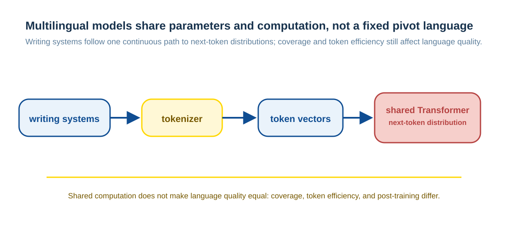

# Multilingual LLMs: How Languages Share Representations and Capabilities

When a user asks a question in Chinese, does a model first translate it into English, reason, and translate it back? In a typical end-to-end multilingual LLM, there is usually no identifiable internal pipeline of Chinese text to English text and back. The model tokenizes the input and uses one parameter set to predict the next token; its internal states are continuous vectors, not sentences in a hidden natural language.

That does not make languages equivalent. Training coverage, tokenization, post-training, and task type determine how well a language works in practice.

## From Characters to a Shared Model

Multilingual training places material in many languages under the same training objective. A model does not need to translate every example into English first; it directly predicts later tokens in each language's token sequence. Shared parameters make languages compete for representational capacity, while allowing reusable patterns—such as entity relations, code structure, and common question-answer forms—to transfer across languages.

“Shared representation space” is a useful summary, but it should not be read as a fixed language-neutral vector for every meaning. Representations vary with context, layer, position, and task; a model can also retain features associated with a language, script, or style.

## Where Cross-lingual Alignment Comes From

Alignment usually comes from several complementary signals:

| Signal | What it provides |
| --- | --- |
| One model processing many languages | Encourages parameter reuse and supports cross-lingual transfer |
| Parallel text, translations, and bilingual pages | Directly associates two expressions |
| Shared entities, code, numbers, symbols, and web material | Supplies anchors across languages |
| Similar tasks and contextual structures | Lets a model learn transferable processing patterns |

Cross-lingual ability therefore neither comes only from translation pairs nor appears automatically from monolingual data alone. Data proportions and training methods differ by model and are not public in full, so no fixed percentage can explain every system.

## Why Output Cannot Reveal an “Internal Language”

Some products show English reasoning text or produce English retrieval queries. At most, that shows that the product's reasoning presentation, tool chain, or training preference uses English; it does not prove that the model internally translates every Chinese question into English first. Conversely, direct Chinese output does not prove that all intermediate representations are “Chinese thinking.”

For an internal state that cannot be directly observed, behavioral comparisons are more reliable: whether cross-lingual transfer exists, how errors change between translation and original-language input, and whether token cost or retrieval material in different languages changes the result.

## Why Language Capabilities Are Uneven

English occupies a large share of many public corpora, benchmarks, development materials, and tool documents, so it often has broader coverage; the pattern varies with the model, domain, and language. More specific limits include:

- **Training coverage:** Low-resource languages, specialist terminology, or local variants may have fewer examples.
- **Token efficiency:** The same content can consume different token counts under different tokenizers, affecting context capacity and cost.
- **Post-training and evaluation:** Instruction data, preference data, and safety evaluation biased toward one language can tilt behavior in that direction.
- **External systems:** Language coverage in retrieval corpora, tool interfaces, and knowledge bases affects the whole application, not only the model.

Thus, “English is always stronger” and “languages no longer differ” are both unreliable rules.

## Which Language a Prompt Should Use

Start with the language of the user and business material, then evaluate the target task directly. If results are unstable, treat language itself as an experimental variable:

1. Use the original language for input and output.
2. Test bilingual instructions while preserving the original material.
3. Test translated reasoning and back-translation only where they have demonstrated value.
4. Compare correctness, citations, latency, token cost, and user readability.

An English prompt with Chinese output can help a particular model, source corpus, or historical version; it is not a universal shortcut to quality. Translation can also lose terminology, ambiguity, and local context.

## Summary

Multilingual LLMs do not mechanically translate every input into English before working. They train on token sequences in many languages and form transferable, but not fully unified, representations through shared parameters. Language choice is an engineering variable shaped jointly by data, tokenization, the model, and external material; the most reliable conclusions come from direct evaluation of the target language and task.

## Further reading

- [mT5](https://arxiv.org/abs/2010.11934)
- [BLOOM](https://huggingface.co/bigscience/bloom)
- [XGLM](https://arxiv.org/abs/2201.10005)
