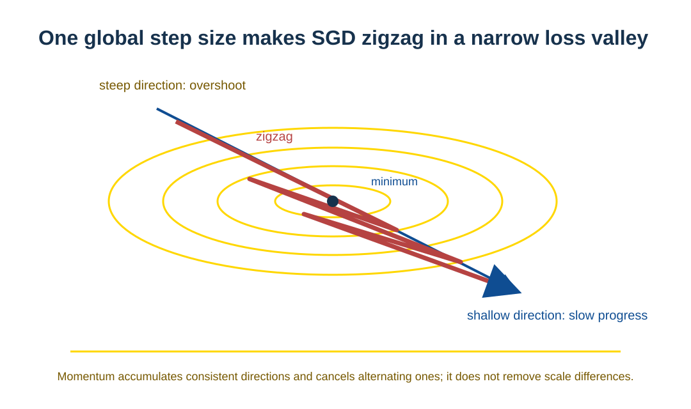
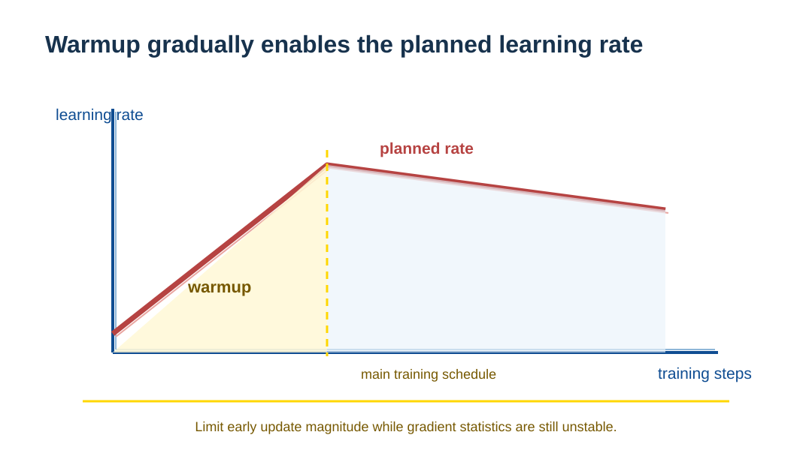
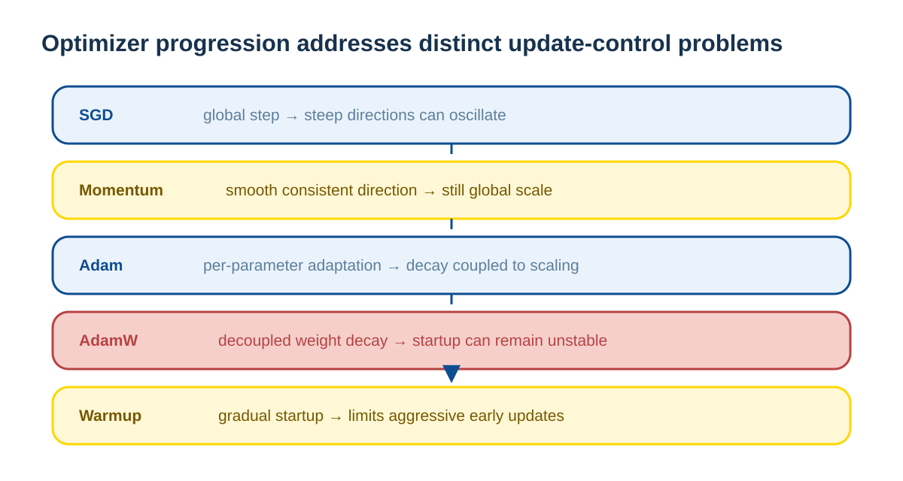

# Optimizers: How Gradients Become Parameter Updates

> A complete evolutionary path around “how gradients are used correctly.”

---

## What an Optimizer Must Solve: Direction Also Needs Step Size

Training a neural network is fundamentally an optimization problem:

$$
\min_{\theta} L(\theta)
$$

Backpropagation supplies the gradient $g_t = \nabla_\theta L(\theta_t)$, which indicates the direction of steepest loss descent.

**But a gradient alone cannot answer three key questions:**

1. **How fast should it move?** — choosing a learning rate.
2. **Should different parameters update at different speeds?** — the need for adaptivity.
3. **How can it remain stable in noisy, non-stationary conditions?** — the need for robustness.

The history of optimizers evolves around these questions.

---

## SGD: The Simplest Update Rule

### 2.1 SGD Update Rule

$$
\theta_{t+1} = \theta_t - \eta \cdot g_t
$$

It carries a strong assumption: **all parameters have similar geometry and can use one learning rate.**

### 2.2 SGD's Structural Limitation

In high-dimensional non-convex optimization, the normal condition for deep networks:

- **Gradient scales differ greatly by direction:** some directions are steep and others shallow.
- **One step size causes oscillation:** it is too large along steep directions and too small along shallow ones.

Intuitively, this is a contour plot of the loss function:

**The core problem:** the step size treats every direction equally.

---

## Momentum: Smooth Oscillation with Inertia

### 3.1 Introduce Historical Information

$$
\begin{aligned}
v_t &= \mu v_{t-1} + g_t \\
\theta_{t+1} &= \theta_t - \eta v_t
\end{aligned}
$$

The physical analogy is a rolling ball: it accelerates along the main direction while contributions in oscillating directions cancel one another.

### 3.2 Improvements and Limits

✅ **Improvement:** smooths update direction and accelerates convergence along consistent directions. 
❌ **Limit:** still uses one learning rate and cannot resolve scale differences among parameters.

Momentum improves **directional stability**, but does not solve **the appropriateness of step size**.

---

## Adam: Parameter-Level Adaptive Learning Rates

### 4.1 Core Innovation: Every Parameter Has Its Own Effective Learning Rate

Adam maintains two kinds of statistics.

**First moment** (exponential moving average of gradients):

$$
m_t = \beta_1 m_{t-1} + (1-\beta_1) g_t
$$

**Second moment** (exponential moving average of squared gradients):

$$
v_t = \beta_2 v_{t-1} + (1-\beta_2) g_t^2
$$

### 4.2 Adaptive Update Rule

$$
\theta_{t+1} = \theta_t - \eta \cdot \frac{\hat{m}_t}{\sqrt{\hat{v}_t} + \epsilon}
$$

(Here $\hat{m}_t$ and $\hat{v}_t$ are bias-corrected estimates.)

**Key mechanism:**

- A parameter with persistently large gradients → larger denominator → automatically smaller effective step.
- A parameter with sparse or smaller gradients → smaller denominator → relatively larger effective step.

This is an adaptive first-order method based on the first moment of gradients and second moment of squared gradients. Its “second moment” is not a Hessian, so Adam is not equivalent to second-order optimization.

### 4.3 Why Do Transformers Especially Need Adam?

Transformer parameter structure is highly heterogeneous:

| Parameter type | Gradient characteristic |
| --- | --- |
| Embedding | Input lookup often produces sparse updates; if weights are tied to the output layer or a full Softmax is computed, gradients can also become dense |
| Q/K/V projection matrices | Distribution varies with attention weights |
| FFN weights | Relatively stable but at different scales |
| LayerNorm parameters | Small in scale but critical, requiring different update speeds |

**Two core challenges:**

1. **Gradient-scale heterogeneity:** gradient magnitudes can differ by orders of magnitude across modules.
2. **Training non-stationarity:** attention patterns continue to evolve during training, so gradient distributions change with them.

SGD's one learning rate is fragile in this setting; Adam's adaptive mechanism can **dynamically adjust every parameter's learning speed**.

---

## AdamW: Decoupled Weight Decay

### 5.1 The Risk of Adam Plus L2 Regularization

Traditional L2 regularization adds a penalty to the loss:

$$
L' = L + \frac{\lambda}{2}\|\theta\|^2
$$

In Adam, the regularization gradient $\lambda\theta$ is scaled by the second-moment statistic $\sqrt{\hat{v}_t}$, causing:

- **actual regularization strength to differ among parameters**;
- departure from weight decay's original meaning as “parameter shrinkage.”

### 5.2 AdamW's Decoupling Strategy

$$
\theta_{t+1} = \theta_t - \eta \cdot \frac{\hat{m}_t}{\sqrt{\hat{v}_t} + \epsilon} - \eta \lambda \theta_t
$$

**The key change:** separate weight decay from gradient calculation and apply it directly to parameters.

**Effects:**

- Parameters in the same weight-decay parameter group receive a consistent decay ratio; in practice biases and normalization parameters are often excluded from that group.
- More stable generalization performance.
- Better suited to large-scale Transformer models.

---

## Warmup: Addressing Non-Stationarity at the Start of Training

### 6.1 The Special Challenge at Training Start

At the beginning of training:

- Parameters are randomly initialized and attention patterns have not formed.
- Gradient distributions are highly unstable, with large variance.
- Adam's second-moment estimate $\hat{v}_t$ has not converged to a reliable value.

Using the full learning rate then can lead to:

- excessively large updates for some parameters;
- a training trajectory entering an unfavorable local region;
- even numerical instability such as exploding gradients.

### 6.2 The Warmup Strategy

Over the first $N$ steps, the learning rate grows linearly from near 0 to its target $\eta$:

### 6.3 What Warmup Fundamentally Does

**It does not improve the statistics themselves; it reduces reliance on unreliable statistics:**

- limits early update size and gives the model time to warm up;
- avoids aggressive updates while gradient distributions fluctuate strongly;
- supplies a stable initialization path for attention structures to form.

This is an engineering protection mechanism for **the high non-stationarity at the start of training.**

---

## The Evolutionary Logic from SGD to AdamW

This is not a simple accumulation of tricks, but **layered solutions to structural difficulties in deep-learning training.**

---

## Summary: How Optimizers Constrain Updates

### Essence One: Gradient Direction ≠ a Reasonable Update Magnitude

Gradients tell us only “which way to go,” but:

- parameters differ in sensitivity;
- reliability differs by training stage;
- **parameter-level adaptive adjustment** is needed.

### Essence Two: Transformer Training Is Highly Non-Stationary

- Attention patterns move from disorder to order.
- Gradient distributions change as the structure evolves.
- A mechanism must **dynamically adapt to changing gradient statistics.**

### Essence Three: Modern Optimizers Are More “Humble,” Not More “Clever”

- SGD assumes a simple world: all parameters are homogeneous.
- Adam acknowledges a complex world: parameters have different scales.
- Warmup acknowledges limited knowledge: early statistics are unreliable.
- AdamW acknowledges the need for decoupling: optimization and regularization are distinct goals.

---

## Key Takeaways

> **The difficulty of Transformer optimization is not “which direction to take,”**
> **but:**
> - **Who should move how fast?** → Adam's adaptive mechanism.
> - **How can regularization avoid interfering with optimization?** → AdamW's decoupling.
> - **When can training proceed at full speed?** → Warmup's gradual strategy.
>
> **These three are common Transformer training ingredients; whether and how to use them still depends on the model, data, scale, and training objective.**
