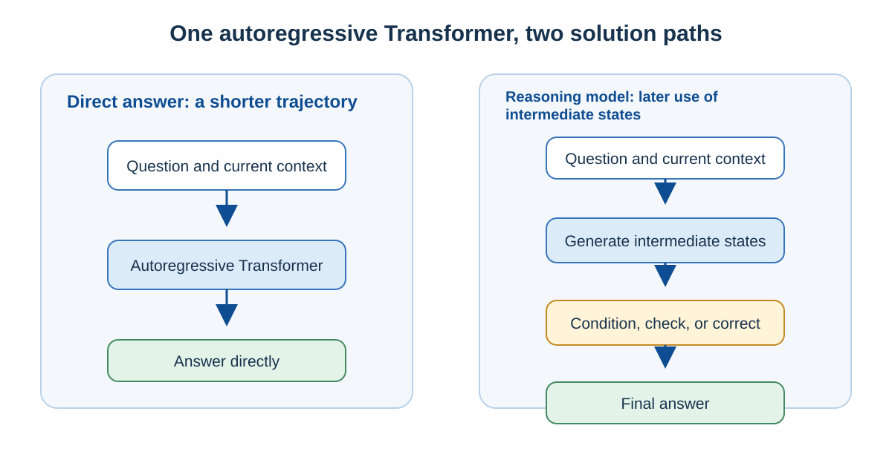
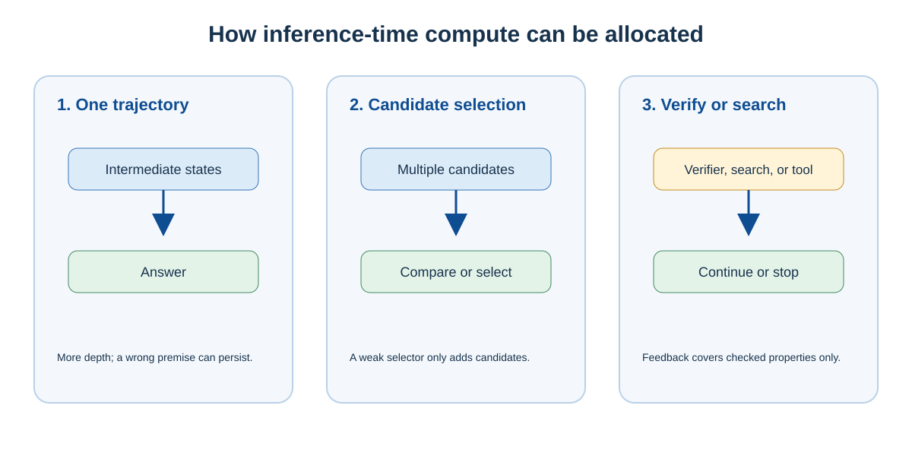
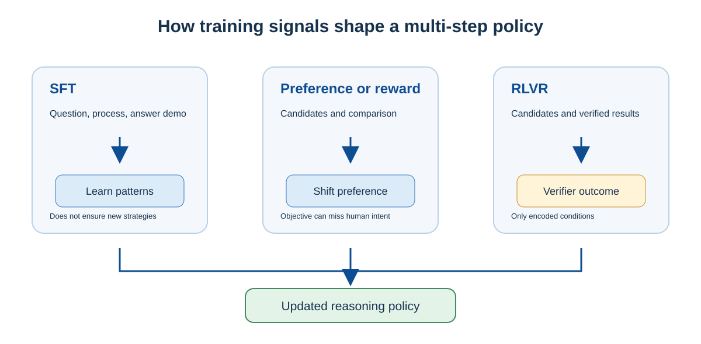

# Reasoning Models: How Multi-Step Reasoning Improves Complex Problem Solving

The same Transformer can face a difficult question in two ways: it can continue quickly to an answer, or it can first decompose conditions, try paths, check a result, and then decide what to do next. The latter does not add a new network architecture. Training makes the model better able to use intermediate processes, while the runtime system provides an additional reasoning budget for the problem at hand. Language models that more often generate and use intermediate processes on difficult tasks are commonly called **reasoning models**.

The problem a reasoning model addresses is not “how to make a model talk longer.” It is how to turn one prediction into a problem-solving process that can check and revise itself. This chapter explains how model generation, training, and inference-time computation jointly create that ability. When a model begins to call external tools and change an environment, the problem extends into the Agent systems of part three.

## Reasoning Models Are Still Autoregressive Transformers

Most reasoning models still generate one token at a time:

$$
P_\theta(x_t \mid x_{<t})
$$

Here, $x_{<t}$ is the question together with every token generated so far. Each generated token enters the context for the next step; the same Transformer parameters process that longer context again to predict the next token. A multi-step process therefore does not require a separate “thinking module” alongside the model.

“Reasoning model” and “ordinary model” are not an absolute binary either. An ordinary model can write steps when given an appropriate prompt, and a reasoning model can answer an easy question directly. The more accurate distinction concerns training objectives and runtime policy: on difficult tasks, reasoning models more often choose decomposition, comparison, checking, and correction, and reserve a computation budget for those operations.

## How Intermediate Tokens Become a Workspace

A complex problem often cannot reliably jump from question to answer in one step. If a model writes conditions, subproblems, or a candidate conclusion into context first, its next prediction can explicitly condition on those intermediate states. For example, on a problem with several constraints, a trajectory can write “conditions A and B” → “candidate C” → “C violates B” → “try candidate D.” Each step lets the next one read conditions and checking results already established. Intermediate tokens serve as a serialized workspace that later computation can read.

This mechanism creates both benefit and risk. Correct intermediate states reduce uncertainty in later steps; a mistaken premise is also preserved and can continue to influence generation. The value of a generated process is therefore not that it “has steps,” but that its steps help establish, test, or revise useful states.

Chain of Thought (CoT) is one observable kind of intermediate trajectory in a solution. The [original CoT study](https://arxiv.org/abs/2201.11903) found that demonstrations containing intermediate steps can improve large-model performance on some arithmetic, commonsense, and symbolic-reasoning tasks. CoT is not the definition of reasoning: requiring a `<thinking>` tag does not automatically create an effective strategy, and fluent text neither proves every step correct nor fully reveals internal computation. Layerwise representation transformations in Attention, MLPs, and other components remain where the neural-network computation takes place.

## How Inference-Time Compute Can Buy Higher Success Rates

One visible property of reasoning models is a willingness to spend more **inference-time compute** (also called test-time compute) on one problem. This does not temporarily add Transformer layers. Extending a trajectory usually adds decode-stage forward passes, latency, and cost; selecting candidates, using a verifier, or receiving tool feedback also adds the corresponding selection, verification, or external-environment computation. A KV cache reuses Keys and Values for an already processed prefix; each new position still requires computation and reads accessible historical state. [LLM Generation: From Input to the Next Token](llm-generation.md) explains that runtime path in detail.

Extra computation can be used in different ways, so output-token count is not enough to measure it:

| Allocation | What the model does in addition | Main failure mode |
| --- | --- | --- |
| Extend one trajectory | Continues to maintain and transform one sequence of intermediate states | Travels farther from a mistaken premise or produces redundant steps |
| Generate multiple candidates, then select | Increases coverage and compares answers or paths | Without a reliable selector, only the number of candidates grows |
| Search, verify, or use tool feedback | Tests partial paths or obtains new information from an environment | Verifiers and tools guarantee only properties they actually cover |

Thus, “thinking longer” can improve success only when the extra computation is allocated effectively. Problem difficulty, the model’s existing capability, candidate quality, verification method, and stopping rule all change the appropriate strategy. [Research on optimal test-time-compute allocation](https://arxiv.org/abs/2408.03314) compares search and adaptive strategies under different prompt difficulties; it does not equate generated length with capability.

## How Training Teaches the Model to Use These Steps

More room for generation does not turn into problem-solving ability by itself. Training must establish a stable connection between how intermediate processes are generated and whether a task is completed. Three common signals have distinct roles:

| Training signal | Feedback to the model | What it primarily teaches | Boundary |
| --- | --- | --- | --- |
| SFT | High-quality demonstrations of questions, processes, and answers | Existing decompositions, formats, and basic steps | Does not ensure discovery of an effective unseen strategy |
| Preference or reward training | Relative preferences or scores among candidates | Output behavior favored by an evaluation objective | The evaluation objective is not complete human intent |
| RLVR | Verifiable results such as numbers, tests, or proof checks | Task-completing paths reinforced by outcome signals | Properties not encoded in the verifier have no guarantee |

Reinforcement learning (RL) does not require a model to emit one fixed tag. It updates parameters from the scores of candidate trajectories: if decomposition, checking, or changing approach more often earns high scores on the training distribution, those behaviors are reinforced. RLVR abbreviates Reinforcement Learning with Verifiable Rewards. Mathematical answers, code tests, and formal-proof checks can provide comparatively clear outcome signals, which makes them especially suitable for this route.

Verifiable results do not make an entire process correct. Tests can miss edge conditions, and a model can find a shortcut that passes a check without satisfying the real intended objective. This is a gap between the reward function and the true goal, not a consequence of whether the model displays a reasoning trace. [DeepSeek-R1](https://arxiv.org/abs/2501.12948) illustrates that reinforcement learning can incentivize patterns such as verification, reflection, and strategy adaptation; it is a training example, not a recipe every reasoning model must reproduce.

## Visible CoT, Distillation, and Agents Belong to Different Layers

Visible CoT is a linguistic intermediate trajectory, not a complete transcription of a model’s internal activations. A product can display a full process, a processed summary, or only an answer; those interface choices do not alter the token-generation mechanism described above.

A reasoning trajectory can also be a distillation signal, but distillation is not copying a complete CoT. A teacher can provide final answers, shortened processes, multiple candidates, verification results, tool trajectories, or rewards. A student learns behavior that its capacity and training distribution allow it to represent. [Fine-Tuning and Distillation as Function Approximation](fine-tuning-and-distillation.md) explains that approximation relationship.

A reasoning model mainly spends extra computation in text, candidate, and verification spaces. A system enters the Agent problem space only when it can also call tools, observe external results, update state, and continue acting. At that point, reliability depends not only on the model’s reasoning process but also on permissions, environment isolation, stopping rules, and validation of the external result. For this loop, continue with [How LLMs Interact with the External World](../part3-llm-external/llm-external-interaction.md) and [Harnesses, Agent Runtimes, and Skills](../part3-llm-external/harness-runtime-skills.md).

## Summary

Reasoning models are usually still autoregressive Transformers. By leaving intermediate tokens in context, they let the same model turn a complex task into states that can be computed on and checked; training then teaches when to decompose, compare, verify, or revise. Spending more computation at inference time can improve complex-task success, but length is not capability and a verifier guarantees only the conditions it covers. These points make reasoning models understandable as a problem-solving approach constrained by learned policy and compute budget, rather than as a mysterious independent “thinking organ.”

## Further Reading

- [LLM Generation: From Input to the Next Token](llm-generation.md)
- [How Models Acquire Their Capabilities Through Training](model-training-lifecycle.md)
- [Fine-Tuning and Distillation as Function Approximation](fine-tuning-and-distillation.md)
- [How LLMs Interact with the External World](../part3-llm-external/llm-external-interaction.md)
- [Chain-of-Thought Prompting](https://arxiv.org/abs/2201.11903)
