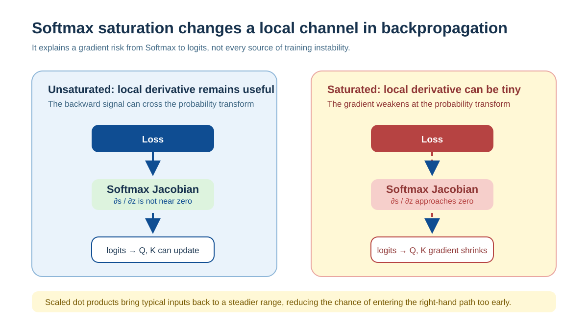
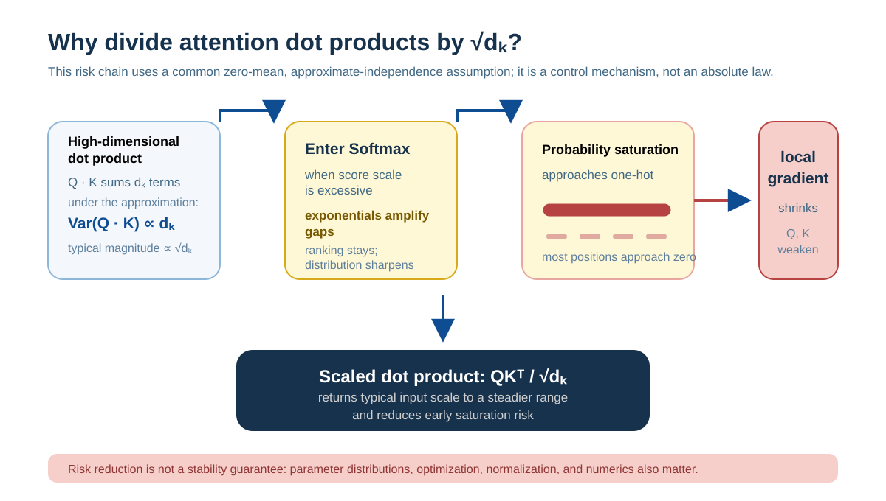

# Scaled Dot Products: Why Softmax Gradients Become Extreme

## Background: Why Attention Scores Need Scaling

Transformer attention uses this classic expression:

$$
\text{Attention}(Q,K,V) = \text{softmax}\left(\frac{QK^\top}{\sqrt{d_k}}\right)V
$$

When people first see it, they often ask:

* Why does attention use a dot product to measure relevance?
* Why is the dot product followed by a softmax?
* **Most importantly, why is it usually divided by $\sqrt{d_k}$?**

Treating this only as an empirical formula leaves attention understood at a surface level. This scaling term controls the typical scale that grows with dot-product dimension and prevents Softmax from entering an overly concentrated regime too early in training.

---

## The Role of Softmax and Its Sensitivity to Scale

Softmax is defined as:

$$
s_i = \frac{e^{z_i}}{\sum_j e^{z_j}}
$$

It maps real-valued scores to a probability distribution. But Softmax has an important property:

> **Softmax is extremely sensitive to the overall scale of its input.**

With moderately sized inputs, Softmax produces a relatively smooth distribution; when the whole input becomes larger, its output quickly becomes extreme.

### A Simple Numerical Example

**Case 1: a moderate input scale**

```
Input: z = [1, 0]
Output: softmax(z) ≈ [0.73, 0.27]
```

Both positions retain noticeable probability, so the model still preserves uncertainty.

---

**Case 2: a larger input scale**

```
Input: z = [10, 0]
Output: softmax(z) ≈ [0.9999, 0.0001]
```

The Softmax output is now almost equivalent to the **one-hot distribution** `[1, 0]`.

Exponentiation turns a linear gap into an exponential one. As soon as the overall input scale grows, the Softmax output rapidly collapses toward an extreme.

---

## Why Dot Products Make Attention Scores Larger

In attention, Softmax receives the dot product of the query and key vectors:

$$
z = QK^\top
$$

For one query–key pair, this score is:

$$
z = \sum_{i=1}^{d_k} q_i k_i
$$

To explain the statistical motivation for scaling, it is common to use an idealized initialization-stage approximation:

* Each $q_i$ and $k_i$ is independent.
* Their mean is 0.
* Their variance is 1.

### Deriving the Dot-Product Variance

Under these assumptions, for each term $q_i k_i$:

* Mean: $\mathbb{E}[q_i k_i] = \mathbb{E}[q_i] \cdot \mathbb{E}[k_i] = 0$
* Variance: $\text{Var}(q_i k_i) = \mathbb{E}[(q_i k_i)^2] \approx 1$

When $d_k$ independent terms are added:

$$
\text{Var}(z) = \text{Var}\left(\sum_{i=1}^{d_k} q_i k_i\right) = \sum_{i=1}^{d_k} \text{Var}(q_i k_i) = d_k
$$

Therefore, the standard deviation is:

$$
\sigma(z) = \sqrt{d_k}
$$

> **Key conclusion: the typical numerical scale of a dot product is proportional to $\sqrt{d_k}$.**

Under these assumptions, this is neither an implementation detail nor an accident: it is the statistical result of a high-dimensional dot product. Trained Q/K distributions are affected by projection weights, correlations, and model structure, so they need not satisfy these conditions exactly.

### A Concrete Numerical Example

| Dimension $d_k$ | Dot-product standard deviation $\sqrt{d_k}$ | Typical dot-product range |
|-----------|------------------------|------------|
| 64        | 8                      | [-16, 16]  |
| 128       | 11.3                   | [-23, 23]  |
| 512       | 22.6                   | [-45, 45]  |

When $d_k = 512$, dot products can reach ±45, which severely saturates Softmax.

---

## The Gradient Structure of Softmax

Softmax is a **vector-to-vector** function:

* Input: $z = [z_1, z_2, \ldots, z_n]$
* Output: $s = [s_1, s_2, \ldots, s_n]$

When both input and output are vectors, we need to describe:

> **How does a small change in one input component affect every output component?**

The complete table of these partial-derivative relationships is called the **Jacobian matrix**:

$$
J_{ij} = \frac{\partial s_i}{\partial z_j}
$$

### The Specific Form of the Softmax Jacobian

For Softmax, the Jacobian has the explicit form:

$$
\frac{\partial s_i}{\partial z_j} = \begin{cases}
s_i(1 - s_i) & \text{if } i = j \\
-s_i s_j & \text{if } i \neq j
\end{cases}
$$

**Key observations:**

* When $s_i \approx 1$ (saturation), $s_i(1-s_i) \approx 0$.
* When $s_i \approx 0$, $s_i s_j \approx 0$.

> **Gradient magnitude is controlled directly by the output probabilities themselves.**

---

## Softmax Saturation: How the Output Distribution Changes

### Comparison: Moderate Scale vs. Large Scale

**At a moderate input scale (for example, $z = [2, 1, 0, -1]$):**

![Softmax at a moderate scale: logits [2, 1, 0, −1] produce probabilities [0.52, 0.28, 0.14, 0.06], which remain spread over four positions.](../../../../assets/en/diagrams/softmax-gradient-scaling/saturation-comparison.svg)

In this state, several positions have nonzero probability and the output remains sensitive to changes in the input.

---

**At a larger input scale (for example, $z = [20, 10, 0, -10]$):**

![Softmax at a large scale: logits [20, 10, 0, −10] concentrate almost all probability at the first position, creating saturation.](../../../../assets/en/diagrams/softmax-gradient-scaling/saturation-comparison.svg)

Now almost all probability mass is concentrated at one position, and every other probability is compressed toward zero.

This transition from a “smooth distribution” to an “extreme distribution” is called **Softmax saturation**.

---

## How Gradients Become Small at Softmax

In backpropagation, gradients follow the chain rule:

$$
\frac{\partial L}{\partial z} = \frac{\partial L}{\partial s} \cdot \frac{\partial s}{\partial z}
$$

### Unsaturated State: Gradients Propagate Normally



---

### Saturated State: Gradients Are Cut Off


> **Softmax saturation substantially weakens gradients at this local operation; it is not the only source of gradient attenuation in a deep network.**

This is a vanishing-gradient problem with a very specific location.

---

## The Causal Chain from Dot Product to Smaller Gradients

Putting the preceding pieces together gives a complete causal chain:



**The essence of the problem is that the dot product makes Softmax enter its saturation range too early, causing gradients to vanish.**

---

## Why This Is Not Gradient Explosion

This phenomenon is sometimes mistaken for gradient explosion, but their mechanisms are entirely different.

### Gradient Explosion vs. Gradient Vanishing

| Property | Gradient explosion | The problem discussed here |
|------|---------|--------------|
| Gradient magnitude | Tends toward infinity | Tends toward zero |
| Cause | Product of derivatives > 1 | Softmax saturation makes ∂s/∂z ≈ 0 |
| Numerical stability | Numerical overflow | Numerical underflow |
| Training behavior | Parameter oscillation, NaN | Parameters stop updating |

**Key difference:**

Softmax gradients are controlled by their output probabilities, specifically $s_i(1-s_i)$ and $s_i s_j$. Since $s_i \in [0,1]$, these local Jacobian terms are numerically bounded; increasing input scale cannot make this local derivative arbitrarily large.

The Softmax Jacobian is non-expansive in the $\ell_2$ norm; what matters here is that it approaches zero as input scale grows. Since the Jacobian mixes components, this does not mean that every individual gradient component can never grow.

Therefore the problem is not uncontrolled gradient growth, but systematic gradient compression and eventual disappearance.

---

## Scaled Dot-Product Attention: The Solution

Since the root cause is that dot-product variance is proportional to dimension ($\text{Var}(z) = d_k$), the most direct solution is to scale the dot product:

$$
z = \frac{QK^\top}{\sqrt{d_k}}
$$

### Statistical Properties after Scaling

After scaling, dot-product variance becomes:

$$
\text{Var}\left(\frac{QK^\top}{\sqrt{d_k}}\right) = \frac{\text{Var}(QK^\top)}{d_k} = \frac{d_k}{d_k} = 1
$$

**Effects:**

* Keeps the typical dot-product scale at a constant order (independent of dimension).
* Prevents Softmax from entering saturation too early.
* Preserves the output's sensitivity to input changes.
* Allows gradients to continue flowing back to Q and K.

This step is **variance normalization**.

---

## Why Scale by the Square Root of Key Dimension

### Comparing Three Scaling Choices

| Scaling choice | Dot-product variance | Softmax behavior | Problem |
|---------|---------|-------------|------|
| No scaling | $d_k$ | Saturates quickly | Vanishing gradients |
| Divide by $d_k$ | $1/d_k$ | Too uniform | Weak discrimination; every position has similar probability |
| Divide by $\sqrt{d_k}$ | $1$ | Stable typical scale, easier to learn | Standard choice |

### An Intuitive Explanation

* **No scaling:** dot-product variance grows linearly with $d_k$, so Softmax saturates quickly.
* **Divide by $d_k$:** this overcorrects. The variance becomes $1/d_k$ and, when $d_k$ is large, makes all attention weights too uniform, losing the point of “attention.”
* **Divide by $\sqrt{d_k}$:** under the approximation above, this normalizes variance to 1 and avoids systematically increasing the typical scale with dimension. Learned projections can still make actual attention sharp or smooth.

This shares the statistical idea behind Xavier initialization and LayerNorm: **keep signal variance propagating stably through a network.**

---

## Summary

An overly large dot product does not make Softmax's local Jacobian arbitrarily larger; instead, it makes Softmax saturate too early. Once the output distribution becomes extreme, gradient terms in its Jacobian approach zero, substantially weakening learning signals passed through this operation to Q and K.

Under the statistical approximation above, introducing $\sqrt{d_k}$ normalizes dot-product variance from $d_k$ to 1, preventing growth in dimension from systematically increasing Softmax's typical input scale.

This is a carefully designed mathematical solution with a clear statistical rationale.
