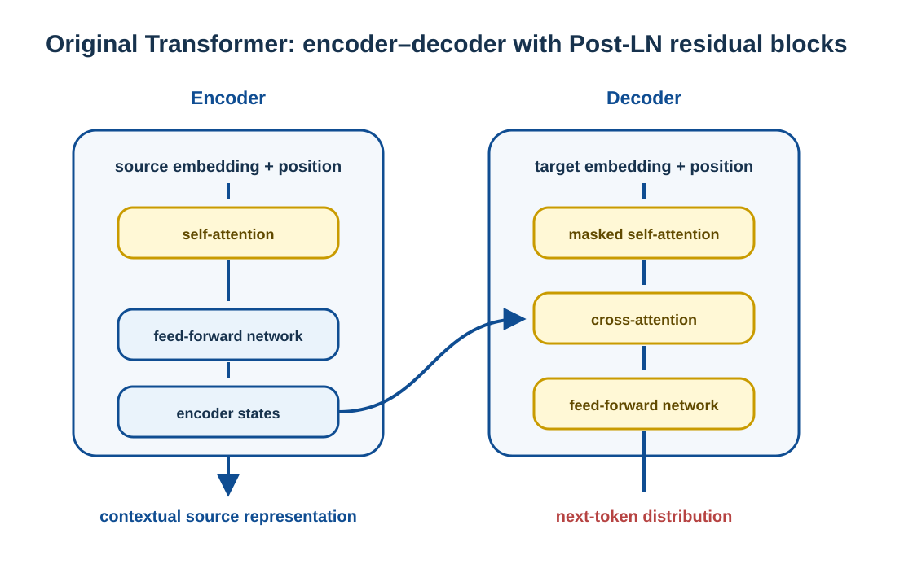
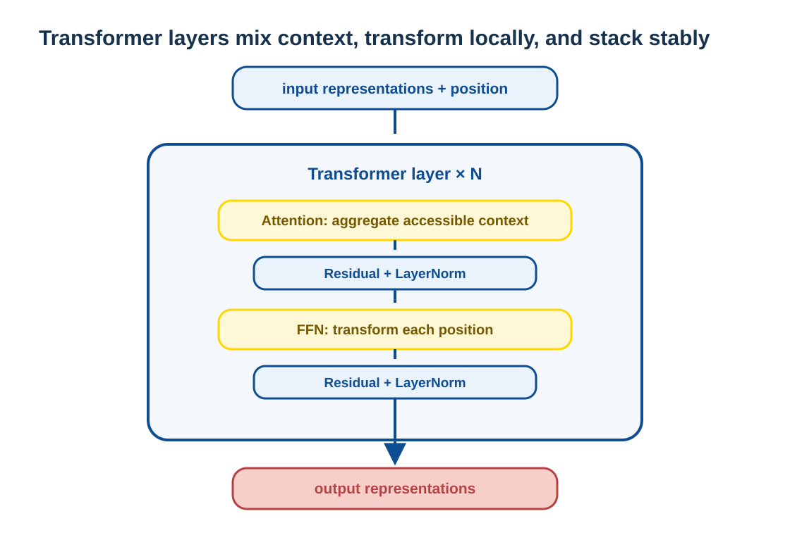
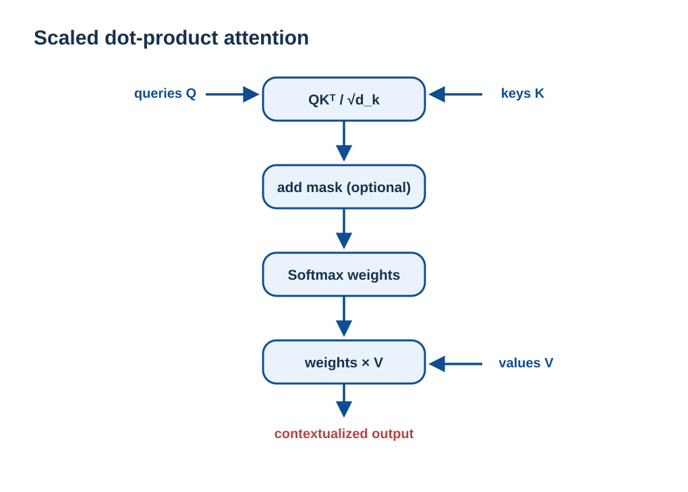
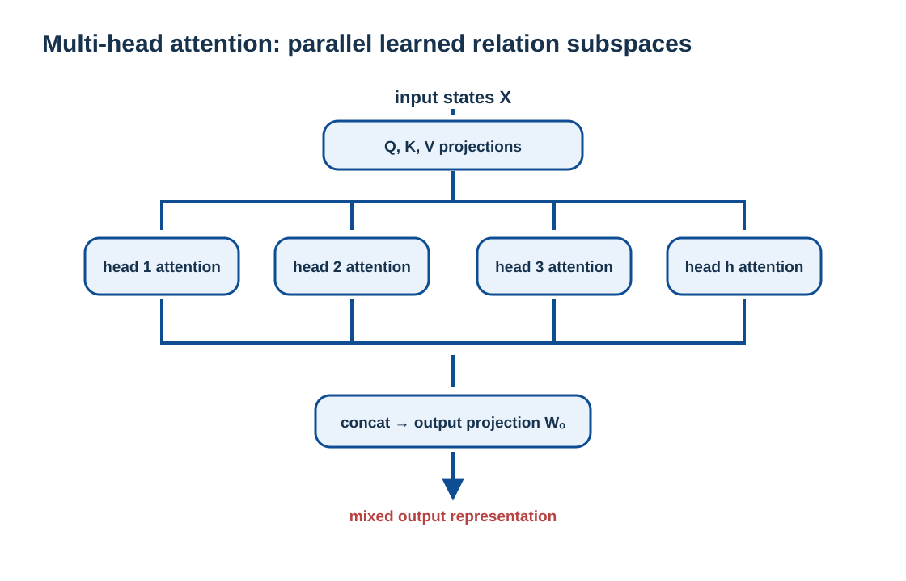
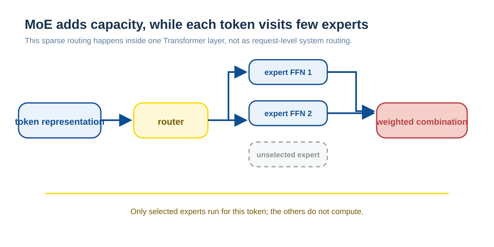
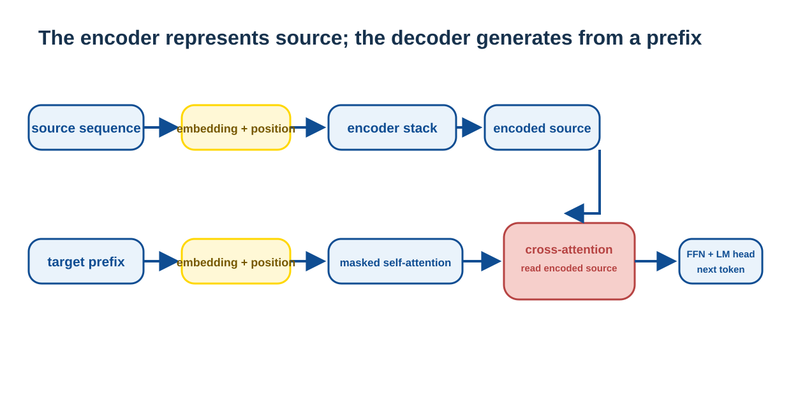

# Transformer architecture: understanding from data flow

Transformer receives a sequence of existing representations, repeatedly lets each position read information from permitted context, transforms the result at that position, and finally outputs vocabulary scores for the next step. It separates sequence relationships, per-position transformation, and stable training into stackable components. Understanding how data flows through a block explains training parallelism, causal generation, and long-context cost better than memorizing abbreviations.

## Three computing responsibilities of Transformer

The most important responsibilities of a layer of Transformer can be summarized as:

* **Attention = Information routing between states**
* **FFN = nonlinear transformation within the state**
* **Multi-Head = Parallel modeling of multiple relational subspaces**

Attention determines how positions exchange information; the FFN determines how each position transforms its aggregated representation; multi-head mechanisms compute these relationships in several subspaces at once. Residual connections and normalization place these computations in paths that can be stacked and trained stably.

### Overall architecture overview





The first figure is the original 2017 Transformer’s **encoder–decoder, Post-LN** reference structure, useful for sequence-to-sequence tasks such as translation; it is not a fixed topology for every language model. The later generation examples use decoder-only models, and many modern language models use Pre-LN or RMSNorm arrangements. Both forms contain attention, FFNs, residual paths, and normalization, but differ in visibility, whether cross-attention exists, and normalization placement. An output layer maps final representations to vocabulary scores.

---

## What problem does Transformer solve?

Transformer is a **sequence modeling architecture**. Its input and output are essentially token sequences, and the goal is to learn functions of the following form:

$$y_i = f(x_1, x_2, \dots, x_n)$$

There is only one biggest difficulty:

> The representation of each position requires not only knowing **information about other positions**, but also knowing **how it should change**.

### Why go to Transformer?

Transformer does not replace the previous model out of thin air, but is a structural choice made based on the constraints gradually revealed in sequence modeling:

| Directions | How it uses context | Main limitations | Transformer responses |
| --- | --- | --- | --- |
| N-grams and fixed-window feed-forward networks | Read a fixed number of preceding positions | Information outside the window cannot enter the current computation directly; rare combinations have sparse statistical coverage | Let a position aggregate from accessible context based on content |
| RNNs and LSTMs | Pass hidden state along the sequence | Positions within a layer have sequential dependencies, limiting cross-position parallelism; distant information travels through a longer path | Let accessible positions establish direct relationships and organize them as matrix operations |
| Transformer | Establish direct relationships by content | Dense Attention still has secondary computation and storage costs for long sequences | Continue to choose between expressiveness, optimizability and engineering costs |

Word vectors allow discrete tokens to have learnable continuous representations, but they do not solve the problem of "how the current token should be combined with the context." The concern here is how these representations exchange information in sequences; the formation and evolution of Embedding are unfolded in the relevant chapters of this book.

Transformer's solution to this problem:

* **Use Attention to solve "Who interacts with whom within the allowed range"**
* **Use FFN to solve "how to change after interaction"**

This constitutes the first principles of Transformer.

Looking further, Transformer uses a pure Attention structure to solve the **parallelism** and **long-distance dependency** problems of sequence modeling, and is also the structural source of modern large models:

* Parallelism is mainly solved by **Self-Attention mechanism**
* Long-distance dependencies are mainly solved by **Self-Attention + multi-head mechanism + structural design**

### How is parallelism solved?

The core lies in **Self-Attention + removing RNN/CNN**:

* Self-Attention performs matrix operations on the entire sequence
* In the known training sequence, multiple positions of the same layer can be calculated simultaneously
* No need to wait for the loop hidden state of the previous position
* This reduces the serial dependence on the sequence dimension, but does not mean that the total computational cost of Attention becomes constant

### How to solve long-distance dependencies?

Relying on the collaboration of a group of components with Self-Attention as the core:

* **Self-Attention**: Any two visible positions can be directly connected in one step
* **Multi-Head Attention**: Provides multiple sets of relationship subspaces, and may learn different remote patterns
* **Residual + LayerNorm**: remote information and gradients are not easy to disappear
* **Positional Encoding**: Make "far and near" meaningful

In short: **self-attention lets visible positions establish direct relationships, shortening long-distance information paths and supporting parallel computation across positions in the same layer.** A decoder under a causal mask still cannot see future positions.

---

## The input is not text, but a state vector

### Token and Tokenizer

The model does not process characters or words directly, but tokens. The input text first passes through the tokenizer and is divided into token_id sequences.

Modern tokenizers often use subword or byte-level strategies (BPE, WordPiece, Unigram, Byte-level BPE). Different strategies handle characters outside the vocabulary in different ways: a tokenizer with byte fallback can encode any byte sequence into a token; some WordPiece or Unigram configurations will map unsegmentable fragments into unknown tokens. They all output token_id sequences, but whether or not the original characters are preserved losslessly depends on the specific tokenizer.

Overlapping tokens are allowed in the vocabulary (such as "I / very / like / very much" exist at the same time). A word segmentation will output a segment according to the tokenizer's rules; some algorithms use greedy matching, and some will select segments based on scores, and the output will not retain multiple candidate paths at the same time.

### Token Embedding

token_id is mapped to a vector through the embedding matrix:

That is $\text{token\_id} \mapsto \text{embedding} \in \mathbb{R}^d$.

Three key facts:

* token_id is a fixed index
* embedding vector is a trainable parameter
* The specific value of embedding is continuously learned and updated during the **training process**

Embedding is not a human-defined semantics, but a completely data-driven state representation.

### Why is there a position mechanism necessary?

Attention’s core computation is based on content similarity and is itself insensitive to order. Without positional information:

> "I like you" and "You like me" are just different arrangements of the same set of tokens in Attention's view.

This mathematically corresponds to Permutation Equivariance of Attention: rearranging the input will only cause the corresponding rearrangement of the output, and will not produce "sequential semantics".

Language, time series, audio, and code are sequence-sensitive, so a positional mechanism is required.

Common ways:

* Trainable position embedding
* Sinusoidal position encoding
* Relative position mechanisms such as RoPE and ALiBi

It should be noted that:

> **Positional encoding participates in the forward pass during both training and inference.**
> Some implementations store positions as parameters; others encode them as a computation rule.

Positional encoding is not "knowledge", but the **coordinate system** by which Transformer understands the sequence.

---

## Attention: Learnable information routing



### Definition of Q, K, V

Given the input state of a certain layer $X$:

$$Q = XW_Q,\quad K = XW_K,\quad V = XW_V$$

Key points:

* $W_Q, W_K, W_V$ is the parameter matrix
* Shared for **all tokens**
* Q / K / V are dynamically calculated at runtime

The model does not save "the Q/K/V table of each token", but saves "the rules of how to map from any state to Q/K/V".

**Core understanding**:

> Q / K / V are essentially representations of the same token in different "perspective spaces".
>
> Calculation process of Attention = Use Query space to perform similarity search in Key space, and then weight and summarize the information in Value space.

From the perspective of semantic roles:

* **Query**: Query target ("What am I looking for")
* **Key**: Match index ("What can I be found by")
* **Value**: transmit information ("What content do I want to transmit")

This is typical content-based addressing.

#### Why separate Q/K/V?

If the same vector is used to represent "query requirement", "matching identifier" and "delivery content" at the same time, it will lead to:

* **Expression ability is limited**: Search rules and information content are bound
* **Optimization Difficulty**: Changes in one dimension affect three semantic roles at the same time
* **Rough Learning**: Unable to learn different relationship patterns independently

Advantages after separation:

* **Decoupling requirements and content**: Different dimensions are dedicated to "asking questions" (Q), "indexing" (K), and "loading content" (V)
* **Higher freedom of expression**: Upgrade Attention from simple "similarity mixing" to "learnable information retrieval"
* **Stable optimization path**: three projection matrices can be learned independently

### Calculation of Attention

$$\text{Attention}(Q, K, V) = \text{softmax}!\left(\frac{QK^T}{\sqrt{d_k}}\right)V$$

This process:

1. Use Q and all K to do similarity matching
2. Softmax obtains attention weight distribution
3. Take a weighted sum of V to aggregate information

This is exactly "information routing between states".

The “selection” here is differentiable weighted computation: the model assigns different weights to visible positions and combines the corresponding values into a new representation. It is not a database query, network call, or explicit relation table. Weights depend on the current input states and learned parameters, so the same token can aggregate from different positions in different sentences, positions, or layers.

To read the formula into two steps: $QK^T$ determines "where and how much to look" and the weighted sum of $V$ determines "what to bring back". Although K and V come from the same input state, they are obtained by different projections; the "features suitable for comparison" and "what is written into the new representation" can therefore be different.

#### Design logic behind the formula

**Why $QK^T$ (dot product)? **

Dot product calculates vector similarity:

<pre>
score[i, j] = Q_i · K_j^T
            = Σ (d = 1 → d_k) Q[i, d] × K[j, d]
</pre>

* If $Q_i$ and $K_j$ are in the same direction (demand matching), the dot product is large
* If the directions are inconsistent, the dot product is small or even negative.
* Dot product satisfies: differentiable, efficient (GPU friendly), stable in high-dimensional space

This is a typical **content-based similarity matching**.

**Why divide by $\sqrt{d_k}$? **

This is a **numerical stability** issue. When dimension $d_k$ is large:

* The variance of the dot product grows linearly with the dimension
* Causes softmax input value to be too large and saturated quickly
* The gradient is close to 0, making it difficult to train

Through $\sqrt{d_k}$ scaling, the numerical distribution is controlled within a reasonable range.

**Why use softmax? **

softmax provides three key properties:

1. All weights ≥ 0
2. Sum of all weights = 1 (normalized probability distribution)
3. Differentiable and stable gradient

This gives the attention weight a clear probabilistic interpretation: "60% of the current token is looking at A, 30% is looking at B, and 10% is looking at C."

**Why multiply V at the end? **

Because $QK^T$ only decides who to watch and how much to watch, while $V$ decides what content to get. The final output is a weighted information aggregation:

```
output[i] = Σ_j α[i, j] · V[j]
```

Where $\alpha_{ij}$ is the normalized attention weight.

### Self-Attention and Cross-Attention

#### Definition of Self-Attention

**Core features of Self-Attention**: Q, K, and V all come from **the same sequence** (the same set of states).

$$Q = XW_Q,\quad K = XW_K,\quad V = XW_V$$

Here $X$ is the hidden state of the same sequence. That is:

* The same batch of tokens
* Both question (Query)
* Asked again (Key)
* Also provide information (Value)

It can be understood as: **The sequence does Attention** to itself, which is the routing and integration of information within the sequence.

#### Cross-Attention

In the Encoder-Decoder architecture:

* Query from Decoder
* Key and Value come from Encoder

$$Q = X_{\text{decoder}}W_Q,\quad K = X_{\text{encoder}}W_K,\quad V = X_{\text{encoder}}W_V$$

This is the Decoder "Attention on the Encoder", used to align two different sequences.

#### Comparison summary

| Type | Q Source | K/V Source | Purpose |
| --------------------- | ------- | --------------- | -------- |
| Self-Attention | The same sequence | The same sequence | Integration of information within the sequence |
| Cross-Attention | Decoder | Encoder | Cross-sequence information alignment |
| Masked Self-Attention | The same sequence | The same sequence (with causal mask) | Autoregressive generation |

#### The design significance of Self-Attention

Transformer chooses Self-Attention as its core mechanism, which has three key advantages:

1. **Breaking sequential dependencies**: Unlike RNN, which requires step-by-step processing, it can be calculated in global parallel
2. **Direct interaction between any two points**: The first token can directly follow the 1000th token, and the path length is 1
3. **Symmetric, universal, scalable**: No grammatical structures or distance relationships are assumed. All structures are learned by data-driven learning.

**Core Intuition**:

Think of the sequence as a group of people discussing:

* Everyone listens to others and is listened to by others
* There is no "external information source", all information flows among this group of people
* This is what "Self" means - self-correlation within a sequence

#### Masked Self-Attention

The **Masked Self-Attention** used in Decoder is still Self-Attention, but with added constraints:

* Each position can only see the previous position (causal mask)
* But Q, K, V still come from the same sequence

Therefore: Masked Self-Attention = Self-Attention with causal constraints

Besides causal masks, batch computation commonly uses padding masks to exclude fill positions; specialized structures may use masks to limit particular interactions. In every case, a mask defines visibility. If causal visibility differs between training and inference, training exposes answers unavailable during generation.

---

## Multi-Head: Parallel relational subspace



### Basic principles

Multi-head attention is not simply computing the same attention several more times. Instead:

* Each head has its own $W_Q, W_K, W_V$
* Project from the same input state to different subspaces
* Learn different relationship patterns in different subspaces

In implementation, $d_{\text{model}}$ is usually divided into per-head dimensions, computed in parallel, concatenated, and fused through the output matrix $W_O$.

### Specific implementation of subspace

Assuming $d_{\text{model}} = 512$, $n_{\text{heads}} = 8$, then the dimensions of each head are $d_{\text{head}} = 64$.

**Implementation method** (not 8 sets of completely independent small Attention):

1. **One-time linear projection**: $Q = XW_Q \in \mathbb{R}^{n \times (8 \times 64)}$
2. **Reshape**: $Q \rightarrow (n, 8, 64)$, allocated to 8 heads
3. **Each head calculates Attention independently**
4. **Concat + $W_O$ Fusion**

**The meaning of "subspace"**:

* It is not a manually pre-specified "grammatical subspace" or "semantic subspace"
* Rather: the same input is mapped to representation spaces in different directions under different linear projections
* Each head has an independent $W_Q^{(h)}, W_K^{(h)}, W_V^{(h)}$, which naturally defines different subspaces

### The key role of output projection

$$\text{MultiHead}(X) = \text{Concat}(\text{head}_1, \dots, \text{head}_h) W_O$$

**Why can't it be concat directly? **

Because:

* Each head only works in **low-dimensional subspace**
* concat is just simple splicing, there is **no interaction** between different heads
* Lack of information fusion mechanism

The essential function of **$W_O$**:

1. **Information Fusion**: Linearly mix the results of multiple heads to allow interaction between heads
2. **Dimension mapping**: map the concatenated vector back to $d_{\text{model}}$ so it can be added to the residual path
3. **Output projection**: As the real "output projection layer" of the Attention layer

$W_O$ can be understood as "the editor-in-chief after the multi-expert discussion".

**Why does each layer need its own $W_O$? **

Because different layers focus on different relationship levels:

* Bottom layer: partial and syntactic relationships
* High-level: partial semantics, abstract relationships

The "information fusion method" of each layer should be different, so each layer has independent $W_O$ parameters.

### How do different heads achieve differentiation?

Multi-Head Attention **There is no explicit mutual exclusion mechanism** to force different heads to learn different modes. So why don't they usually learn to be exactly the same?

#### Three implicit differentiation mechanisms

**1. Differences in parameter initialization**

The initial value of $W_Q^{(h)}, W_K^{(h)}, W_V^{(h)}$ for each head is different, resulting in:

* Different optimization trajectories
* Early gradient directions are different
* Enter different local optimal areas

**2. Path-dependent gradient update (core mechanism)**

This is the most critical differentiation pressure:

* The gradient received by each head depends on what it is currently "already paying attention to"
* Once there is a small difference between heads, the gradient will **amplify the difference** instead of smoothing it out
* Optimization is path dependent: different attention patterns → different gradient signals → further differentiation

For example, even if both heads prefer "long-distance dependencies", they may respectively focus on:

* head A: syntactic long distance (subject-predicate spans the sentence)
* head B: refers to long distance (pronoun - antecedent)

Different attention patterns → different contribution paths to loss → different gradient directions → continue to differentiate

**3. Implicit competition caused by $W_O$**

The output of all heads is finally fused through $W_O$, which creates a **resource competition mechanism**:

* The final loss of the model only cares about "which head information is really useful"
* If two heads provide highly similar information, the marginal contribution to loss is **redundant**
* The gradient will tend to: strengthen one of them and let the other turn in other useful directions
* This is **implicit diversity pressure**: redundant heads are "wasted parameters", and optimization tends to reduce waste

#### Actual manifestation of Head differentiation

In the trained language model, common phenomena:

* Certain heads focus on **local dependencies** (adjacent tokens)
* Certain head focus **long distance dependencies**
* Some heads favor **syntactic relations** (subject, predicate, and object)
* Some heads prefer **referential relationships** (he/she/it)

**There are no hard-coded rules, these patterns are formed spontaneously through training. **

### Head Redundancy phenomenon and over-parametric design

It should be pointed out: Multi-Head Attention **does have redundancies**.

**Known Phenomenon**:

* Multiple heads may learn very similar attention patterns
* Some heads are almost "not working"
* Uneven utilization of Head

**Experimental Evidence**:

* The paper shows that: a considerable part of the head can be cut off, and the performance is almost unchanged
* Model after Head pruning: fewer parameters, faster inference, and basically no performance degradation

This shows that: **Multi-Head Attention is over-parameterized in practice. **

**Why accept over-parameterization?**

1. **Over-parameterization is a feature, not a bug**

   * Make optimization easier
   * Give the model more freedom of "self-organization"
   * Reduces the need for designers to "manually specify the structure"

2. **Explicit mutual exclusion constraints may hurt performance**

   * Some people have tried in history: forcing head orthogonality, decorrelation loss, specialization regular terms
   * The result is often: training is more difficult, convergence is slower, and generalization may not be better
   * Reason: The model "knows how to divide the labor"; artificially imposed constraints limit its freedom.

### Core understanding

Multi-head attention is a mechanism of “soft division of labor and spontaneous organization”:

* No explicit mutual exclusion mechanism to prevent multiple heads from learning similar patterns
* Through parameter initialization differences, path-dependent gradient updates, and implicit competition in the output fusion layer, a spontaneous division of labor is formed in practice
* This structure is **deliberately over-parameterized**, allowing a certain degree of redundancy rather than forcing optimal decomposition
* The number of Heads (8, 16, 32, 64) is a hyperparameter, which represents the upper limit of the capacity of parallel relationship modeling, rather than the "number of relationship types"

---

## FFN: Nonlinear transformation within the state

Attention completes "information routing" - deciding where to gather information. But how is the aggregated information transformed? That’s what FFN does.

### Structure of FFN

$$\text{FFN}(x) = W_2 \cdot \sigma(W_1 x + b_1) + b_2$$

**Core Features**:

* **Per-token computation**: apply the same parameters independently to every token in the sequence
* **Parameter sharing**: use the same $W_1, W_2$ at every position
* **No interactivity**: No information exchange occurs between tokens
* **Strong nonlinearity**: Introduce nonlinear transformation through activation function $\sigma$
* **Dimension raising-compression**: Usually the dimension is raised first (such as 4×d) and then the dimension is reduced

Typical configuration:

* $W_1: d_{\text{model}} \rightarrow d_{ff}$ (upgraded dimension, usually $d_{ff} \approx 4 \times d_{\text{model}}$)
* $W_2: d_{ff} \rightarrow d_{\text{model}}$ (dimensionality reduction)
* $\sigma$: activation function (ReLU, GELU, SwiGLU, etc.)

### Why is Attention itself not enough?

The core output of Attention is:

$$y_i = \sum_j \alpha_{ij} v_j$$

This is a linear weighted sum. Even though the attention weight $\alpha_{ij}$ is calculated non-linearly through softmax, the operation on $V$ is still linear.

**Limitations of Linear Operation**:

* Cannot create new features
* Cannot do complex feature combinations
* Cannot implement conditional logic (combinations such as "A and B")

> **Basic principles of deep learning**: When there is no nonlinearity, the composite of multi-layer linear transformation is still a linear transformation; if a bias is included, the whole is still just an affine transformation.

### Why can FFN "reshape representation"?

#### 1. Nonlinear activation breaks linear restrictions

The activation function $\sigma$ introduces true nonlinearity, enabling the model to learn complex nonlinear functions.

#### 2. Dimension raising → nonlinearity → compression = feature reorganization

FFN can be understood as:

1. **Expand**: Project the token representation into a high-dimensional space ($d_{\text{model}} \rightarrow 4d_{\text{model}}$)
2. **Transformation**: Nonlinear "cutting" and "gating" in high-dimensional space
3. **Compression**: Project back to the original space ($4d_{\text{model}} \rightarrow d_{\text{model}}$)

This allows the model to learn:

* **High-order feature combination**: complex feature interaction patterns
* **Conditional activation**: Some features only take effect in specific contexts
* **Abstract semantic direction**: higher level semantic representation

### Division of labor between Attention and FFN

These two components play complementary roles in Transformer:

* **Attention**: Responsible for "relationship modeling"
  - Tokens can interact with each other
  - Decide "who to look at"
  - Aggregate information

* **FFN**: Responsible for "Expression Transformation"
  - There is no interaction between tokens
  - Decide "what to become"
  - Complete information reorganization

**Intuitive metaphor**:

Think of the sequence as a row of students:

* **Attention stage**: students discuss and refer to each other’s answers
* **FFN Stage**: Each student returns to his seat and thinks independently using the same set of rules

No students communicate with the people next to them, but everyone uses the same "formula book" (shared parameters).

### The precise meaning of "token by token"

**Key Point**: FFN does not allow tokens to interact with each other.

For a sequence $X = [x_1, x_2, x_3, \dots, x_n]$, the FFN computes:

$$\text{FFN}(x_1), \text{FFN}(x_2), \text{FFN}(x_3), \dots, \text{FFN}(x_n)$$

Features:

* ✔ Each token **calculated independently**
* ✔ **Parameter sharing** (same set $W_1, W_2$)
* ✔ Can be parallelized in a forward pass over a known sequence (all positions can be computed simultaneously)
* **No information exchange** between ❌ tokens

This design has three advantages:

1. **Decoupling responsibilities**: Attention focus relationship, FFN focus transformation
2. **Efficient Parallel**: All positions of the known sequence can be calculated simultaneously; autoregressive generation still requires incremental output additions.
3. **Enhanced nonlinearity**: Each token undergoes a complete nonlinear transformation

This design achieves the decoupling of relational modeling and representation transformation, both of which perform their own duties and complement each other.

### What would happen without FFN?

If only Attention + Residual is stacked, without FFN:

* The entire network degenerates into **multiple linear mixtures**
* Indicates that space cannot be truly "deformed"
* The model degenerates into a complex **linear filter**
* **Severely limited expressive power**, unable to approximate complex nonlinear functions

Both experiments and theory show that FFN is the key source of Transformer's expressive ability.

### MoE: Replacing a Dense FFN with Sparse Computation

Mixture of Experts (MoE) often replaces dense FFNs in some Transformer layers with multiple expert FFNs. The router selects a small number of experts based on the representation of the current token and merges their outputs:



Its goal is to increase model capacity without passing every token through all parameters. MoE can be used in text or multimodal models, but it is not required for multimodal input, tool calling, or agents. It also differs from an external system choosing one model for an entire request: the former is learned computation for one token inside one layer, while the latter is application control flow.

---

## Residual and LayerNorm: stable path for deep training

To make multi-layer stacking feasible, Transformer uses two key technologies:

* **Residual Connection**: Prevents information degradation and allows deep networks
* **LayerNorm**: Help control the representation scale and improve training stability

Many modern language models employ normalization arrangements such as Pre-LN or RMSNorm to enhance stability; the exact structure varies from model to model.

These two technologies are not innovations of Transformer, but they make the training of deep networks more feasible. Specific stability still depends on factors such as architecture order, initialization, optimizer, learning rate, and data.

The residual connection can be written as $y=x+F(x)$: the input bypasses the transformation and is retained directly to the output, providing a shorter path for information and gradients, making deep optimization easier. It does not guarantee that the gradient is returned "losslessly"; LayerNorm, parameter scale, optimizer and data jointly affect whether the training is stable. LayerNorm adjusts the numerical scale in the feature dimension of each position to prevent the representation distribution of certain layers from continuing to get out of control.

---

## Transformer Block: overall architecture

Now that all the core components are understood, it's time to see how they are organized into a complete architecture.

### Basic structure of Block

Regardless of Encoder or Decoder, the core of Transformer is to repeatedly stack the same Block. Typical structure:

1. Multi-Head Self-Attention
2. Residual + LayerNorm
3. Position-wise FFN
4. Residual + LayerNorm

The essence of Transformer is: **This Block is stacked N times. **

N depends on the model scale, ranging from a dozen layers to hundreds of layers.

### Complete path of information flow

In each Block:

1. **Attention stage**: Complete information routing through Self-Attention, allowing each token to gather relevant information from other tokens
2. **Residual connection**: retain the original information and prevent information loss
3. **LayerNorm**: Stable numerical distribution
4. **FFN stage**: Perform nonlinear transformation on the aggregated information and reshape the representation
5. **Residual + LayerNorm**: Stable output

This process is repeated N levels, gradually abstracting and refining the information.

### Encoder vs Decoder

**Encoder**:

* Can see the complete input sequence
* No causal mask
* The output is "fully understood expression"
* Typical applications: text understanding, classification, vector retrieval (BERT)

**Decoder**:

* Use Masked Self-Attention (causal mask)
* Each position can see only preceding positions
* Used for autoregressive generation
* Typical application: language models (GPT)

**Encoder-Decoder**:

* Additional Cross-Attention layer included in Decoder
* Used to align two sequences (such as machine translation)
* Typical applications: T5 and BART

The original Transformer's Encoder-Decoder data flow can be summarized as:



The encoder first forms contextual representations of the complete input. The decoder reads only the known target prefix while using cross-attention to read encoder representations. In machine translation, the source sentence and translated-prefix sequence are these two data flows.

### Why are large models almost all Decoder-only?

Because the core training goal of large models is autoregressive language modeling:

$$P(x_t \mid x_1, \dots, x_{t-1})$$

Internet data is naturally a continuous text stream, not a strict input/output pair. Decoder-only:

* The objective function is the simplest
* Highest data utilization
* Engineering achieves the most unified
* Reasoning is highly compatible with KV Cache

Therefore it has become the de facto standard for general large models.

This also explains the relationship between the original Transformer and today's common LLM: the Decoder-only model eliminates the need for independent Encoder and Cross-Attention, and prompt words, chat templates and generated tokens all enter the same causal sequence. It is not "no longer using Attention", but only retains Self-Attention with causal visibility constraints; the generation process is still "calculate the next token, and then connect it back to the input".

---

## Training and inference: what to save and what to reuse in the model

### What to save in model parameters?

After training is completed, the model is saved as:

* token embedding matrix
* $W_Q, W_K, W_V, W_O$ for each layer
* FFN parameter ($W_1, W_2, b_1, b_2$)
* LayerNorm parameters
* Output layer parameters ($W_{\text{vocab}}$)

**Q/K/V themselves are not parameters; they are intermediate computation results.**

The model saves "rules" rather than "results" - it saves how to calculate the weight matrix of Q/K/V, rather than the specific Q/K/V value of each token.

### Inference Process Overview

During inference, the model is executed repeatedly in an autoregressive manner:

1. Current token sequence → forward
2. Predict the probability of the next token
3. Sampling or selecting tokens
4. Splice to the end of the sequence
5. Repeat

The context length is always equal to:

> **Input token number + generated token number**

Hidden states are intermediate variables, not counting tokens, and do not account for the context length.

### Inference Walkthrough

Taking a Decoder-only model (such as GPT) as an example, assume that the current input sequence is `[x₁, x₂, ..., xₜ]`:

**Step 1: Embedding + Position Encoding**

$$h_i^{(0)} = \text{Embedding}(x_i) + \text{Position}(i)$$

Get the hidden state matrix of layer 0 (input layer): $H^{(0)} = [h_1^{(0)}, h_2^{(0)}, \dots, h_T^{(0)}]$

**Step 2: Transformer Block Layer by Layer**

For layer $\ell$ ($\ell = 1, 2, \dots, N$):

1. **LayerNorm（Pre-LN）**
   $$\tilde{H}^{(\ell-1)} = \text{LayerNorm}(H^{(\ell-1)})$$

2. **Calculate Q/K/V**
   $$Q^{(\ell)} = \tilde{H}^{(\ell-1)} W_Q^{(\ell)}, \quad K^{(\ell)} = \tilde{H}^{(\ell-1)} W_K^{(\ell)}, \quad V^{(\ell)} = \tilde{H}^{(\ell-1)} W_V^{(\ell)}$$

3. **Masked Self-Attention** (only the previous position can be seen at each position)
   $$A^{(\ell)} = \text{softmax}!\left(\frac{Q^{(\ell)} {K^{(\ell)}}^T}{\sqrt{d_k}} + \text{mask}\right)$$
   $$Z^{(\ell)} = A^{(\ell)} V^{(\ell)}$$

4. **Multi-Head Fusion**
   $$Z_{\text{out}}^{(\ell)} = \text{Concat}(\text{head}_1, \dots, \text{head}_h) W_O^{(\ell)}$$

5. **Residual connection**
   $$H'^{(\ell)} = H^{(\ell-1)} + Z_{\text{out}}^{(\ell)}$$

6. **FFN + Residual**
   $$H^{(\ell)} = H'^{(\ell)} + \text{FFN}^{(\ell)}!\bigl(\text{LayerNorm}(H'^{(\ell)})\bigr)$$

**Step 3: Extract the representation of the last token**

$$h_{\text{last}} = h_T^{(N)}$$

Because the goal of the language model is to predict: $P(x_{T+1} \mid x_1, \dots, x_T)$

**Step 4: Map to vocabulary (LM Head)**

$$\text{logits} = h_{\text{last}} W_{\text{vocab}}$$
$$\text{probs} = \text{softmax}(\text{logits})$$

**Step 5: Sample the next token**

Obtained through sampling strategy (greedy, top-k, top-p, temperature): $x_{T+1}$

**Step 6: Append and Repeat**

Add the new token to the sequence: `[x₁, x₂, ..., xₜ, x_{T+1}]`, and then re-execute the entire forward process.

> **Key point**: inference does not repeatedly calculate within one forward pass. Each forward pass predicts one token, which is appended to the sequence before the next full computation (or KV-cache-accelerated computation).

### KV Cache: state reuse during inference

When generating the $t$th token, Attention requires the K/V of all historical tokens. But these historical K/Vs will not change in subsequent steps.

So in the inference phase:

* K/V of historical tokens are cached
* New tokens only need to calculate K/V once
* Attention uses cache + new value directly

The KV cache **is not a new architecture**. It is an inference-time attention optimization that turns repeated recomputation of historical state into efficient incremental computation.

#### What is "history token"?

In autoregressive generation:

**History token = all tokens that have been determined before the current step**

Includes two parts:

1. The initially entered prompt token
2. The token generated and accepted by the model in the previous step

#### Generation process example

Assume the input prompt is `[I, like]`.

* **Step 1**: Predict the 3rd token

  * Current sequence: `[I, like]`
  * Historical tokens: `[I, like]`
  * Their K/V is computed and cached
  * Predicted token: `to eat`

* **Step 2**: Predict the 4th token

  * Current sequence: `[I, like, to eat]`
  * Historical tokens: `[I, like, to eat]` (the newly generated token is now historical)
  * Compute K/V only for `to eat` and append it to the cache
  * Predicted token: `apples`

* **Step 3**: Predict the 5th token

  * Current sequence: `[I, like, to eat, apples]`
  * Historical tokens: all 4 tokens
  * New K/V calculated only for "Apple"

#### Token instance vs Token type

**Key distinction**:

* **Token type (token_id)**: tokenizer level concept, such as "my" token_id may be 1234
* **Token instance (token occurrence)**: token at a specific position in the sequence. Even if the token_id is the same, different positions are different instances.

#### Why are the K/V of the same token_id different?

Suppose the sequence is `[I, like, I]`.

Although the two `I` tokens have the same token ID:

1. **Different positions**
   $$h_1 = \text{Embedding}(\text{I}) + \text{Position}(1)$$
   $$h_3 = \text{Embedding}(\text{I}) + \text{Position}(3)$$

2. **Different context** (this is the more critical reason)

   * The first `I` can see only itself
   * The third `I` can see `[I, like, I]`
   * Attention results are completely different

3. **So K/V is different**
   $$K_1 = h_1 W_K,\quad V_1 = h_1 W_V$$
   $$K_3 = h_3 W_K,\quad V_3 = h_3 W_V$$

   Since $h_1 \neq h_3$, so $K_1 \neq K_3$,$V_1 \neq V_3$

#### The precise meaning of KV Cache

**Transformer doesn't care about "whether this token appears repeatedly", it only cares about "which position in the sequence is this". **

KV Cache caches:

* **K and V of a certain layer, a certain head, a certain position**
* **Not** the K/V of a certain token_id

Cache structure: `[(pos=1, token=I), (pos=2, token=like), (pos=3, token=I)]`

Each position is an independent token instance, even if its token ID is repeated.

#### History K/V The meaning of "will not change"

**In the inference stage (under the premise that the parameters are fixed)**:

* Once a token instance is calculated, its K/V at that layer is completely determined
* These cached values will not be modified in subsequent generation steps.
* The newly generated token will calculate a new K/V and append it to the cache

This is why a KV cache can substantially accelerate inference: it avoids recomputing historical tokens.

#### The essence of Context Window

**Why context window = input + output? **

Every time the model generates a token during inference, it is appended to the end of the sequence to continue processing. The historical token stored in KV Cache contains prompt + generated output. The two are completely equivalent in structure and share the same capacity. So the upper limit is not "input upper limit", but "input + total sequence length upper limit of generated output".

**The available Context Window is determined by a combination of model design, training, and service implementation:**

1. **Position representation and architecture (architecture layer)**—affects the supported length
   - Learned absolute position embedding usually only has pre-trained table entries; without additional expansion, the table cannot be looked up directly if the table length exceeds it.
   - Relative-position methods such as RoPE can be extended through scaling or long-context training, but their quality and usable range must be confirmed by actual training and evaluation.

2. **Training sequence length and data (training layer)**—affect long-context capability
   - Whether the model truly learns to utilize distant information depends on training length, data distribution and training method, not just positional encoding.
   - The formal ability to accept longer inputs does not mean that long-distance retrieval, reasoning or anti-interference capabilities are equally reliable.

3. **Video memory/deployment resources (inference layer)**—hard upper limit for actual usage
   - The KV cache grows linearly with context length; insufficient GPU memory prevents long-context execution.
   - For the same model, the context lengths available for service providers and local deployments may differ several times.

The published context window is the interface limit of a model and service. Deployment must trade off KV cache capacity, concurrency, GPU memory, and latency; locally available length can be below the model’s nominal limit.

---

## Architecture selection and capability boundaries

After the previous technical details, you can now understand the design philosophy of Transformer from a higher level.

### Evolution rather than derivation

An often overlooked fact needs to be emphasized:

> **Transformer is not an optimal structure that is necessarily deduced from first principles, but a highly effective architecture that has been gradually evolved under mathematical constraints, engineering constraints, and experimental verification. **

Its design logic can be summarized as:

1. **The goal is expressiveness**: All mathematical structures (Attention, FFN, Multi-Head, etc.) jointly construct a highly expressive and optimizable function space
2. **Training filling ability**: Through large-scale data and gradient descent, let the parameters converge to an area in the space that can effectively model the data distribution.
3. **Inference is an emergent result**: The so-called "reasoning ability" is not explicitly programmed, but the behavioral pattern that the model naturally presents after training.

### Core Insights

Modern deep models do not "explicitly teach the model how to reason", but construct a function space that is large enough and flexible enough to allow "reasoning ability" to emerge as a natural result after training. What the model learns is "in what context, what is the conditional distribution of the next token", rather than explicit logical rules such as "if A and B, then C".

This means:

* The various components of Transformer together form a learnable representation space, rather than independent "intelligent modules"
* The essence of each "mathematical technique" (LayerNorm, Residual, scaling, softmax) is to enable training to find a good solution
* The effectiveness of the structure comes from the comprehensive balance of: **Expressiveness** (what can be expressed) + **Optimizability** (can it be learned) + **Engineering feasibility** (can it be realized)

### The essence of three-tier architecture

Transformer’s success comes from the synergy of three elements:

**The first level: function space (structural design)**

* Attention: determines how states are connected to each other
* FFN: determines how the state transforms nonlinearly
* Multi-Head: determines the capacity of parallel relationships
* → This layer determines **"what can be expressed"**

**Tier 2: Optimizing Reachability (Mathematics and Engineering)**

* LayerNorm, Residual: stable training
* Parameter initialization, scaling skills: control values
* Autoregressive objective: simplify optimization
* → This layer determines **"whether it can be learned"**

**Level 3: Data Distribution (Semantics and Behavior)**

* Language structure, logical patterns
* World knowledge, traces of reasoning
* Statistical regularities in human text
* → This level determines **"what kind of learning"**

**Key Insight**: The reasoning, understanding or planning capabilities displayed by the model come from the overall behavior formed by multi-layer calculations, training data and optimization processes; it cannot be simply attributed to a certain Attention head, FFN layer or individual components.

### The evolutionary nature of design

The birth process of Transformer can be understood as **structure search under fourfold constraints**:

1. **differentiable constraints**: must be end-to-end trainable and can be efficiently calculated on GPU
2. **Expression constraints**: It must be able to express a sufficiently complex function and be able to scale
3. **Engineering Constraints**: Must be parallel-friendly and easy for distributed training
4. **Experimental Constraints**: Must perform significantly better under the current computing resources and data scale

This is not the result of deductive reasoning, but a **constrained empirical evolutionary process** - more like biological evolution and engineering design than formal logical proof.

Many seemingly "reasonable" explanations are actually **post hoc rationalizations**: the structure is first experimentally verified to be effective, and the theoretical explanation is to "understand why it survived." This is a typical scientific path: first discover → then explain → then abstract → then guide the next round of design.

### From structure to emergence of capabilities

**Core Concept**:

The design of modern deep models is not essentially about “explicitly teaching the model how to reason”, but rather:

1. Construct a highly expressive and optimizable function space
2. Let the training process converge to an effective area in the space under the constraints of large-scale data
3. Observed from the outside, this functional behavior shows capabilities similar to reasoning, understanding and planning.

**This means**:

* Transformers typically do not have a single, explicit symbolic reasoning module; the relevant behavior results from multiple layers of computation on continuous representations
* "Inference" can refer to both externally observed task behavior and the calculation process inside the model; the two cannot be equated with each other solely based on the output text.
* The emergence of capabilities depends on: the expression space allowed by the structural design × the pattern contained in the data distribution × the area that the optimization process can reach

---

## Summary: Transformer’s Computational Division of Labor

### Technical summary

Transformer is a sequence modeling framework based on tokens:

* Implement learnable global information routing through Attention
* Implement token-by-token nonlinear state transformation through FFN
* Parallel modeling of different relationship subspaces through multiple heads
* Rely on residual and normalization to stabilize deep training
* Generate output step by step in an autoregressive manner in Decoder-only mode
* The long-term statistical laws formed by training are encoded in the parameters; the short-term context required for the current task is dynamically provided by the token sequence, and external facts can also enter this context through retrieval or tools

### Three levels of understanding

There are three levels to understand Transformer:

1. **Technical level**: Know what each component is and how to calculate it
2. **Principle Level**: Understand why these components are needed and what problems they solve
3. **Philosophical level**: Realize that these structures are not inevitable from theoretical derivation, but the product of exploration in the constrained space

When you start to think about "why this structure and not others", your cognition moves from the second level to the third level.

This thought process itself is a sign of in-depth understanding - it means no longer viewing Transformer as a perfect theoretical edifice, but understanding its essence: a feasible and effective path evolved within the constraints of current cognitive, resource and engineering capabilities.

**The success of Transformer is essentially that it allows the correct emergence under the correct constraints. **
