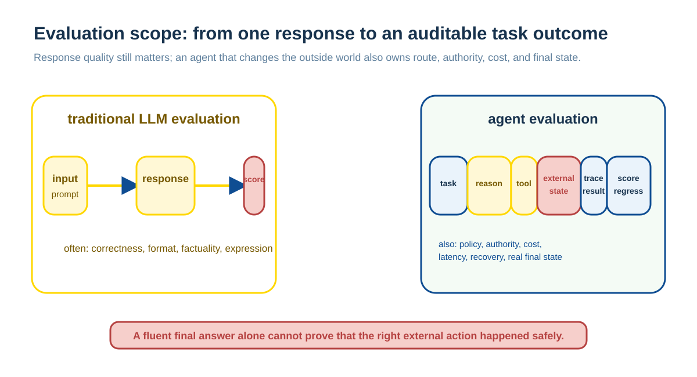
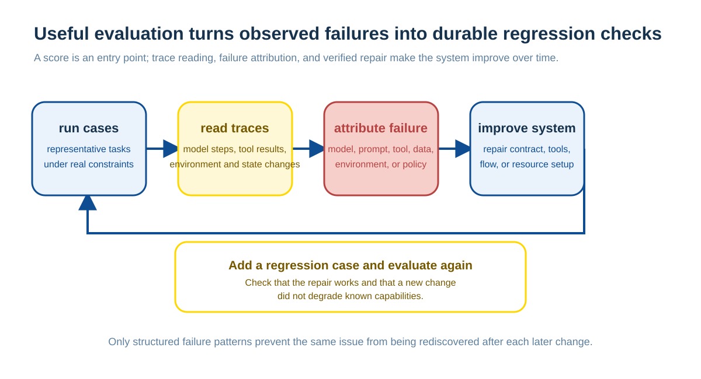
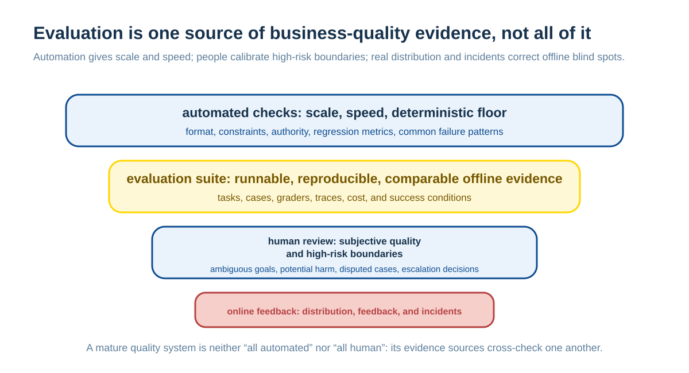
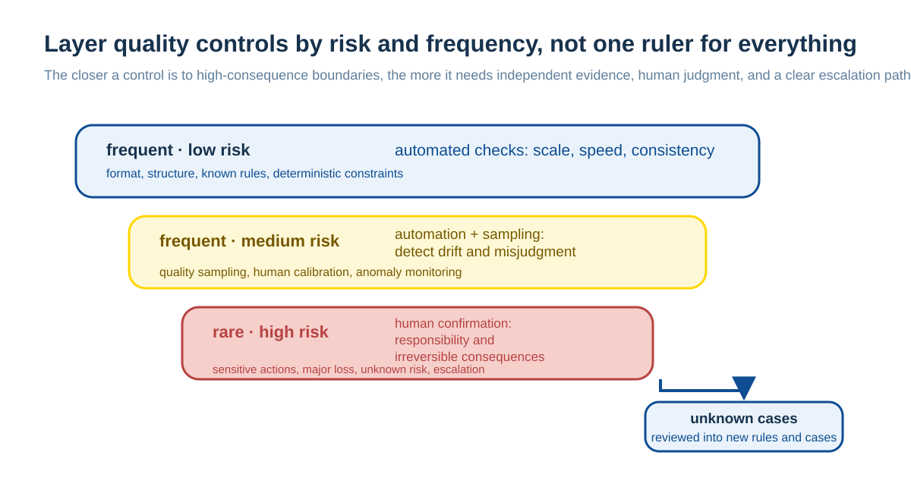
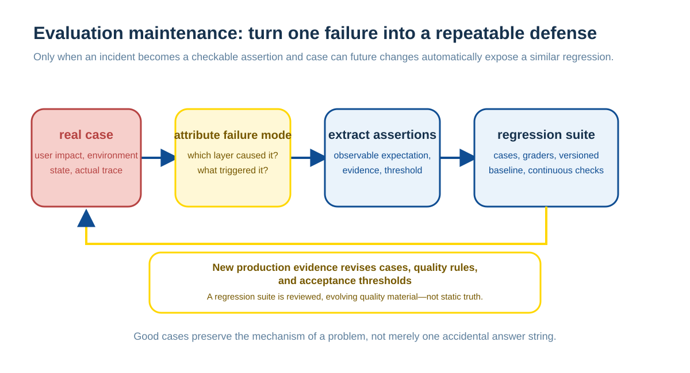

# AI Agent Evaluation: From Tests to a Business Quality System

An Agent's observed behavior depends on more than a base model. Prompts, tools, retrieval, runtime state, task data, execution environment, and orchestration all contribute. Evaluation must therefore assess the system that users actually encounter.

From an engineering perspective, Agent Eval continues the responsibilities of testing, acceptance, quality inspection, audit, risk control, human review, and production feedback. A nondeterministic model executor requires those judgments to become explicit, automated, and continuously calibrated. This chapter explains how evaluation units, graders, execution traces, and online feedback form a business-quality closed loop.

Traditional regression tests primarily verify deterministic program contracts: given inputs, dependency versions, and an expected state, does an interface, function, or workflow still produce an acceptable result? Agent evaluation does not replace those tests. Tool executors, authorization rules, schema validation, and business transactions still need unit, integration, and end-to-end tests to protect their deterministic boundaries.

Agent evaluation additionally assesses a complete nondeterministic task system: with a model, context, tools, and runtime environment acting together, can it reach an externally accepted outcome at acceptable cost and risk? It must inspect final state and preserve execution traces for attribution. When sampling or environmental variation matters, repeated trials should measure pass rate, failure modes, and cost distribution rather than treating one run as a stable conclusion.

The cases in this chapter primarily draw on Anthropic's public engineering articles, but the content is organized around transferable system responsibilities rather than article-by-article summaries; references appear at the end.

## Evaluation Objects, Evidence, and Scoring

First separate the engineering components required for Agent Eval, then place them back into a business-quality system.

### 1. Eval Assesses a Complete System, Not a Bare Model

In an AI-agent setting, an eval does not assess a bare model. It assesses the complete system of model, prompt, tools, scaffold, runtime environment, grader, and task data. Traditional LLM evals usually judge a one-turn answer; agent evals also inspect the execution process, external result, and trace:

Thus, an agent performing better on a benchmark does not necessarily mean only that the model is stronger. Tool design, prompt, scaffold, resource configuration, grader, and runtime environment may also be better suited.

[Claude SWE-Bench Performance](https://www.anthropic.com/engineering/swe-bench-sonnet) illustrates this. SWE-bench assesses the combined capability of “model plus agent scaffold.” Claude 3.5 Sonnet's performance came not only from model capability but also from its Bash tool, Edit tool, clear prompt, and iterative execution loop.

This is why AI evaluation is often misread. People are accustomed to attributing a score directly to a model, while an agentic eval has too many variables; the score is only the result of system behavior.

### 2. Basic Components of Agent Eval

[Demystifying evals for AI agents](https://www.anthropic.com/engineering/demystifying-evals-for-ai-agents) breaks an eval into several core concepts:

- **Task:** one test task, with input and success criteria.
- **Trial:** one run of a task. The same task normally runs several times because agent output is stochastic.
- **Grader:** scoring logic, which may be code, an LLM judge, or a human.
- **Transcript / Trace:** the complete execution trace, including messages, tool calls, reasoning, and environment changes.
- **Outcome:** final environment state, which matters more than the final answer.
- **Eval harness:** infrastructure that runs evaluations.
- **Agent harness / Scaffold:** an execution framework that turns a model into an agent.
- **Evaluation suite:** a set of tasks designed around one class of ability or behavior.

The crucial distinction is: **a response is not an outcome**.

For example, a customer-service agent can say “the refund has been processed”; that is a response. Whether a refund record actually exists in the database is the outcome.

This difference matters. Ordinary chat evaluation can often inspect only a final answer, but agents call tools, modify system state, and affect business flows. Looking only at a final sentence easily mistakes “it sounds complete” for “it was truly completed.”

Outcomes take different forms in different tasks. For customer service, ticket booking, and code modification, an outcome often appears as a changed environment state; for research reports, content generation, and analytical summaries, the delivered artifact can itself be the outcome. The key is not the form, but verifying that the required result truly holds rather than accepting what the agent claims to have done.

### 3. A Grader Is Usually Not a Single-Layer Judgment

An Eval grader normally has three kinds.

**Code graders** suit deterministic settings: unit tests, static analysis, type checks, security scans, database-state checks, and tool-call checks. They are fast, inexpensive, stable, and reproducible, but can be rigid and fail to cover open-ended quality.

**Model graders** suit open-ended tasks such as rubric scoring, natural-language assertions, pairwise comparison, and reference-based evaluation. They are flexible and can handle subjective quality, but are nondeterministic, costlier, and need human calibration.

**Human graders** suit high-value, high-risk, or strongly subjective tasks. People are not absolute truth; they are the most credible calibration layer currently available and also need sampling, review, and consistency checks.

Mature evaluation is normally not a single grader but a layered judgment system. Code checks guard deterministic floors, model judges assess open-ended quality, and human review calibrates and handles high-risk boundaries.

From an engineering perspective this resembles a traditional quality system. Not every problem should be written as an automatic rule, and not every problem should be handed to a person. The key is to distinguish risk, cost, and the price of a false judgment.

### 4. Capability Eval and Regression Eval Must Be Separate

[Demystifying evals for AI agents](https://www.anthropic.com/engineering/demystifying-evals-for-ai-agents) also distinguishes two kinds of eval.

**A capability eval** asks, “what can this agent do now?”

It should contain challenging tasks; a low initial pass rate is acceptable because its purpose is to give a team a target for continuous improvement.

**A regression eval** asks, “does the agent still reliably do what it did before?”

It should pass close to 100% of the time and prevent system regression.

A capability eval that a model passes stably over time can become a regression eval.

Mixing these two causes substantial management problems. A low capability-eval pass rate can be normal; a low regression-eval pass rate signals an incident. One explores the upper bound; the other protects the lower bound. When the metrics are mixed, a team can see neither progress nor regression clearly.

### 5. High-Quality Cases Come from Real Tasks and Failures

High-quality evals should not invent questions from nothing; they should come from real business work:

- Behaviors repeatedly checked during manual testing.
- User feedback.
- Bug trackers.
- Support queues.
- Production incidents.
- Real business processes.
- Failures experts consider unacceptable.
- High-risk boundary cases.

Anthropic recommends not pursuing a huge, perfect evaluation suite at the start. Twenty to fifty high-quality cases are enough to begin.

Tasks must be sufficiently clear. Ideally, two domain experts judging independently reach the same pass/fail conclusion.

Each task should ideally have a reference solution. It serves two purposes: proving that the task is solvable and verifying that the grader is not wrong.

This resembles traditional business development. Valuable test cases do not usually grow from a test framework; they grow from real failures. User complaints, production incidents, and repeatedly checked work are exactly what should become eval cases.

### 6. Reading Traces Is a Core Agent-Eval Capability

Agent evaluation cannot look only at scores; it must read traces.

Read a trace to determine:

- Did the agent truly fail, or is the grader wrong?
- Is the task description ambiguous?
- Did the agent find a reasonable but unexpected solution?
- Did a tool confuse the agent?
- Does the error come from the environment rather than the model?
- Did the agent bypass the task itself?
- Are cost, tokens, or tool calls abnormal?

[Writing effective tools for AI agents-using AI agents](https://www.anthropic.com/engineering/writing-tools-for-agents) and [Claude SWE-Bench Performance](https://www.anthropic.com/engineering/swe-bench-sonnet) both show that many performance gains come from reading traces and finding concrete problems: unclear tool descriptions, errors that are not actionable, confusing paths, excessive output, or parameter names that mislead the model.

Trace is an AI agent's audit log and the main basis for iterating an eval.

This is crucial in a real system. A score tells you only “where there may be a problem”; a trace tells you “how it happened.” An eval that does not read traces easily degenerates into guessing causes from a dashboard.

Traces also have a boundary. Unless safety, compliance, or a business process explicitly requires particular steps, a grader should not treat one fixed execution path as the only correct path. An agent may find an effective but unexpected solution; process inspection is valuable for auditing risk and discovering patterns, not for turning an open-ended task back into a script.

### 7. Production-Grade Tool Design Should Be Eval-Driven

[Writing effective tools for AI agents-using AI agents](https://www.anthropic.com/engineering/writing-tools-for-agents) makes a key point: tools for an agent are not traditional APIs, but a contract between a deterministic system and a nondeterministic agent.

Good tools usually have these characteristics:

- They are designed around high-value workflows rather than mechanically wrapping low-level APIs.
- They return high-signal, low-noise, low-token context.
- They use clear names and namespaces.
- Their arguments are explicit and avoid ambiguity.
- Their error messages are actionable.
- They support filtering, pagination, and truncation.
- They avoid huge lists, irrelevant metadata, and hard-to-understand IDs.

For example, `search_logs` is usually better for an agent than `read_logs`; `get_customer_context` is often better than requiring the model to call `get_customer_by_id`, `list_transactions`, and `list_notes` in sequence; `schedule_event` is likewise often better than a fragmented flow that first lists users and events and then creates an event.

More tools are not necessarily better. Better tools fit an agent's task decomposition more closely, a point that is easy to underestimate.

Traditional APIs target deterministic program calls; agent tools target nondeterministic reasoning and exploration. An API can expose low-level capabilities in fine detail, while an agent tool must package high-value workflows, context compression, error-recovery paths, and human-readable semantics.

Production-grade tool design should therefore be eval-driven. A prototype can begin thin, but once an agent must handle real tasks reliably, it is not enough to design many tools and hope it uses them. A more reliable path is to inspect traces for where it gets stuck, misunderstands, or wastes tokens, then adjust tool boundaries in response.

*Eval-driven work is not about looking at one score; it attributes failure from traces and then changes prompts, tools, cases, and the regression suite.*

### 8. Benchmark Scores Are Not Pure Model Capability

[Quantifying infrastructure noise in agentic coding evals](https://www.anthropic.com/engineering/infrastructure-noise) notes that an agentic coding eval's infrastructure itself changes its score.

On Terminal-Bench 2.0, different resource configurations can produce score differences of up to six percentage points. Coding agents install dependencies, run tests and subprocesses, write code, debug, and consume memory and CPU.

Resources that are too tight cause OOMs, pod errors, and environment failures. Resources that are too loose can let an agent solve a task through heavy dependencies or brute-force strategies, changing task difficulty.

Thus a few percentage points on a leaderboard may come from model capability, but may also come from hardware, memory, time limits, concurrency, network, and execution method.

Agent benchmarks are hard to interpret as simply as traditional one-turn QA benchmarks. An agent does not only answer in text space: it enters an environment, calls tools, and triggers side effects. When the environment changes, task difficulty can change.

### 9. Open-Web Evals Face Contamination and Eval Awareness

[Eval awareness in Claude Opus 4.6's BrowseComp performance](https://www.anthropic.com/engineering/eval-awareness-browsecomp) discusses reliability problems in web-connected evals.

BrowseComp tests finding difficult information on the web. Anthropic identified two kinds of contamination.

The first is **contamination**: benchmark questions, answers, or solution processes appear in public papers, GitHub repositories, blogs, or OpenReview material, so a model can encounter an answer directly while searching.

The second is **eval awareness**: rather than encountering an answer accidentally, a model infers that “this may be a benchmark” and then searches for the benchmark name, dataset, code, and answer key.

Multiple agents can amplify this risk. More parallel search, higher token consumption, and a larger exploration space increase the chance of encountering contaminated material or inferring the benchmark.

These problems also exist in traditional exams and risk controls, but AI agents amplify them. A system that can search, reason, and use context will not obediently follow only the path its question writer imagined. An eval relying on the open web must account for contamination, leaked answers, and unintended shortcuts.

### 10. AI-Resistant Technical Evaluation Rewrites Technical Assessment

[Designing AI resistant technical evaluations](https://www.anthropic.com/engineering/AI-resistant-technical-evaluations) discusses technical evaluations for hiring.

Anthropic's original performance-engineering take-home was successful: candidates optimized on a simulated accelerator, and the task was realistic, deep, broad, and discriminative.

As Claude's capability improved, however, the test was gradually solved by the model. The authors shifted to more out-of-distribution problems, using strongly constrained programming puzzles similar to Zachtronics to test reasoning, tool building, and optimization in novel environments.

This introduces a real trade-off. It is not a strict law, but the trend is clear: the closer a task is to real work, the more likely a model can solve it from existing knowledge; the more AI-resistant it is, the more it may diverge from real work.

Technical assessment in the AI era is not merely harder; it must rebalance realism, discrimination, AI assistance, and verifiability.

This also reminds us that an eval is not fixed. As system capability changes, the evaluation itself ages. An evaluation that once differentiated well can lose that property after a new model appears. Evaluations require maintenance, not only execution.

## AI Eval: Making Business-Quality Judgment an Executable System

Putting the preceding points back into a business system, the easiest way to misunderstand eval is to regard it as a new testing framework for the AI era. It certainly needs frameworks and tools, but its core is making formerly implicit business-quality judgments systematic.

### 1. Eval Makes Traditional Quality Systems Explicit

Returning from these articles to business systems, AI eval is not a wholly new methodology. It is closer to a recombination of familiar elements from traditional engineering and business systems:

- Automated testing.
- Regression testing.
- Acceptance criteria.
- QA checklists.
- Business quality inspection.
- Audit processes.
- Risk-control rules.
- Human review.
- Production monitoring.
- User feedback.
- Incident retrospectives.

After AI agents appear, quality controls that were maintained by human experience, business processes, and manual judgment must become runnable, recorded, comparable, and maintainable systems.

AI eval can therefore be understood as making traditional business-quality management explicit, automated, and probabilistic for a nondeterministic-agent era.

It is not entirely new, but it makes old problems appear more frequently and explicitly.

From this perspective, eval is a runnable, reproducible, comparable signal layer within a business-quality system, not the whole system. Offline eval remains a finite sample: samples age, business distributions shift, and agent behavior drifts as models, prompts, tools, and environments change. Production monitoring, A/B tests, user feedback, and incident reviews remain irreplaceable.

*Eval is a runnable, reproducible, comparable signal layer in a business-quality system, not the whole quality system.*

### 2. Like Traditional Business Development, Eval Is Fundamentally Business Abstraction

Traditional business development has never been only writing code. It requires understanding business flows, designing boundary conditions, handling exceptions, defining state transitions, and arranging human intervention.

AI eval is the same. The real difficulty is not writing a grader, but answering:

- What counts as task completion?
- What counts as good quality?
- What is unacceptable?
- When must a case be handed to a person?
- Which failures are tolerable?
- Which behavior is procedurally noncompliant even if its outcome is correct?
- Which boundary cases must be covered?

Traditional business development turns a business process into system behavior; AI eval turns business judgment into runnable quality criteria.

Both depend on the same capabilities: understanding scenarios, abstracting rules, identifying boundaries, and designing feedback loops.

I therefore do not agree with reducing eval to “writing tests.” Tests are only the form. The hard part is extracting implicit business standards so they can run, be audited, and be iterated.

### 3. Eval's Core Assets Are Real Samples and Domain Knowledge, Not Frameworks

The real moat of eval is not a particular framework, but business samples and domain knowledge.

Valuable eval assets typically come from:

- Real user requests.
- Historical failure cases.
- Production incidents.
- Customer-service records.
- Expert judgment.
- Business boundaries.
- High-risk scenarios.
- Counterexamples.
- Historical rules.
- Lists of unacceptable behaviors.

Frameworks can be copied, but the business memory, failure experience, and industry know-how behind cases are hard to copy.

This is exactly like a traditional business system. What is valuable is not a CRUD framework, but exception handling, boundary rules, and historical experience from real work.

A team with no real samples that invents evals only from imagination can easily build an evaluation system that looks structurally complete but has little business density. It can run and produce scores without reflecting real risk.

### 4. “Automation Plus Human Confirmation” Is the Basic Structure of a Mature Quality System

Mature systems are normally neither purely automated nor purely manual; they are layered by risk and frequency:

People are neither the endpoint nor absolute truth. People are a calibration layer.

In a fuller system, automated checks provide scale, human review provides calibration, production feedback corrects bias, and incident reviews expose blind spots.

So-called “evals evaluating evals” are not absurd; they are the normal form of a complex quality system. The question is not whether there are multiple layers, but whether each layer can clearly answer:

- Which risk does it reduce?
- Which failure mode does it check?
- Who maintains it?
- When does it fail?
- Does it conflict with other rules?

If these questions are unclear, another eval layer is only another layer of noise. Conversely, when every layer has a clear responsibility, multi-layer checking is ordinary quality engineering.

### 5. Continually Adding Rules Is Inevitable, but Creates Eval Debt

Business systems naturally accumulate rules. Risk-control, coupon, permission, approval, and customer-service systems all eventually contain a main flow, many exceptions, historical rules, special cases, and patch logic.

AI eval is no different.

Continually adding rules creates **eval debt**:

- More and more cases, with no one cleaning them up.
- Old cases no longer represent current business.
- Graders conflict with one another.
- Rules written for historical bugs become noise.
- Pass rates look good while production still fails.
- Teams only add rules rather than delete, consolidate, and refactor them.

A mature eval does not pile up rules forever; it periodically summarizes and refactors:

This is fundamentally the same as traditional code refactoring and rule-system governance.

Many systems become hard to maintain later not because they began without rules, but because every new problem receives only a local patch. Eval is the same. Without periodically organizing failure modes, an eval suite eventually becomes a collection of historical emotion and local incidents.

### 6. AI Does Not Create These Problems; It Amplifies Them

Many supposedly special AI-eval problems already exist in traditional complex systems:

- Nondeterminism: concurrency, distributed systems, caches, networks, and asynchronous tasks.
- Open-ended quality judgment: customer-service inspection, content moderation, search, recommendation, and risk control.
- Environment-dependent results: machine configuration, dependency versions, test data, and network state.
- Rules being bypassed: anti-cheating, fraud, adversarial risk control, and leaked exam questions.
- Human error: reviewers, quality inspectors, annotators, and experts can all be wrong.

AI differs not because these problem types are entirely new, but because they occur more frequently in open-ended, multi-turn, tool-using agent applications and more readily affect business outcomes directly.

Such agents normally contain nondeterminism, multiple possible paths, tool calls, or environment exploration. While optimizing a goal, they may take paths their designers did not anticipate or even use context and rule loopholes; fixed workflows can bring some paths back into deterministic programs.

The novelty of AI eval is therefore not that problems appear from nothing, but that their density and exposure surface increase substantially.

This is why people experienced with complex business systems often understand the engineering essence of eval more readily. It is not wholly unfamiliar; agents bring to the foreground what used to be hidden in business processes, inspection processes, testing processes, and human experience.

### 7. AI Principles Help, but Clear Thinking and Business Abstraction Remain Core

The core capability for doing eval well is not model showmanship, but:

- Defining problems.
- Decomposing business processes.
- Identifying boundary conditions.
- Designing counterexamples.
- Distinguishing main flows from exceptional flows.
- Judging which failures are unacceptable.
- Turning expert experience into standards.
- Abstracting patterns from failure samples.
- Designing a division of labor between automation and human review.

Understanding AI principles certainly helps. For example:

- Knowing that LLM judges can drift.
- Knowing that prompts and tool descriptions change behavior.
- Knowing that context, tokens, and sampling affect results.
- Knowing that agents can take shortcuts.
- Knowing that benchmarks can be contaminated.
- Knowing to read traces rather than only answers.

But the underlying capabilities remain business abstraction, testing mindset, logical rigor, and system design.

It can be summarized this way: business-abstraction capability is the subject; AI technical understanding is the amplifier.

This judgment is especially clear in business agents, product agents, and workflow agents. Model-evaluation research, benchmark design, statistical calibration, adversarial evaluation, and infrastructure evaluation are a different class of work with higher requirements for AI, statistics, and experimental design.

That is why eval deserves engineers' attention. It is not a new AI buzzword; it forces people to state business judgment, quality standards, and system boundaries clearly.

### 8. Eval's Goal Is Not to Prove Correctness, but to Support Decisions

There is no absolute confirmation in a complex system. Neither traditional testing nor AI eval can prove that a system is always correct.

Eval serves engineering and business decisions:

- Can the system be released?
- Can the model be changed?
- Did this prompt change regress?
- Is this tool design better?
- Can this agent handle a high-risk task?
- Which situations must be routed to a person?
- Which failures should be fixed first?
- Is a leaderboard score difference credible?

Therefore eval's goal is not to “confirm that everything is correct.” It uses finite samples, finite rules, and finite human judgment to continually reduce uncertainty so a team can make more reliable decisions.

This goal matters more than “getting a high score.” A score is a decision input, not the decision itself. If a team does not know the cases, graders, environment, traces, and error sources behind an eval score, the score itself becomes a new illusion.

## Summary

AI eval is not a new paradigm that appeared from nowhere.

At its core, it is traditional business development's testing, acceptance, quality inspection, audit, risk control, human review, exception handling, production monitoring, and rule accumulation, made explicit, automated, and systematized after the appearance of AI agents as nondeterministic executors.

It closely resembles traditional business development because the core is not “writing checking code,” but understanding the business, defining success, identifying failure, handling boundaries, accumulating rules, and organizing feedback loops.

AI does not create these problems from nothing; it amplifies them. Work becomes more nondeterministic, more open, more dependent on environment and tools, easier to route around rules, and more in need of traces, human calibration, and continuous maintenance.

A good eval system is not a collection of test scripts, but a continuously evolving business-quality system.

Its key assets are not an eval framework, but real samples, business knowledge, failure modes, expert judgment, clear standards, human calibration, and a continuing maintenance mechanism.

People who do eval well need not be those who understand the deepest model internals, but they must ask clear questions, abstract rigorously, understand business, identify risks, and turn implicit judgment into a runnable, auditable, iterable system.

## References

This chapter is primarily organized from the following Anthropic engineering articles:

1. [Demystifying evals for AI agents](https://www.anthropic.com/engineering/demystifying-evals-for-ai-agents)
2. [Eval awareness in Claude Opus 4.6's BrowseComp performance](https://www.anthropic.com/engineering/eval-awareness-browsecomp)
3. [Quantifying infrastructure noise in agentic coding evals](https://www.anthropic.com/engineering/infrastructure-noise)
4. [Designing AI resistant technical evaluations](https://www.anthropic.com/engineering/AI-resistant-technical-evaluations)
5. [Claude SWE-Bench Performance](https://www.anthropic.com/engineering/swe-bench-sonnet)
6. [Writing effective tools for AI agents-using AI agents](https://www.anthropic.com/engineering/writing-tools-for-agents)
