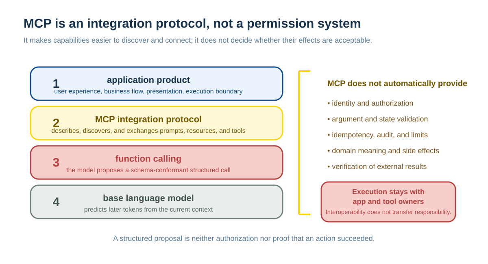
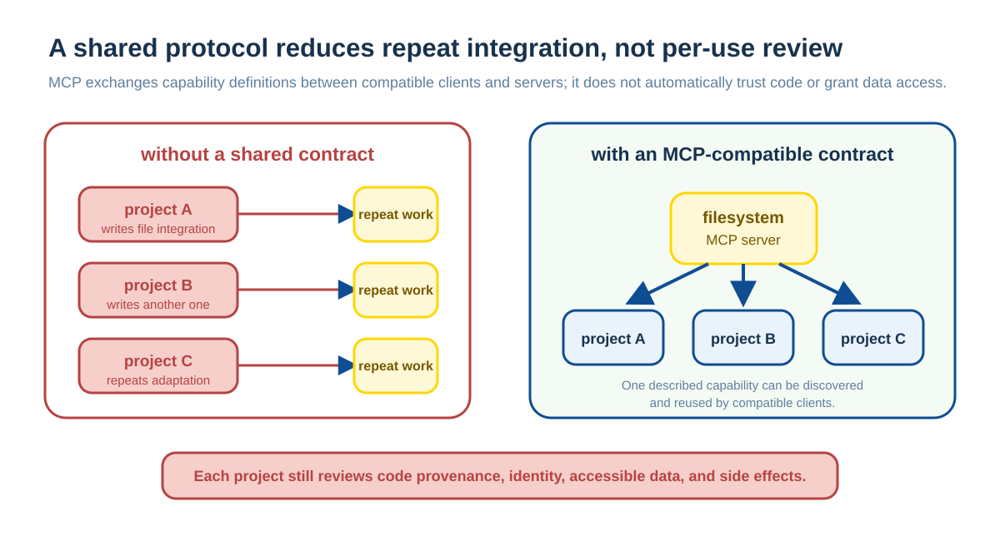
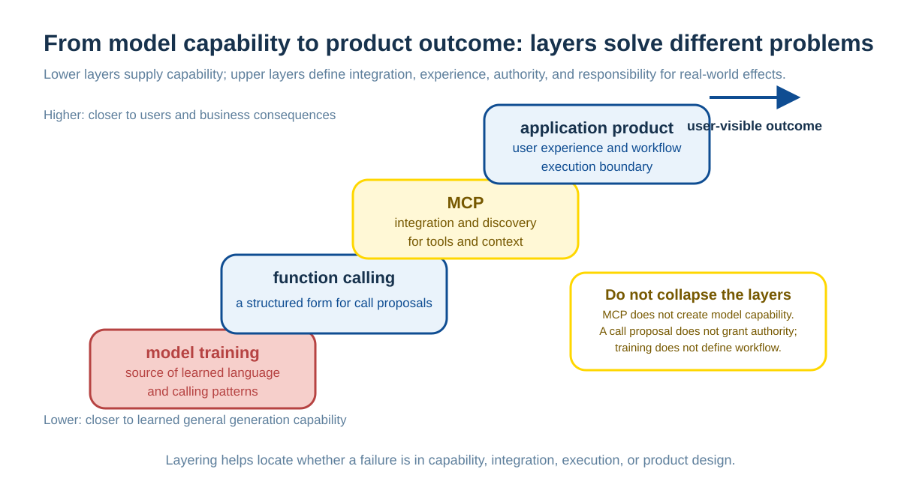

# Function Calling and Tool Use: Mechanism, Difference, and Essence

Models generate only text or structured proposals; reading a database, making an HTTP request, modifying an order, and executing code are all done by external programs. Function Calling and Tools APIs provide a common interface at this boundary: an application declares available capabilities and parameter constraints, the model proposes a call, and the application validates, authorizes, executes, and returns the result. We must distinguish the model's generative capability, an API's representation, and the execution environment's responsibilities.

This chapter supplements the tool-calling section in [How LLMs Interact with the External World](llm-external-interaction.md), focusing on:

1. The definitions of and differences between Function Calling and Tools.
2. Its boundary with ordinary formatted output.
3. How training, context, and API constraints jointly influence calling.
4. MCP's place in tool and context integration.

---

## Function Calling and Tools: Definition and Difference

### Function Calling Is a Structured Call Proposal

In the API contexts of providers such as OpenAI, Google, and Anthropic, “function calling” more accurately means **the model's ability to generate structured tool calls when tools are available in context**. Common characteristics are:

- The application declares available tools and their parameter schemas first.
- The model generates structured tool-call information when appropriate.
- Arguments normally need to conform to a predefined schema.
- The application executes the call and returns its result to the model.

It is the model's ability to generate a structured call request given tool definitions. Executing the function, checking permission, and returning results remain external application responsibilities.

### Tools Are the Catalog of Callable Capabilities

Tools are the **set of tool definitions** supplied to a model at the API layer, including:

- Function name.
- Input-parameter schema.
- Parameter types and constraints.
- Functional description, so the model can understand the tool's purpose.

They tell the system: “these are the tools you can call now.”

### Their Relationship

Their relationship can be understood as:

- **Tools are the tool catalog the system gives the model.**
- **Function calling is the capability and mechanism by which the model selects and calls a tool.**
- **The API layer defines structure; the model decides and generates the call.**

In other words:

**Tools = the available tool catalog<br />
Function calling = the ability to select and call a tool correctly**

---

## The Difference Between Function Calling and Ordinary Formatted Output

### Prompted Formatting Is Still Probabilistic

When a prompt asks a model to produce JSON:

```
Return JSON containing name and age fields.
```

The model may:

- Produce invalid JSON.
- Mix in comments or explanatory text.
- Produce incomplete structure or incorrect nesting.
- Use incorrect quotation marks or omit commas.

It follows the request with **higher probability**, but without a forced guarantee.

### Function Calling Combines Training and Interface Constraints

In function-calling mode:

- Models usually learned tool-call patterns during training.
- APIs provide structured signals such as `tools`, `tool_choice`, and schemas to constrain output.
- On some platforms, enabling strict schema constraints gives more reliable argument formatting.
- Compared with JSON generated only from a prompt, structured calls are usually more stable.
- But the exact return form and strictness still depend on each provider's API design.

### Summary of the Difference

| Dimension | Ordinary formatting | Function Calling |
|------|-----------|------------------|
| Control method | Prompt guidance only | Learned capability plus API structure |
| Reliability | Mainly prompt-dependent; format can fail easily | Training, structured interfaces, and constrained decoding can improve formatting reliability; validation remains necessary |
| Mechanism | The model understands natural language | Specially trained structured-output capability |

---

## How an API Specifies Function-Calling Mode

### Tool Definitions in an API

Provider field names and nesting vary, but a tool definition normally includes a model identifier, messages, a tool catalog, and a parameter schema. The following illustration omits provider-specific fields:

```json
{
  "model": "your-supported-model",
  "messages": [...],
  "tools": [{
  "type": "function",
  "function": {
    "name": "get_weather",
    "description": "Get weather information for a specified city.",
    "parameters": {
      "type": "object",
      "properties": {
        "city": {
          "type": "string",
          "description": "City name"
        }
      },
      "required": ["city"]
    }
  }
  }]
}
```

### Calling-Mode Control

#### A. Automatic Mode (Model Decides)

```json
{
  "tool_choice": "auto"
}
```

The model decides from the conversation whether it needs to call a tool.

#### B. Force a Particular Tool

```json
{
  "tool_choice": {
    "type": "function",
    "function": {"name": "get_weather"}
  }
}
```

#### C. Disable Tool Calls

```json
{
  "tool_choice": "none"
}
```

### This Is Declarative Control at the API Layer

Unlike a pure prompt, these are structured control signals that the model has learned to respond to during training.

---

## Why a Model Produces Tool Calls

**The core reason is usually the combined effect of model training, API structural constraints, and contextual prompting.**

Modern models such as GPT, Gemini, and Claude usually learn through training and subsequent alignment to enter a structured calling mode more reliably when tools are available. The following decomposition is a useful working model, not a provider-disclosed universal training recipe.

### Data Collection

- Collect many tool-call examples.
- Include a complete calling flow:
  - User request.
  - Model decision about whether to call a tool.
  - JSON format for the tool call.
  - Tool return result.
  - A final answer produced after the model integrates the result.

### Supervised Fine-Tuning (SFT)

- Teach the model the correct tool-call format.
- Strengthen argument extraction and JSON generation.
- Learn when a tool should be called.

### Reinforcement Learning or Other Alignment Methods

- Optimize the timing decision for a tool call.
- Improve formatting accuracy.
- Improve multi-tool collaboration.

### Trigger Mechanism

When an API request contains a `tools` field:

1. The model recognizes a tool-available context.
2. It activates tool-calling behavior patterns learned during training.
3. Its output space is biased toward a tool-call format.
4. It decides from the conversation whether to call a tool and which one to call.

**This is not a rule system; it is learned model capability.**

---

## Tool Calling Is Probabilistic Behavior, Not Hard-Coded Logic

### It Is Not a Hard-Coded if-else

The model does **not** enter tool mode because of:

```python
if api_has_tools:
    output_format = "function_call"
```

### It Is a High-Probability Behavior of a Probabilistic Model

In practice:

- Training gives the model a strong preference for tool calls.
- When contextual signals (`messages + tools schema`) appear,
- the probability of a tool-call format becomes very high.
- The model's judgment about whether to call, which tool to call, and whether arguments are semantically correct still comes from a conditional probability distribution.
- Even when an interface constrains syntax, the application must validate business semantics and execution results.

### Why Reliability Can Still Be High

- Large quantities of high-quality training data.
- Optimization with specialized loss functions.
- Reinforcement during RLHF stages.
- In engineering practice, a success rate often substantially higher than prompt-only constraints.

But this remains **the behavior of a probabilistic model**, not a deterministic system.

---

## How Training, APIs, and Prompts Work Together

### What Is Incomplete About Calling It “Only Prompt Engineering”

**What is partly correct:**

- A tools schema in an API is indeed contextual information for the model.
- A system prompt can also contain tool-use guidance.
- In information-theoretic terms, both control the output probability space through input.

**What is not fully accurate:**

- An API's tools field is not natural language alone; it is a structured control signal.
- A model's response to tools depends not only on “understanding a prompt,” but on **specialized learned capability**.
- That capability is not taught to the model on the spot by a prompt; it is trained beforehand.

### A More Accurate View

Function calling is a cooperative mechanism of three layers:

1. **Model-capability layer** (structured-output capability acquired through training).
2. **API-control layer** (tool definitions and the `tool_choice` parameter).
3. **Context layer** (system prompt and conversation history).

In formula-like terms, successful tool calling is the joint result of trained model capability, API structural control, and contextual guidance.

If any one of these is absent, reliability drops substantially.

---

## MCP: An Integration Protocol for Tools and Context

After understanding function calling, we can examine how the industry standardizes tool integration and context exchange. **MCP (Model Context Protocol)** is an open protocol initiated by Anthropic to standardize how clients discover, read, and call tools, resources, and prompt-related capabilities from external servers.

### From Capability to Protocol: Why MCP Is Needed

Although major model providers support function calling, practical applications face these problems:

**Fragmented tool definitions:**

- Every developer defines a tool format of their own.
- Tools with the same function are repeatedly developed in different projects.
- Tools cannot be reused across applications and platforms.

**No common standard:**

- No tool-discovery mechanism.
- Permissions and security management are implemented separately.
- Integration is costly and hard to maintain.

MCP attempts to reduce these integration problems. It does not provide Function Calling for a model, nor does it automatically unify each domain's business semantics, permission model, or security responsibility.

### MCP's Technical Position

**MCP can be understood as an open protocol in the integration layer for tools and context.** In many implementations it works with function calling or other tool-calling mechanisms, but they are not in a strict one-to-one dependency. Their relationship can be approximated as a technology stack:



This layered architecture resembles a network protocol stack:

- **Function calling** is closer to a model-side ability to propose a structured tool call.
- **MCP** is closer to a standardized integration protocol between an application and tools.
- **Concrete tools** are implementations that expose capabilities over that protocol.

### MCP's Value

**1. A common standard for tool definitions**

MCP standardizes how capabilities such as tools and resources are described and exchanged. In practice, when both client and server support the same MCP version, reuse across applications becomes easier:

```json
{
  "name": "read_file",
  "description": "Read file contents",
  "inputSchema": {
    "type": "object",
    "properties": {
      "path": {"type": "string", "description": "File path"}
    },
    "required": ["path"]
  }
}
```

**2. A standardized communication protocol**

The current MCP specification uses JSON-RPC messages and defines standard client–server communication to improve interoperability among implementations.

**3. A reusable tool ecosystem**

Developers can package tools as MCP servers for compatible clients. Reuse lowers integration cost, but installing a third-party server still requires review of code, authentication, data scope, and side effects; it is not an “install without conditions” plugin.

### MCP Application Scenarios

MCP can provide a relatively uniform integration path for the following scenarios; clients and servers still decide detailed permissions and execution policy:

- **File-system access:** through a filesystem MCP server, AI can read and write local files.
- **Database operations:** through a database MCP server, AI can query and modify data.
- **Cloud-service integration:** through MCP servers for Google Drive, Slack, and similar services, AI can access cloud resources.
- **Development tools:** through a Git MCP server, AI can perform version-control operations.

These capabilities are often used together with a model's tool-calling ability, but MCP concerns “how an application supplies tools and context to a model in a standardized way,” rather than replacing each provider's own calling mechanism.

### The Relationship Between MCP and Function Calling

| Concept | Network-technology analogy | Role |
|------|-------------|------|
| Function Calling | Structured calling ability within an application | Lets a model generate a tool call |
| MCP | Integration protocol / standard | Defines how tools and context are exposed |
| MCP Servers | Concrete service implementations | Provide concrete functionality |

Or consider a mobile-app ecosystem:

- **Function calling** = the phone's ability to install and run applications.
- **MCP** = the app-store standard (how applications are packaged, distributed, and installed).
- **MCP Servers** = the individual applications in the store.

### From Isolated Capability to Open Ecosystem

MCP provides a shared integration contract for tools and context:

**Without MCP:**



**With MCP:**

This standardization can reduce repeated adaptation; tool quality and security still need separate verification by maintainers, deployers, and users.

---

## Summary: From Capability to Ecosystem

### Key Takeaways

1. **Function calling is a foundational capability.**
   - A model obtains structured calling capability through specialized training.
   - High reliability comes from training optimization, not hard-coded logic.

2. **Tool mode is probabilistic behavior.**
   - It is a high-probability output pattern formed from training data.
   - API controls, learned capability, and contextual prompting must work together.

3. **MCP is an integration protocol for tools and context.**
   - It can work with Function Calling but does not depend on a single provider's calling format.
   - It supplies a common contract for capability description, discovery, and reuse.
   - It does not replace domain modeling, authorization, execution validation, or audit.

4. **Technical evolution has three stages.**
   - Stage 1: the model gains function-calling capability.
   - Stage 2: each provider defines its own tool-call format.
   - Stage 3: open protocols such as MCP drive interoperability across clients and servers.

5. **Understanding the layered relationship is essential.**



### Engineering Implications

**When designing tool calls:**

- Keep schema descriptions clear and precise; they are the basis for model understanding.
- Use a system prompt to add usage guidance and constraints.
- Implement error handling and fallback plans for boundary cases.
- Account for probabilistic behavior through monitoring and safeguards.

**When adopting an MCP ecosystem:**

- Prefer mature MCP servers to avoid rebuilding the same wheel.
- Attend to permissions and security configuration to protect sensitive data.
- Follow the MCP specification when developing custom tools so they are easier to share and maintain.
- Separate tool logic from business logic to improve system extensibility.
