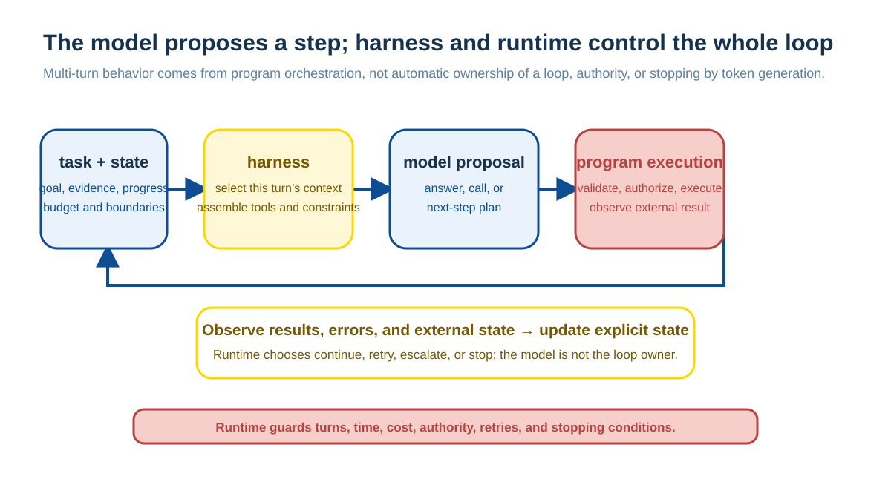
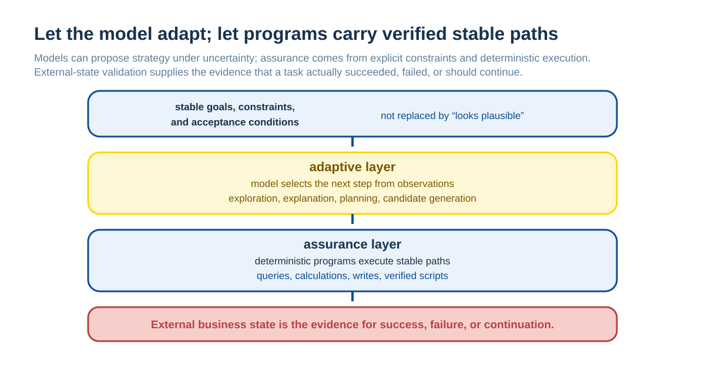
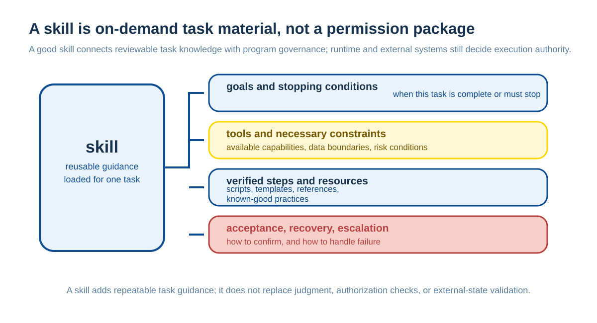
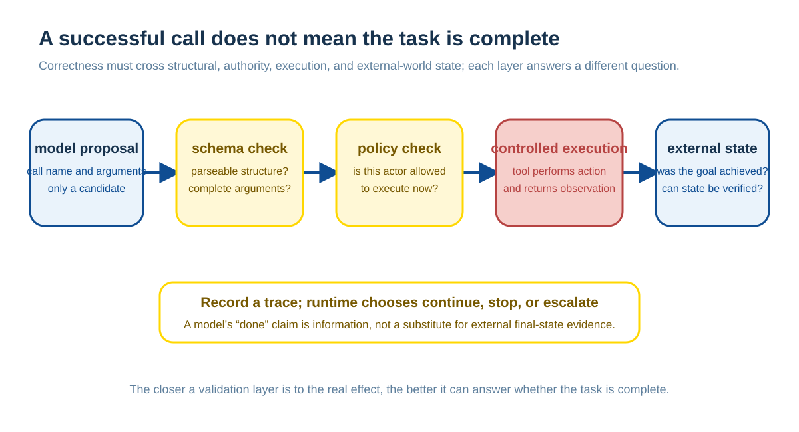

# Harnesses, Agent Runtimes, and Skills: How Multi-turn Tasks Run Reliably

Tool use lets a model propose one external operation. Long-running work must also choose later steps, preserve observed facts, handle failure, and stop at the right time. Harnesses, Agent runtimes, and skills organize that work. They do not add parameters or make probabilistic output deterministic. They let model proposals, program execution, and external state cooperate in a bounded loop.

This chapter is about a responsibility chain shared by multi-turn systems, not one SDK: who assembles context, who executes an action, which state survives, and when the system recovers, escalates, or stops.

## First Decide Whether an Agent Loop Is Needed

Using a model and tools does not automatically require an Agent. If steps, branches, and exception handling are known in advance—“read an order → calculate an amount → send a notice”—a fixed workflow is usually easier to test, observe, and recover. A model can simply extract fields, classify a request, or write the user-facing explanation.

A model-directed loop is justified only when the next step depends on a newly observed result. A system may inspect device state, retrieve another source after finding a gap, or select another check after encountering a constraint. Its smallest form is:

The model does not own the loop. It proposes from current context; the runtime still controls turns, time, cost, tool authority, retries, and termination. Placing “think–act” in a prompt does not create those boundaries.

## Harnesses and Agent Runtimes Manage Different Scope

They often appear together, but they manage different scopes.

| Layer | Primary responsibility | What it must not replace |
| --- | --- | --- |
| Harness | Assemble context, call a model, parse structured output, route tool results | Business authority, durable state, final fact judgment |
| Agent runtime | Preserve state across turns; enforce budgets, authority, concurrency, recovery, audit, stopping | Model reasoning or business transaction guarantees |
| Tool executor | Access services with a controlled identity and return observations | Letting a model decide authority or treating a request as success |
| Business system | Hold authoritative state, enforce rules, transactions, idempotency | Understanding a natural-language goal |

A small Q&A system may need only a harness. A fuller runtime is justified when work spans turns, has side effects, or must recover after interruption. The distinction makes “how this call runs” and “how the entire task survives” separately observable and replaceable.

## Let the Model Adapt; Let Programs Carry Stable Paths

Models are useful where information is incomplete, an interface changes, or the next step is uncertain. Deterministic programs suit operations already verified, requiring exact control, or carrying side effects. A long-running system should not replan every stable path on every run.

Verified repeated queries, calculations, and action sequences should become workflows, scripts, or small clear tools. The model can still diagnose changed conditions, choose a branch, or request human handling, but need not regenerate the same stable route. This reduces cost and variation and makes failure easier to locate.

This does not mean that every task should be made rigid. When the environment changes quickly, the goal is open-ended, or success criteria cannot be defined in advance, a system must not pretend that a deterministic fast path exists. The key is to make clear which layer adapts and which layer provides guarantees.

## State, Recovery, and Stopping Conditions Must Be Explicit

Chat history is not complete task state: it may be truncated, summarized, or reconstructed, and the same fact may recur with different wording. A runtime must retain at least enough state to recover and audit:

| State | Why it matters |
| --- | --- |
| Goal and acceptance conditions | Separates taking an action from completing work |
| Actions and idempotency keys | Avoids repeated payment, publication, or writes after recovery |
| Decisive evidence and tool results | Lets a later turn act on observations rather than blind retries |
| Current stage and recovery point | Identifies where to resume |
| Budgets and limits | Constrains turns, tokens, time, money, and concurrency |
| Approval and authority state | Prevents authorization expanding during recovery or handoff |

Recovery is not simply trying again. Observe external state first, then decide whether the preceding operation failed, partly completed, or completed while its response was lost. Side-effect tools require idempotency keys, transaction state, or queryable final state from the business system; a model saying “done” is not recovery evidence.

Stopping is a runtime decision too: the goal is externally verified, evidence or authority is insufficient, approval is required, a budget is reached, failures repeat, or a conflict cannot be safely recovered. An Agent that tries forever lacks a control boundary.

## A Skill Is an On-demand Task Asset

A skill organizes relatively stable knowledge for a task: goals, preconditions, steps, tool guidance, scripts, examples, checks, and recovery rules. It helps a model and host obtain guidance when needed for work that repeats but is not completely fixed.

A skill is neither a newly learned model capability nor an authority grant. Loading one adds instructions and resources visible to a task; executors still independently verify identity, tenant, limits, and approval. Skills should also be supplied on demand. Loading every manual, history, and script into context recreates the context-noise problem.

MCP helps a client discover prompts, resources, and tools; a skill organizes how a task uses such capabilities. They can work together but are not synonyms. The boundary between MCP and domain capability models appears in [From MHS and MCP to Domain Capability Protocols](mhs-mcp-domain-capability-protocol.md).

## Correctness Comes from External Final State and Layered Checks

An HTTP success, button click, or tool call without an error is only a process signal. Completion must be decided by external business state and acceptance criteria. Publication should confirm a published object; a refund should confirm accounting and idempotency state; retrieval should confirm that evidence supports the conclusion.

Self-critique and multiple Agents can add signals, but cannot replace these checks. Models sharing one mistaken premise can produce the same fluent error. Multiple Agents merit added complexity only when they provide independent evidence, specialist tools, or independent verification.

## Minimal Input and Minimal Authority Form a Runtime Boundary

Model services, retrieved material, and tool executors sit across different trust boundaries. Giving a model an entire customer file, internal policy, or every available tool may not improve this task, but widens the consequences of disclosure, prompt injection, and misuse. Redaction reduces direct identifiers but does not necessarily remove business-information exposure. A safer default is the smallest facts and capabilities required for the decision.

Similarly, a tool catalogue must not equal everything the model can execute. Runtimes should narrow visible and callable capabilities by user, tenant, task stage, and risk. High-risk actions need limits, approval, a sandbox, or human confirmation. Execution-side checks must enforce authority; a prompt saying “the model must not do this” is insufficient.

## Summary

A harness connects each model call to context and tools. An Agent runtime makes state, budgets, recovery, and stopping executable across turns. Skills preserve reusable task knowledge and verified paths. The model proposes at points of uncertainty; programs execute stable work, enforce minimal authority, and validate state. This keeps a fluent generation from being mistaken for reliable completion. [AI Agent Evaluation: From Tests to a Business Quality System](agent-eval-business-quality-system.md) explains how tasks, traces, and graders can continually test that chain.
