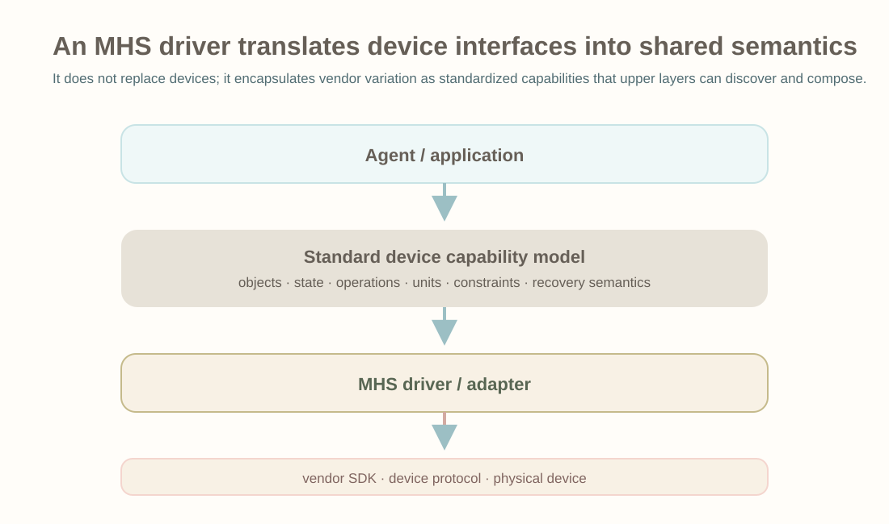
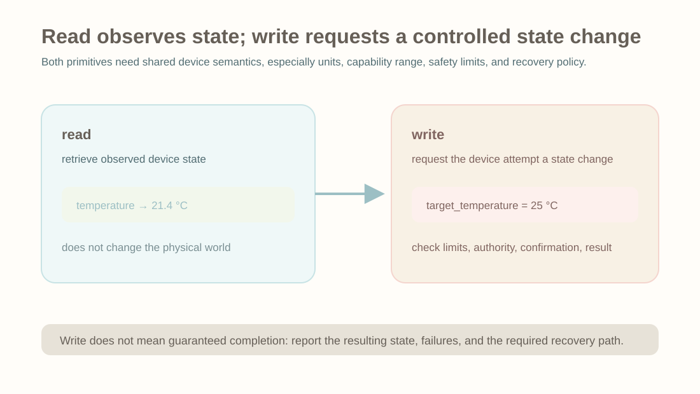
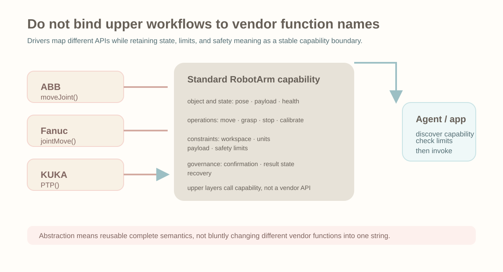
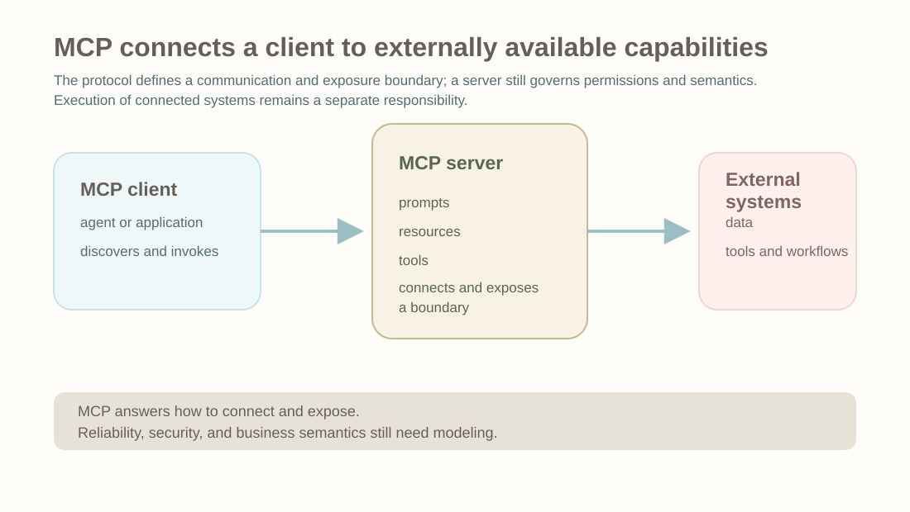
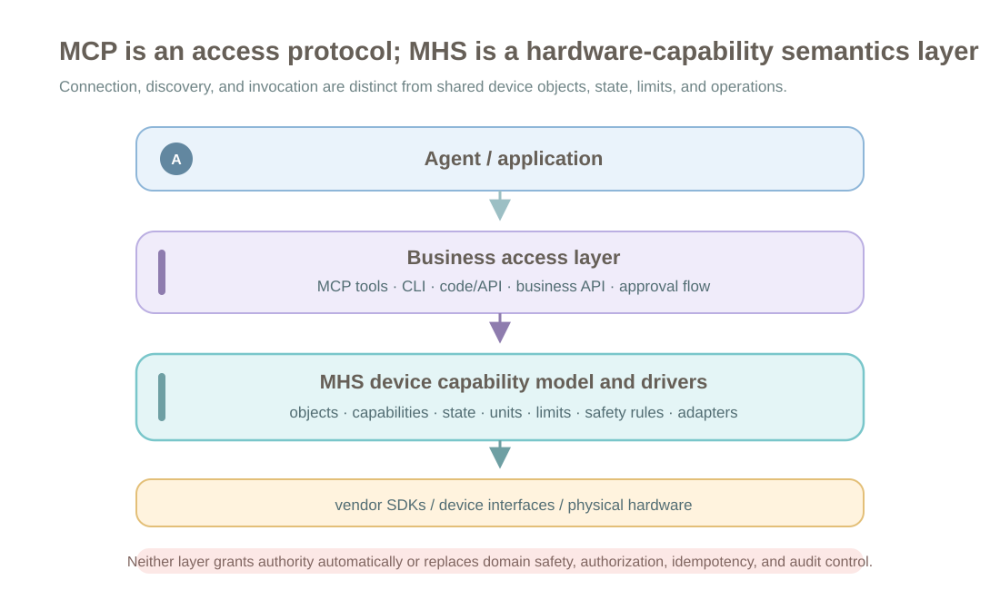
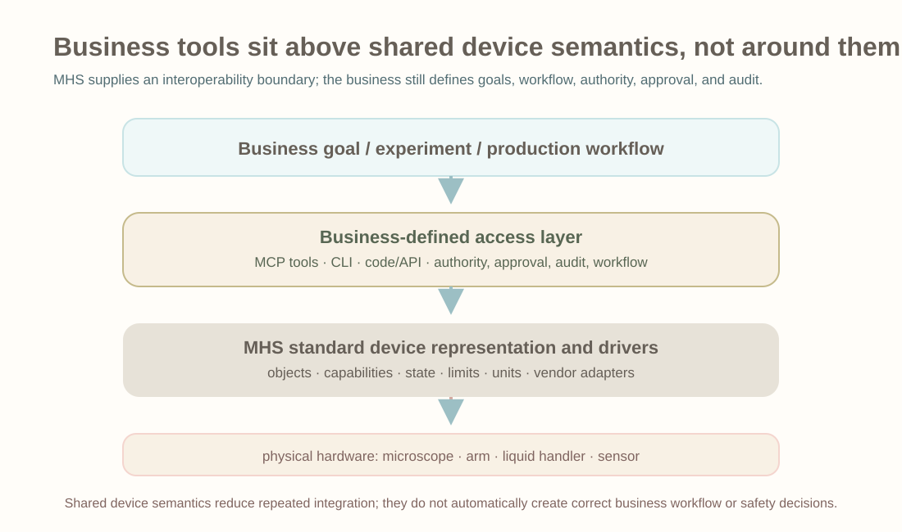
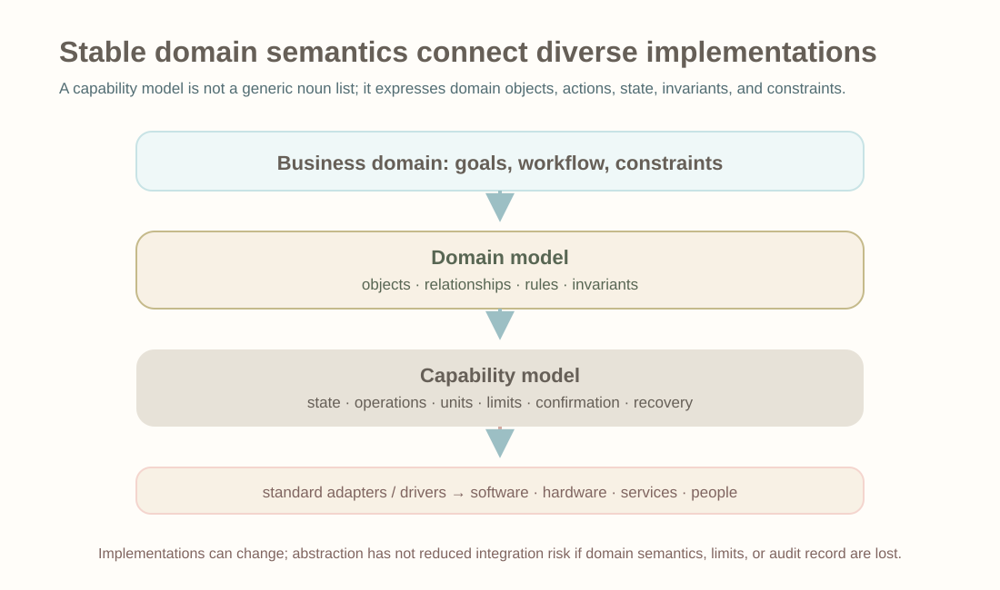
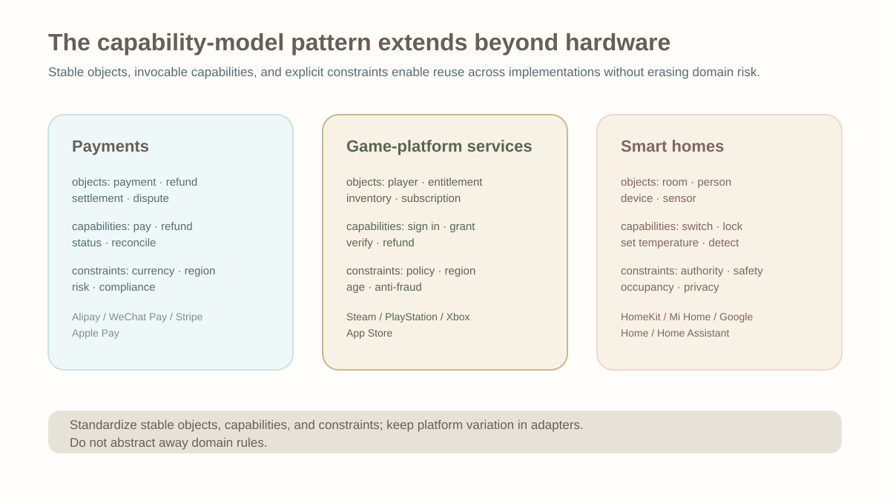

# From MHS and MCP to Domain Capability Protocols

On August 27, 2026, Anthropic released a research preview of MHS (the Model Hardware Standard). In its official definition, MHS is a shared specification for AI agents to operate physical equipment safely, with the first applications aimed at scientific laboratories and advanced manufacturing. It is not yet a mature public standard: it is initially available to selected partners, while Anthropic evaluates safety and develops best practices before open sourcing it.

MHS is first of all a hardware standard. But the engineering problem behind it is not new: when a domain contains many heterogeneous implementations, how can its objects, capabilities, states, constraints, and operations be abstracted into a common model that upper-layer software can use reliably?

AI did not create this requirement. Software engineering had many analogous abstractions before AI appeared:

- JDBC abstracts different databases.
- POSIX abstracts different operating-system capabilities.
- USB Class abstracts different categories of devices.
- Kubernetes abstracts underlying compute resources.
- OpenAPI describes service interfaces as machine-readable contracts.

MHS is distinctive because it places this kind of standardized abstraction in the setting of “physical equipment plus agent use.” AI did not create the need, but it changes the user and amplifies it.

Such standards fundamentally reduce repeated adaptation and turn implicit knowledge into a public contract. Without one, each business system, agent, or tool integrator may have to understand vendor interfaces, manuals, state semantics, and safety boundaries again. With standardization, that domain knowledge can settle into a shared abstraction layer, while upper layers orchestrate tasks against stable objects and capabilities where possible.

For agents, there is also a practical added benefit. When MHS is accessed through MCP, a CLI, code files / APIs, or a higher-level business API, the upper integration layer need not repeatedly describe entire hardware manuals. An MCP tool can concentrate its description on the business entry point and parameters, while more stable information—device capabilities, state, units, and safety limits—comes from MHS's standard device representation. This reduces the repeated context cost of vendor manuals, temporary prompts, and long rules.

## What MHS Standardizes

MHS is officially positioned as a hardware standard. It addresses programmable physical equipment such as microscopes, liquid-handling workstations, robot arms, sensors, and laser systems.

It does not answer merely “can AI call a function?” It addresses a lower-level integration problem:


*MHS is not about one function call. It addresses scattered hardware semantics, incompatible vendor interfaces, and repeated integration work.*

MHS introduces a standardized Driver. The Driver sits between vendor interfaces and an upper-layer agent. It does not replace a vendor's underlying protocol; it translates vendor SDKs, device interfaces, and hardware state into a representation that upper layers can understand consistently.



*An MHS Driver translates vendor SDKs and device interfaces into a device representation that upper layers can use consistently.*

MHS Drivers use simple primitives such as `read` and `write`. The official example is:



*`read` and `write` themselves are simple; the crucial part remains the device semantics, state, and safety constraints behind them.*

This may look like interface unification, but device representation is the more important unification.

A device is not merely several functions. It also contains information that code alone does not reveal:

- What it can measure.
- What it can adjust.
- Its current state.
- Its physical characteristics.
- Its safety limits.
- Which operations require human confirmation.
- Whether it can recover after an error.

Anthropic's official article notes that much of this information previously lived in paper manuals, files on users' computers, or human experience. An MHS Driver can use tags so that users write this information in natural language; an agent can also collect hardware configuration through interviews and generate a reference file that describes what a device can measure, what it can adjust, and which safety limits it enforces.

Therefore, MHS is not merely an API wrapper for hardware. It turns hardware manuals, vendor interfaces, device states, physical characteristics, and safety limits into a structured device representation that an agent can read and use.

This also explains why it is more than “convenient calling.” Without this structured representation, a business may expose hardware tools through MCP but still have to repeat device manuals, vendor differences, unit conversion, and safety rules in tool descriptions, prompts, or extra documents. With standardization, this content can be queried and reused as part of the device model; an upper-layer MCP tool can keep mainly the information directly relevant to the current business task.

For example, different robot-arm vendors may provide different interfaces. What upper layers need is a shared device-capability model, not those vendor function names:



*The point of standardization is not to make function names look alike, but to give device capabilities, state, and constraints common semantics.*

Once device representations are unified, upper layers can orchestrate multiple devices. An agent can read each device's operating state, arrange steps according to an experiment or production process, monitor changing results, and adjust parameters when conditions change. For long-running or reliably repeatable tasks, it can also write a set of device commands as a deterministic script, so the devices follow that script rather than relying on online model reasoning at every step.

The boundary matters. MHS remains a research preview and currently describes devices with programmable interfaces. It reduces the cost of integration, discovery, description, and orchestration; it does not mean an agent has complete physical-world understanding or that real hardware troubleshooting can dispense with experts.

## MCP and MHS Sit at Different Layers

The Model Context Protocol (MCP) is a standard Anthropic open sourced in November 2024. In the official definition, MCP is an open standard for connecting AI assistants to external systems, including content repositories, business tools, development environments, data sources, tools, and workflows.

Its basic shape is:



*MCP addresses how an AI application connects to external systems and discovers and uses data sources, tools, and workflows.*

This article focuses on Tools, because they are easiest to confuse with MCP Tools when MHS is connected to an agent.

In the current MCP specification, a Tool has `name`, `description`, and `inputSchema`, and it may have `outputSchema`; tool results can be text, images, audio, resource links, or `structuredContent`.

MCP therefore does not expose only unstructured natural language. It can carry natural-language descriptions as well as structured schemas and structured results.

But MCP does not establish a domain model for a particular domain. It can tell an agent:

- There is a tool here.
- What that tool is called.
- What its parameter schema is.
- What its call result is.

It does not inherently tell an agent:

- Which states a microscope should have.
- Which safety limits a liquid-handling workstation has.
- How a centrifuge's rotation speed and centrifugal force convert.
- What a robot arm's workspace and payload bounds are.

Those are the problems MHS addresses.

Their relationship is better understood this way:



*MCP is one entry point through which an agent accesses external systems; MHS lies lower down and represents hardware as a discoverable, readable, constrained capability model.*

MHS is model-agnostic. Official material also notes that an agent harness can access MHS through a standard protocol such as MCP, or control hardware through command-line interfaces and code files (APIs).

Therefore MCP is the protocol layer through which an agent connects to external systems; MHS is the device layer for standardized representation and control of physical equipment. MCP can be an entry point to MHS, but MHS primarily addresses device discovery, standardized Drivers, state reads and writes, device reference files, and safety constraints.

## MHS Does Not Design a Business's Tools

We must also distinguish the “hardware-standard layer” from the “business-integration layer.”

MHS provides a standard capability layer on the hardware side. It lets devices from different vendors expose state, capabilities, limits, and read/write operations in relatively consistent ways. How a specific business exposes those capabilities to an agent remains the user's own decision.

A laboratory can wrap MHS in an MCP Server and expose experiment tasks as tools; it can write CLI commands for automation scripts; it can also write code files (APIs) that use MHS as the underlying device-control layer. MHS does not decide a business's tool names, parameter design, prompt descriptions, approval flow, or task orchestration.

A more reasonable integration relationship is:



*The business designs upper-layer tools and processes; MHS makes lower-layer hardware capabilities more stable to replace and reuse.*

With this layering, a business can define upper-layer tools according to its own needs. For the same microscope, a research experiment might expose `capture_cell_image`, while a quality-control system exposes `inspect_surface_defect`. Their business meanings differ, although both can rely on standardized device capabilities supplied by MHS.

This is also MHS's benefit. If underlying hardware changes from Nikon to Leica, or a robot arm from ABB to KUKA, upper-layer experiment flows, MCP Tools, CLIs, or business code can remain stable if the new Driver supplies the same standard capabilities. In multi-device settings, agents or business programs can also find available equipment and adapt based on MHS device discovery and state descriptions rather than rereading a vendor manual every time.

## Can MCP Alone Meet Domain Needs?

MCP alone can also do many things.

For example, a team can write an MCP Server directly and expose a microscope, robot arm, or centrifuge as tools:

```text
microscope.capture_image()
microscope.set_focus()
robot.move_plate()
centrifuge.spin()
```

From the perspective of whether an agent can call hardware, this path is feasible. MCP can connect external tools and systems; as long as hardware has a programmable interface, an MCP Server can wrap it.

In a fixed setting, it can even be the more practical approach. If a team connects only one microscope for one experiment workflow and equipment will not change often, it need not first design a complete MHS-like model. A small MCP Server can expose the required capabilities and make the business work.

The limitation is that this mainly solves the calling entry point; it does not automatically standardize domain semantics.

Without MHS, every MCP Server must decide for itself:

- What the device is called.
- How capabilities are named.
- How state is represented.
- Which units parameters use.
- Where safety limits are recorded.
- How errors are classified.
- Which operations require human confirmation.
- How multiple devices discover and coordinate with one another.

The likely result is that each team makes its own “hardware MCP.” Superficially, an agent can call every tool, but the device model, state semantics, and safety constraints behind them differ. When the agent moves to another laboratory, equipment set, or vendor, it must learn them again.

So the question is not “can we do it without MHS?” but “can something built solely with MCP be reused across devices, vendors, and laboratories?” MCP lets an agent reach a capability; MHS gives the hardware capability itself shared semantics.

This also marks the boundary for whether standardization is worthwhile: a one-off integration emphasizes the calling entry point, while long-term reuse emphasizes the domain model. MCP is sufficient to “connect it”; MHS tries to ensure that, after connection, diverse devices can be understood and orchestrated through the same semantics.

## AI Amplifies the Need for Domain Semantics

Device standardization, driver abstractions, and protocol unification existed before AI. Industrial automation, robotics, IoT, USB Device Class, and OPC UA all address related problems.

What AI changes is the user.

Previously, a programmer knew which equipment existed on site, read the manuals in advance, and wrote adaptation code ahead of time:

```python
microscope.capture()
```

In that model, much of the semantics lives in the programmer's mind. The programmer knows what the function means, its valid parameter range, when it is dangerous, and what should happen after failure.

The agent model is different. An agent faces a more dynamic environment. It may not know which equipment is present or the vendor interface of each device. It must discover devices, understand capabilities, judge constraints, and combine actions itself.

For example, a user might say only:

> Complete an experiment.

The agent needs to know:

- Which devices are available.
- Which can capture images.
- Which can dispense liquid.
- Which can centrifuge.
- What the parameter ranges are.
- What the safety boundaries are.
- What sequence to use.
- Whether recovery is possible after failure.

Thus AI does not amplify a need for “a few more APIs”; it amplifies the need for machines to understand capability semantics.

That is MHS's value. It turns the parts previously handled by people reading manuals, writing adapters, and remembering experience into a structured, discoverable, composable, constrained model where possible. An agent receives not only a function, but a capability with semantic boundaries.

## From Hardware Capability to Domain Capability

If it remains only at the hardware level, MHS is a physical-device standard. But as an engineering abstraction, it can be understood as a special kind of general business standardization: for a domain, it abstracts stable objects, common capabilities, state transitions, constraint rules, and execution actions.

“Business” here does not mean only enterprise-management systems. It means recurring work patterns in a domain that can be abstracted and reused. Laboratory automation is one business; a manufacturing site is another. Both have stable objects, flows, and constraints:

- Objects: devices, samples, work orders, materials, experiments, production lines.
- Capabilities: measure, move, dispense, process, inspect, roll back.
- States: idle, running, failed, complete, awaiting confirmation.
- Constraints: safety, capacity, permission, physical boundaries, process requirements.
- Flows: plan, execute, monitor, adjust, verify.

MHS's official scope is hardware, but its style of abstraction can be viewed more broadly:



*Viewing the hardware practice more broadly returns us to familiar problems of domain models, capability models, and standardized adapter layers.*

Extending MHS outward does not mean that “business domains sit one level above hardware.” Hardware is simply one domain. If similar standards emerge, they are more likely to be peer capability models for smart homes, payments, games, manufacturing, logistics, healthcare, or energy.

The core problem remains the same: a domain has many heterogeneous implementations, while upper-layer business logic should not be bound directly to one vendor interface. A standard layer extracts stable objects, capabilities, states, and constraints so that different implementations can be understood and substituted through the same semantics.

Payments are an accessible example. Alipay, WeChat Pay, Stripe, Apple Pay, and bank-card rails all appear to “collect payment,” yet their integration mechanisms, signatures, authorization flows, asynchronous notifications, refunds, reconciliation, and risk-control fields differ. An e-commerce system that supports several payment methods usually needs substantial adaptation in a payment gateway or business code.

In an analogy to a hypothetical Model Payment Standard, the point would not be to let an agent bypass business rules to charge or refund money. It would be to extract relatively stable payment objects, capabilities, and constraints. A Model Finance Standard would be broader still, covering accounts, assets, credit, risk control, and settlement, of which payment is only one part.

An upper-layer AI commerce system, customer-service agent, or operations system would then care about business semantics such as “create a payment order,” “query payment status,” “initiate a refund,” and “handle a reconciliation exception,” together with the confirmations, permissions, risk controls, and compliance conditions for each action. An Adapter handles whether the underlying rail is Alipay, WeChat Pay, or an overseas card network; changing payment methods can leave upper-layer flows stable.

Game platforms are similar. Steam, PlayStation, Xbox, App Store, Google Play, and other publishing platforms can involve accounts, payments, inventory, achievements, subscriptions, refunds, anti-cheat, and parental controls. More precisely, this imagines a standard for game-platform services, not one that unifies gameplay or game engines. Its focus is likewise to abstract these platform services into stable objects and capabilities.

These names illustrate an abstraction direction, not existing official standards. The point is that when a domain has many heterogeneous implementations, similar capabilities, frequent replacement and composition, and upper layers want agents or business systems to integrate quickly, a standardization need similar to MHS can arise.

Smart homes fit the same pattern. A home may contain lights, locks, air conditioners, cameras, curtains, and sensors from different vendors and platforms such as HomeKit, Mi Home, Google Home, or Home Assistant. Users care not about “calling a bulb API,” but situations such as “I arrived home,” “I am going to sleep,” “nobody is home,” or “unusual movement was detected.” The shared concepts are rooms, people, devices, sensors, occupancy, permissions, safety, and privacy constraints. Adapters or Drivers handle vendor equipment; upper layers handle scene goals and combined actions.



*Payments, game-platform services, and smart homes are only analogies; they illustrate that other domains may also need capability models and standardized adapter layers.*

Whether this kind of standard is worth building depends on five questions:

- Are heterogeneous implementations sufficiently numerous?
- Are objects and capabilities relatively stable?
- Is frequent replacement and composition required?
- Must agents understand the domain dynamically?
- Does a common model provide more value than its migration cost?

The easiest mistake is to standardize an interface but not its semantics. Every platform may call something `set_mode`, but one platform's “away mode” merely turns off lights while another also locks doors, enables cameras, reduces air-conditioner power, and activates alarm rules. The same action name does not give an upper-layer agent the same meaning.

Valuable standardization must reach business objects and capability semantics, not stop at function names.

## Summary

MCP and MHS differ as follows:

- MCP is a protocol through which AI applications connect to external systems, covering data sources, tools, and workflows.
- MCP can carry natural-language descriptions as well as structured schemas and structured results.
- MHS is a shared specification for AI agents to operate physical equipment safely.
- MHS centers on standardized Drivers, read/write primitives, device discovery, device reference files, and safety constraints.
- Agents can access MHS through MCP, a CLI, or code files / APIs.
- Users design how tools, commands, and business flows are exposed for their own scenarios; MHS makes lower-layer hardware capabilities more stable to replace and reuse.

In short:

- MHS is officially a hardware standard; in engineering terms, it is also a case of domain-capability standardization.
- In the hardware domain, MHS abstracts device objects, capabilities, state, constraints, and operations into one model so different vendors and models can be understood, substituted, and called more consistently by software and AI agents.
- This standardization need was not invented by AI. Heterogeneous-system integration, vendor adaptation, interface standardization, and domain-model abstraction have long been software-engineering and industrial-system problems.
- AI changes the user and usage pattern. Rather than calling only hard-coded APIs, agents need to discover capabilities, understand semantics, read structured constraints, combine resources, and complete goals in dynamic environments; this amplifies the need for semantic exposure and structured descriptions.
- This is general standardization within a particular domain. Its purpose is reuse rather than conceptual uniformity: reuse a domain model, integration layer, and business flows while reducing repeated adaptation when vendors, devices, or platforms change.
- MCP and MHS belong to different layers. MCP connects an agent to external systems; MHS standardizes how hardware is described and controlled. MHS may be exposed through MCP, but can also be accessed through CLI and code files / APIs.
- Extending this idea to other domains produces the question of domain-capability models or protocols. Payments, games, smart homes, manufacturing, logistics, healthcare, and energy may develop similar abstractions when they have heterogeneous implementations and repeated integration costs.
- The engineering practice is not new: as integration, substitution, and reuse demands grow, an industry tends to add a standard layer. AI accelerates this and makes standards describe not only interfaces, but also objects, capabilities, state, constraints, and semantic boundaries.

In practical terms: when a domain has enough integrators, sufficiently different implementations, and strong needs for replacement and composition, it is worth considering a standardized abstraction in the middle. AI agents make this more visible because they need not only interfaces but also readable, constrained, reusable domain semantics.

The difficult part is not field design but shared meaning. A domain-capability protocol has practical value only when its objects are stable enough, its capabilities general enough, its implementations heterogeneous enough, and its composition needs strong enough.

## References

- [Previewing the Model Hardware Standard](https://www.anthropic.com/news/model-hardware-standard-research-preview)
- [Introducing the Model Context Protocol](https://www.anthropic.com/news/model-context-protocol)
- [What is the Model Context Protocol?](https://modelcontextprotocol.io/docs/2026-07-28/getting-started/intro)
- [MCP Specification: Tools](https://modelcontextprotocol.io/specification/2025-06-18/server/tools)
