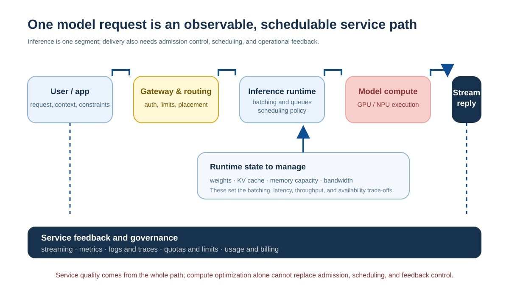
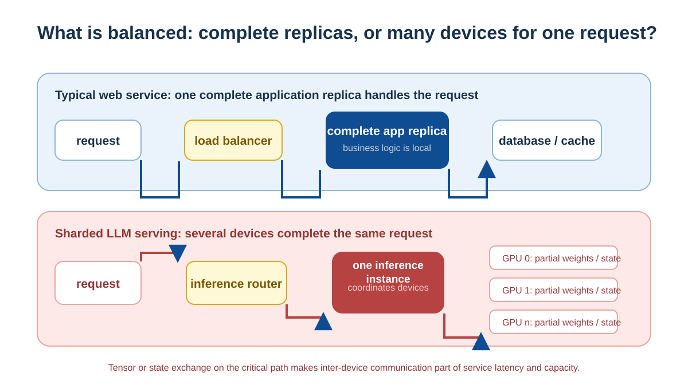
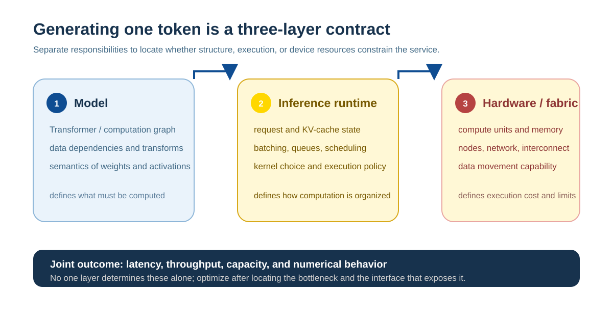
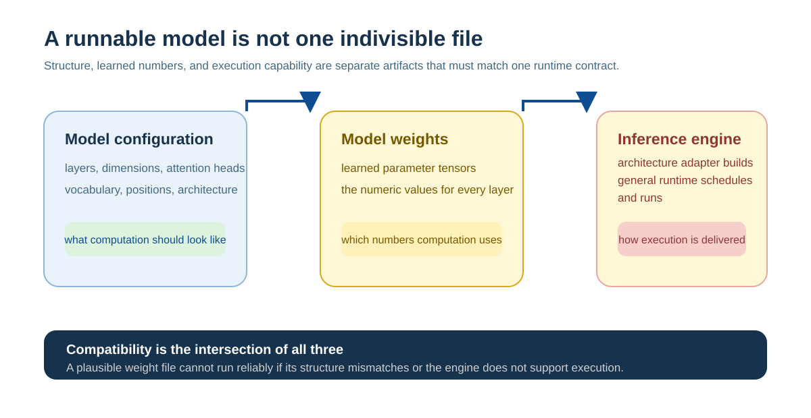
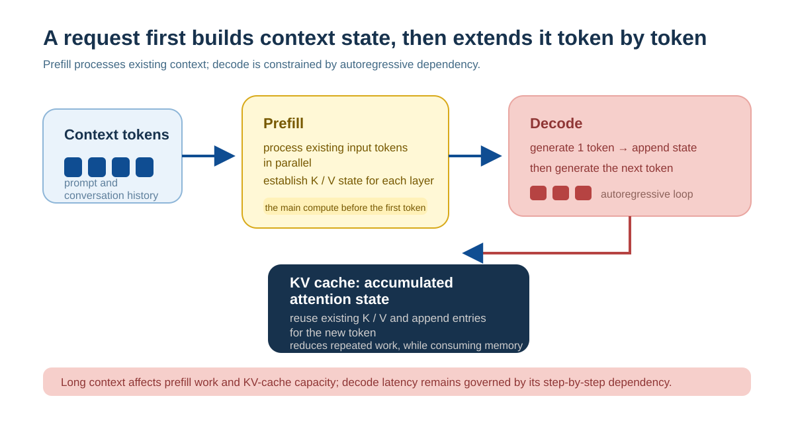

# LLM Infrastructure: How a Model Becomes a Reliable Service

Model serving handles a stream of requests with different lengths, priorities, and cost targets, rather than one isolated computation. This part asks how one model becomes a service that many people can use reliably while balancing latency, cost, capacity, and availability.

AI infrastructure is not simply buying GPUs. It includes devices, memory and storage, networking, and the software that organizes them for training and inference. The useful starting point is one request: where is its data and state, who is waiting, which resource is the bottleneck, and how does the service recover?

The model defines the computation; infrastructure decides whether it fits, how requests share it, when it returns, and how it is observed. Agent tool loops belong to Part III. The loop here is queueing, execution, and delivery of one model call.

## Six Layers from Task to Resource

One model service crosses six layers. They are not six components that every product must have; they are a way to locate a bottleneck.

| Layer | Question |
| --- | --- |
| Application and task | How fast, how costly, streaming or degraded? |
| Model and workload | Model size, input/output tokens, context, request arrivals |
| Inference or training system | Loading, batching, KV cache, scheduling, recovery |
| Operators and runtime | How attention and matrix operations map to devices |
| Processor and storage | Compute, memory capacity, bandwidth, data movement |
| Interconnect and cluster | How cards and machines exchange tensors and contain failures |

“The API is slow” is not a diagnosis. A long input can make prefill slow; decode limits post-first-token speed; KV cache can reduce concurrency; a queue can wait for an instance; inter-machine communication can bottleneck. Locate the waiting layer before changing a prompt, model, scheduler, hardware, or service contract.

## Why This Is Not Ordinary Load Balancing

In a traditional web service, a request is often assigned to one instance with complete processing capability; the first task of load balancing is to distribute requests among healthy, available replicas. The request can still visit databases, caches, or downstream services, but the application computation usually does not require multiple machines to synchronize one step on the same critical path.

LLM serving can use the same shape: when a model and its runtime state fit in a device group, complete replicas serve independent requests and routing mostly provides load balancing and availability. Complexity appears when model weights, KV cache, or latency objectives exceed the capacity and bandwidth budget of one card or machine. One request can then require several devices to cooperate; every layer of computation or generation step can wait for cross-device communication.

This does not mean every LLM request crosses machines, nor that traditional systems lack distributed problems. The difference is that scheduling can descend below “which request goes to which instance.” It may also arrange prefill and decode, tokens in a batch, KV-cache blocks, model shards, device communication, and where state resides. KV cache also gives serving state affinity: returning a later request to cached state can avoid recomputation, but competes with load balance, failover, and tenant isolation.

Hardware topology is therefore not an implementation detail that software can erase. Better abstractions hide much complexity, but cannot remove physical constraints: a model must fit, state must be read in time, and shards must synchronize. High-performance deployment still needs to account for memory hierarchy, device links, and communication paths, much as a high-performance database needs to account for storage and indexes.

## Who Performs the “Operating-System-Like” Work?

Organizing these resources resembles a distributed runtime for model workloads: it schedules work, manages memory state, submits device tasks, coordinates communication, isolates tenants, and recovers from failures. It is not one unified distributed operating system, however. Responsibilities are divided among layers, each with a limited scope.

| OS-like responsibility | Main LLM-infrastructure owner | Objects managed |
| --- | --- | --- |
| Request and short-lived state scheduling | Inference engine | Queues, batches, prefill/decode, KV cache, cancellation, and streaming |
| Long-running training progress | Training framework and engine | Parallel strategy, gradient synchronization, optimizer state, checkpoints |
| Device execution and communication | GPU/NPU runtime, driver, and communication libraries | Kernels, memory allocation, streams, and cross-device collectives |
| Resource placement and isolation | Cluster scheduler and platform | Machines, accelerator quota, job placement, containers, and failure migration |
| Service objectives and lifecycle | Gateway, routing, and serving control plane | Model versions, traffic, scaling, limits, observation, and rollback |

The inference engine is the runtime closest to one generation: it decides when a request runs, how weights and device memory are shared, and when state is retained or released. A training engine handles a different class of long-running synchronized computation; a cluster scheduler assigns machines and devices to work; a serving control plane delivers model capability to users. Together they form a system, but none substitutes for the others.

### Who Is Responsible for One Token?

Transformer defines **what** to compute: Q, K, V, attention, FFN, and dependencies between layers. An inference engine decides **when, with whom, and by which software strategy**: queueing, batching, KV-cache allocation, kernel selection, and model splitting. Hardware decides **which physical resources** execute it: compute units, memory levels, and device links.

K/V values come from Transformer attention; paging, sharing, offloading, and freeing KV cache belong to the inference engine; whether it resides in HBM, host memory, or crosses devices depends on hardware and runtime.

### An Inference Engine Is Not Fully Model-Agnostic

Request queues, batches, memory pools, KV-cache allocation, and streaming output can be reused across many Transformer variants. An inference engine still needs to know how a model computes attention, FFN, MoE, or another specialized structure. Model configuration describes layer counts, dimensions, and architecture type; weights hold numerical parameter values. Neither is a program that can automatically execute any architecture. Engines commonly combine a general runtime with architecture implementations or adapters, then construct computation and load weights from configuration.

An inference engine is therefore neither Transformer nor an ordinary server unrelated to a model. It provides the execution layer between a model computation graph and device resources. A new model structure can require an engine adaptation, operator implementation, or different state management.

## One Generation Request: Prefill, Decode, and State

An application assembles instructions, user input, retrieved material, and tool results. Routing selects an instance with the target model and capacity. After tokenization, inference has two different phases:

**Prefill** processes existing context and often has substantial parallel matrix work. **Decode** adds one token at a time, so later work depends on earlier output. In common large-model serving workloads, prefill is often constrained more by matrix-compute throughput, while decode repeatedly reads weights and KV state and is often constrained more by memory bandwidth. The actual bottleneck still depends on the model, batch, context length, and hardware. User latency should therefore distinguish queueing, time to first token, and later token speed.

Throughput and latency are not the same. A larger batch can share weight reads and raise tokens per second while making an individual user wait longer. Observe **queueing latency** (when resources are available), **time to first token** (queueing plus prefill before the first visible result), **time per output token** (decode speed), and **end-to-end latency** (complete delivery). Interactive chat usually prioritizes first-token and per-token latency; offline work often prioritizes total throughput and unit cost.

KV cache retains attention keys and values for processed tokens, avoiding recomputation of the whole prefix. It saves compute but grows with model depth, hidden size, and context length. Long context therefore also consumes capacity and can reduce concurrent sequences. KV cache is inference computation reuse, not application long-term memory.

## Why Strong Compute Does Not Necessarily Mean Low Latency

Execution is constrained by both compute and movement of data:

$$
\text{time} \geq \max(\frac{\text{operations}}{\text{compute rate}},\; \frac{\text{bytes moved}}{\text{memory/network bandwidth}})
$$

Large matrix work can be compute-bound. Token-by-token decode repeatedly reads weights and state and is often memory-bandwidth-bound. A model split across devices also waits for communication. This explains why common optimizations point in different directions: quantization or a smaller model reduces weights and compute; batching lets requests share weight reads; operator fusion reduces intermediate movement; faster interconnect reduces waiting in parallel computation. Without measurement, one cannot assume that low GPU utilization or insufficient compute is the cause. *Inference Performance and Capacity* examines the concrete relationship among latency, throughput, and KV cache.

## Concurrency, Batching, and Scheduling: Shared Resources Also Make Requests Wait

Online services face a stream of requests with different lengths, priorities, and generation speeds. A scheduler must trade waiting for enough requests to improve device utilization against starting promptly to reduce a user's wait.

**Batching** sends multiple requests to a device together and often increases throughput, but a traditional fixed batch can be held by its longest sequence. Inference systems commonly add or remove requests between generation steps so sequences of different lengths share computation. This improves utilization while requiring management of each sequence's KV cache and output stream.

Capacity is not a single QPS number. It depends on whether model weights remain resident in memory, KV cache per active sequence, input/output length distribution, batching policy, and target service level. Rate limits, queues, priorities, maximum context, and output caps are not merely product details: they prevent a few exceptionally long requests from exhausting finite resources.

## From One Card to a Cluster: When Distribution Is Needed

When model weights and runtime state fit on one device, a single machine is usually simplest, with less communication and a smaller failure surface. Multiple cards, machines, or replicas become necessary when the model is too large, throughput targets are too high, or high availability is required.

| Scaling method | What it primarily solves | New cost |
| --- | --- | --- |
| Replicate model copies | Serve more independent requests and tolerate failures | Repeated weights consume resources; traffic must be routed |
| Split one model across multiple cards | One card cannot hold the model or state | Every step requires inter-device communication |
| Split across machines | One machine still lacks resources | Network latency, bandwidth, congestion, and failures become more prominent |

Both training and inference can be distributed, but their workloads differ. Training needs forward passes, backpropagation, and parameter synchronization, emphasizing large-scale throughput and checkpoints; online inference emphasizes time to first token, per-token latency, KV cache, and request variation. A training parallelism strategy cannot simply be treated as the answer for online serving.

## Service Governance: Turning a Model Version into a Deliverable Promise

A model service is more than an HTTP interface. Reproducible behavior jointly depends on model weights and version, tokenizer, system prompt, tool schema, retrieval index, sampling configuration, and routing policy. Introducing a new model requires gradual traffic, rollback conditions, and evaluation comparable with a baseline; otherwise, a quality or cost regression is hard to attribute to the layer that changed.

Observability must follow the request path: request and queue volume, time to first token and generation speed, errors and cancellation, active KV cache, device memory and utilization, input length introduced by tools or retrieval, and tokens and cost per request. Metrics reveal a problem; traces and logs help explain it. Logs also require redaction, access controls, and retention policies, rather than exposing user context in the name of observability.

Deployment on device, edge, or cloud is a joint choice of latency, data boundary, available hardware, operations, model size, and cost. There is no universally best location. *The Serving Control Plane* explains how routing, scaling, and rollout turn these constraints into service policy.

The causal map is simple: task sets objectives and workload; input length sets prefill and state; output length sets decode time; weights and state set memory capacity; scheduling sets waiting and throughput; devices, storage, and networks set how quickly data arrives; versioning, observation, and rollback make long-term delivery possible. AI infrastructure makes these constraints measurable, controllable, and evolvable.
