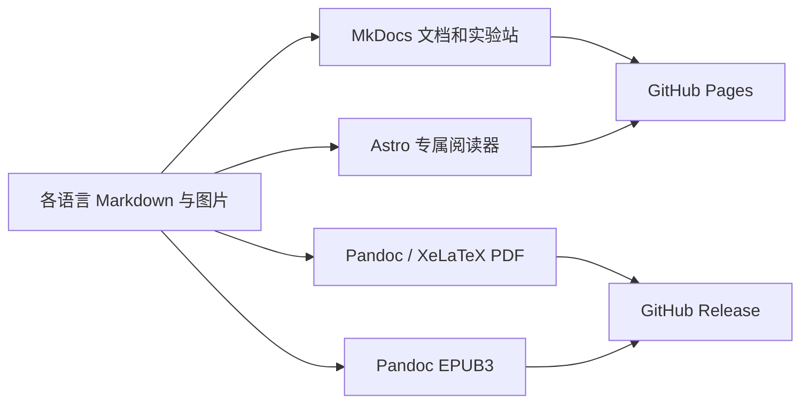

# 从 ai-agent-book 到后端工程师 LLM 书籍平台：对照分析与改造路线

日期：2026-09-23。本文保留改造前的调研快照与方案建议，文中“当前项目”“尚未”及源码行号均指调查基线，不代表改造后的状态。架构迁移现已在本地实现，实际交付与未完成的人工验收见 [改造与验收记录](2026-09-23-implementation-validation.md)。

## 1. 结论与调查范围

建议保留当前书稿的三层知识体系、描述性文章路径和已有 Pandoc/XeLaTeX 出版能力，逐步建设 **统一内容索引 + Astro 专属网站 + 独立 PDF/EPUB 出版链 + 可追踪的中英双语版本**。Honkit 作为迁移期间的可用旧站，最终由一套主站承担公开阅读。没有必要永久复刻参考项目的 MkDocs + Astro 双站。

参考项目值得学习的核心是完整的读者旅程：发现书 → 选择语言与路线 → 连续阅读 → 查找知识 → 下载离线版本 → 实践与反馈。视觉精致来自内容组织、字体层次、布局和交互共同作用，单纯替换主题不能达到同样效果。

调查基线：

- 当前项目：`40ec687021febf2b483796e9962ca0a2a2556b35`；开始时工作区干净。
- 参考项目：`22fd9c5041a378ff0019d91fe22fed9482f8b128`；只读分析，未修改。
- 检查源码、README、导航、网站组件、CSS、构建脚本、部署工作流、翻译模型、出版清单和部分既有测试。
- 当前项目在临时源码副本执行 npm 安装、Honkit 两种构建、打印 HTML 和出版 Markdown 拼接；通过浏览器检查输出及参考线上阅读页。
- 不将已有 `_book/`、`_build/` 当源码；截图来自新构建或实际线上页面。
- 尚未完整构建参考项目 PDF/EPUB 或 Astro 全站；当前环境 PATH 未发现 XeLaTeX，因此当前最终 PDF 也未重新生成。本文不声称最终 PDF 分页、所有翻译质量或全部线上下载已经验收。

出版、README 与多语言的深入源码证据见 [专项审计](2026-09-23-ai-agent-book-publishing-audit.md)。下文参考源码路径均以 `/Users/kingsonwu/programming/github/ai-agent-book/` 为根，当前源码路径以本仓库为根。

## 2. 逐项能力对照

| 方面 | ai-agent-book 实际实现 | 当前项目实际实现 | 改造重点 |
| --- | --- | --- | --- |
| 内容模型 | 10 章主体 + 实验 + 引言/后记/附录，多语言对应 | 18 篇正文，三层目录，前言/导读 | 区分篇、文章、附录，统一稳定 ID 和顺序 |
| 首页 | Astro 独立介绍页、概念图、章节卡片、继续阅读 | Honkit 文档入口，README/index 内容重复 | 建设书籍首页，保留真正的导读 |
| 阅读器 | 两侧目录、字号、主题、专注、进度、划线、笔记、图片浏览 | Honkit 默认搜索、字体设置、左右翻页 | 优先补清晰导航、公式、搜索、移动阅读 |
| 网页排版 | 字体与颜色 token、衬线正文、无衬线界面、语言字形回退 | 23 行定制 CSS，宽度/图片/标题微调 | 中英分别验收字体和版心 |
| 数学与图表 | Astro remark-math/KaTeX、图题、独立 Web 图形 | 网页数学未接入；大量纯文本结构图 | 统一跨格式数学与图表约定 |
| PDF | 独立出版模板、目录、封面、字体回归 | 已有 ctexbook/XeLaTeX、自制封面与目录处理 | 保留有效工具，修目录和版式验收 |
| EPUB | EPUB3、MathML、独立 CSS、EPUBCheck | 没有 EPUB 导出 | 新增可独立构建的 EPUB |
| 多语言 | 15 版正文；界面、图片、README 分别处理 | 两份 README、两份界面 YAML，无英文正文 | 从真实中英双语开始，跟踪原文版本 |
| 发布 | 网站和电子书工作流分离，latest 下载入口 | 网站部署串行构建 PDF，无发行工作流 | 网站与出版解耦，发行产物带版本与校验和 |
| SEO | MkDocs 有 SEO 扩展；Astro 明确 noindex | 主要靠默认主题元数据 | 主站 canonical、站点地图、OG、语言关系 |
| 验证 | 路径、章节、字形、翻译结构等专用检查 | CI 只断言两个 HTML 文件存在 | 验内容清单、路径、公式、资源和出版一致性 |

## 3. 参考项目的结构为什么有效

### 3.1 它实际上有四条交付链



`scripts/build_site.sh` 在 `_web/` 装配 MkDocs 源文件，修改的是暂存副本；`web-astro/src/lib/book.ts` 直接读取原书稿，`book-markdown.mjs` 在渲染阶段适配书稿语法。这个“源文档共享、输出适配分离”的方向值得采用。

但共享源文件不等于共享全部元数据：参考项目仍在 `book.ts`、`editions.json`、MkDocs 配置、PDF 脚本与 EPUB 脚本中维护多份枚举。当前项目应统一这些关系，避免重现漂移。

### 3.2 网站是两种场景的分工

- MkDocs 面向完整文档和配套实验，带全文搜索、编辑入口、修改日期、社交卡片等。见 [mkdocs.yml](/Users/kingsonwu/programming/github/ai-agent-book/mkdocs.yml:1)。
- Astro 面向连续阅读：品牌首页、章节阅读页、轻量交互。通过 Pages 工作流合并到原站 `/astro/`。见 [部署流程](/Users/kingsonwu/programming/github/ai-agent-book/.github/workflows/deploy-pages.yml:45)。
- Astro 阅读器的全书导航、页内 H2/H3 目录、前后章节、下载入口共同减少阅读中断。见 [Reader.astro](/Users/kingsonwu/programming/github/ai-agent-book/web-astro/src/components/Reader.astro:1)。
- 其正文模型假设十个 `chapterN`，不能直接套在本项目 18 篇描述性文章和三层分组上。应重建数据适配层，复用交互思想。

### 3.3 排版的有效做法

`Layout.astro` 引入自托管的 Manrope、Newsreader 字体包；`global.css` 用 CSS 变量定义背景、正文、弱化文字、分隔线、强调色和字体。网页正文采用衬线字，导航/按钮/标题采用无衬线字。浅色偏纸张感，深色使用另一组完整色值。见 [Layout](/Users/kingsonwu/programming/github/ai-agent-book/web-astro/src/layouts/Layout.astro:1)、[全局样式](/Users/kingsonwu/programming/github/ai-agent-book/web-astro/src/styles/global.css:1)。

中文的舒适度并非 Newsreader 带来的：中文实际依靠 Songti SC/SimSun 等系统回退，行高单独设到 1.95；日文、韩文、RTL 也有专门规则。不能以 Mac 上的中文效果代替 Windows/Android 验收。

阅读页最大布局宽 1600px，正文容器最大 870px，两侧分别是章节和页内目录；代码、宽表、公式使用局部横向滚动。移动端重新布置目录和工具，配合焦点样式、跳过导航、减少动画偏好。见 [reader.css](/Users/kingsonwu/programming/github/ai-agent-book/web-astro/src/styles/reader.css:25)。

### 3.4 阅读状态不是简单存一个滚动坐标

阅读进度包含版本、章节、section、相对偏移，解析时校验数据；划线使用 IndexedDB，带文本锚定、语言隔离和 JSON 备份。这样书稿更新后还有机会定位原文。见 [reading-position.ts](/Users/kingsonwu/programming/github/ai-agent-book/web-astro/src/lib/reading-position.ts:1)、[highlight-store.ts](/Users/kingsonwu/programming/github/ai-agent-book/web-astro/src/lib/highlight-store.ts:1)。

这值得作为后续增强，但不是首轮必须承接的复杂度。当前书首先需要可读、可检索、链接可靠；笔记恢复、跨页迁移、导入冲突应单独成阶段。

### 3.5 不应误认作已经完善的部分

- Astro 全页输出 `noindex, nofollow`，本次线上浏览器也确认了该标记。若将其作为新主站，必须重新处理 SEO，不能直接复制。见 [Layout.astro:28](/Users/kingsonwu/programming/github/ai-agent-book/web-astro/src/layouts/Layout.astro:28)。
- Astro 代码中未发现站内全文搜索功能；MkDocs 的搜索不能自动继承到 Astro。
- 浏览器机器翻译是单独的未审校降级视图，并关闭划线等功能；它不能算正式语言版本。见 [machine-translation.ts](/Users/kingsonwu/programming/github/ai-agent-book/web-astro/src/scripts/machine-translation.ts:32)。
- 发布有部分语言的非阻断失败，下载文件可能来自不同构建；语言同步检查主要验证结构，不证明译文及时或准确。
- 许多图形生成脚本专门服务 Agent 教材，不是通用图表平台；引入全部脚本会把参考书的领域假设带进来。

## 4. 当前项目：应先解决的真实问题

### 4.1 目录与电子书收录重复

[SUMMARY.md:15](../../book/SUMMARY.md) 的“第二层”与其下第一篇都指向 `embedding-evolution.md`。`chapter_paths()` 不去重，PDF Markdown 拼接与打印版逐项遍历它。

实测：21 个目录链接，20 个唯一文档（18 篇正文 + 导读 + 前言），打印 HTML 中该文章出现两次。修复应在内容模型中把分组与文章分离；只在一个输出里随手去重，会让各端目录仍不一致。

### 4.2 两种网站构建并不等价

在同一临时副本先执行 `npm ci && npm run build`：成功，7 个资源文件，封面与样式存在。

再执行 `python3 tools/book-kit/build_honkit.py`：命令也成功，但报告 0 个资源文件，输出没有 `assets/cover.svg`、`styles/website.css`、`styles/pdf.css`。脚本使用暂存目录的符号链接共享资源，而本次 Honkit 构建没有将它们复制到结果中。界面 YAML 也不在暂存清单里。证据见 [stage_source](../../tools/book-kit/build_honkit.py)。

这使 README 连续执行两种构建的建议尤其有问题：第二次可能覆盖第一次完整产物。应只保留一个权威入口，验收实际资源存在和 HTTP 可访问，不能只看退出码。

### 4.3 英文构建会静默使用中文

`resolve_source_dir(book, 'en')` 在英文目录不存在时返回中文 `book/`，随后 `load_meta(..., 'en')` 得到 `language=zh-hans`。现有 `book/locales/en.yml` 是界面字符串，与脚本期待的 `book/locales/en/` 正文目录不同。见 [book_meta.py:31](../../tools/book-kit/book_meta.py)。

未发布语言应明确报错；网站可明确显示“本章尚无英文版”并提供中文链接，但不得用英文 URL 和按钮伪装完成的英文书。

### 4.4 打印 HTML 的路径、锚点与结构问题

按工作流复制 `book/exported/` 到 `_book/exported/` 后，用 HTTP 服务提供 `_book/`：打印页中的 `../_book/gitbook/style.css` 返回 **404**；另两条本地 CSS 返回 200。见 [build_print_html.py:134](../../tools/book-kit/build_print_html.py)。

打印页有 **15 个重复 ID 值**。拼接时没有为各文章内部标题 ID 全面加命名空间，而转换章节链接时尝试加文章前缀；不能保证锚点可达。另外正文直接放入 `article`，没有保留 `.markdown-section` 包装，多条以该类选择的 CSS 不生效。见同文件 `rewrite_section_html()` 与 `build_html()`。

应让打印 HTML 有独立模板和资源模型，直接消费规范内容，不长期解析 Honkit HTML 的具体 `<section>` 和 `gitbook.page.hasChanged` 字符串。

### 4.5 网页公式没有渲染

One-hot 文章含 `$V$`、`$d$`；本次实际浏览器中仍显示原始美元符号，数学渲染元素数量为 0。当前 `plugins: []` 仍会加载 Honkit 默认搜索、字体等插件，但没有数学渲染插件。不能据空插件数组声称“没有搜索”。

新增网站应在构建时渲染公式，同时保留语义化数学输出；PDF 继续使用 TeX，EPUB 根据目标阅读器支持验证 MathML。正文中的伪代码公式与真正数学公式也应区分。

### 4.6 部署与验证覆盖不完整

- `.github/workflows/ci.yml` 只验证首页和前言 HTML 存在，没有验证 PDF、目录重复、资源、公式或打印页面。
- Pages 触发路径不含 `tools/book-kit/**`，仅改导出工具不会自动重新发布。见 [deploy-docs.yml:7](../../.github/workflows/deploy-docs.yml)。
- 网站和重量级 TeX 出版串在同一部署工作流里，PDF 失败会阻断网站更新。
- PDF 中间 Markdown/TeX 与网站输出混放在 `_book/`，最终整个目录会被上传；应把中间产物放到 `_build/`，对公开产物使用明确清单。
- `outputs.print_pdf` 有配置，但本次检查未找到生成该文件的实际步骤；不要向读者承诺未产出的格式。

### 4.7 内容与入口也需要整理

18 篇正文约 50,488 字符（含标记和代码，不是中文字数）。第一层 10 篇、第二层 7 篇、第三层 1 篇。README 宣传“外部工具调用”，目前没有对应独立正文，RAG 文章也未覆盖该主题。应标注规划，或作为后续内容工程补齐，不能靠网站美化掩盖范围差异。

根目录中英 README、`book/README.md`、`book/index.md` 重复维护多份介绍。`readme_path` 是 Python 工具读取的字段，本次 Honkit npm 构建仍出现默认 Introduction 和单独导读。应区分项目介绍、书籍首页和正文导读，并消除无意重复。

`LOCAL_DEVELOPMENT.md` 未覆盖完整 PDF 工具链，仍提已归档 Docusaurus，源码快照中并无该目录；它需要与实际维护路径一并更新。仓库未发现已跟踪 LICENSE 文件，开放内容、代码和素材的授权表达需要作者在发行前确定；本轮不擅自替作者选择许可。

## 5. 架构选项与推荐

| 方案 | 优点 | 成本与边界 | 判断 |
| --- | --- | --- | --- |
| 继续 Honkit，修工具链、加主题 | 改动小、旧 URL 自然保留 | 专属首页和现代阅读交互需越来越多主题补丁 | 适合短期修复，不完全满足本次愿景 |
| 迁移文档型主题，如 MkDocs Material | 导航、搜索、编辑入口集成度高 | 品牌首页和书籍阅读器仍需定制，另增 Python 网站链 | 偏知识库路线可选 |
| Astro 定制首页与阅读器，保留 Python 出版 | 与参考体验接近；能适配三层知识体系；静态托管 | 必须自行完成搜索、SEO、无障碍、兼容迁移 | **推荐的长期方向** |

先用一篇数学文章、一篇长代码文章和 RAG 表格文章做贯穿网站/PDF/EPUB 的样本，不先迁完所有页面再发现语法与图片不兼容。

Astro 支持静态 Pages 部署，项目子路径必须显式处理 `base` 和 `site`，参见 [官方部署文档](https://docs.astro.build/en/guides/deploy/github/)。为补齐阅读器全文搜索，建议评估 Pagefind：它按 HTML `lang` 分语言索引，扩展版支持 CJK 分词；实际采用前用本书的中文短语与英文术语混输验收。参见 [Pagefind 多语言文档](https://pagefind.app/docs/multilingual/)。

## 6. 建议的目标结构与数据契约

保留中文正文现有路径，减少 Git 历史和链接迁移。下面是建议新增的边界，不代表文件已经建立：

```text
book/
  book.json                      # 保留书名、作者、发行日期、封面等权威元数据
  catalog.json                   # 新增：分组、文章 ID、顺序、源路径、旧 URL
  editions.json                  # 新增：语言、状态、显示名称、方向
  SUMMARY.md                     # 过渡期由 catalog 生成，禁止形成第二权威索引
  chapters/                      # 现有中文正文
  translations/en/chapters/      # 按相同相对路径组织英文译文
  translations/en/status.json    # 原文 hash、译文状态、审校记录
  assets/                        # 共享封面、插图与素材来源
  locales/                       # 界面文案，与正文翻译分开
  styles/                        # 出版样式；旧网站样式过渡保留
web/
  src/lib/                       # 读取与验证 catalog、路径、语言、Markdown 适配
  src/components/                # 首页、阅读器、目录、搜索、设置
  src/pages/                     # 语言首页、阅读路由、下载页、旧路径兼容页
  src/styles/                    # tokens、排版、阅读器、移动与打印
tools/book-kit/
  catalog.py                     # 出版端读取相同内容索引
  export_book_pdf.py             # 保留并改造现有 PDF 出版
  export_epub.py                 # 新增 EPUB 适配
  build_print_html.py            # 摆脱 Honkit 输出耦合
  validate_book.py               # 内容/语言/资源/交叉引用校验
.github/workflows/
  ci.yml                         # PR 与 main 校验
  deploy-docs.yml                # 网站发布
  release-books.yml              # PDF/EPUB 发行
```

核心约束：

1. 文章稳定 ID 不依赖中文标题、显示编号或语言，例如 `embedding-evolution`；分组也有独立 ID。
2. `catalog.json` 决定阅读与出版顺序。已有 `book.json` 继续管元数据，不能再在各脚本硬编码书名/作者。
3. 语言注册不代表该版已发布。译文按篇记录 draft/reviewed/stale，源 hash 变化标记 stale，不静默自动上线。
4. 章节与重要小节使用稳定锚点；中英切换按 ID 找对应内容，缺译返回明确说明。
5. 正文保持可携带的 Markdown；需要跨输出的提示框/图题用明确、可解析的约定，避免塞入只对 Astro 有效的组件。
6. 所有网页路由、图片与下载地址通过一个 base-aware 路径入口生成，同时测试 `/` 和 `/LLMs-for-Backend-Engineers/`。
7. `_build/` 存中间文件；网站与发行包只从允许清单装配，不直接上传整个工作目录。

## 7. 按读者体验逐项改造

### 7.1 专属首页

首页给出中文主标题“后端工程师的 LLM 指南”、英文书名、明确读者与先修要求。主行动是“开始阅读/继续阅读”，次行动为“浏览目录/下载”。三层结构用本书自己的知识地图展示，不使用参考项目的 Agent 循环图。

随后依次展示三条阅读路线、各篇工程问题与预计阅读量、真实语言/发行状态、作者与反馈入口。统计数从内容索引计算；不加入无实际内容的实验、赞助或语言数量装饰。

### 7.2 正文阅读器

桌面为章节分组导航、正文、页内目录；手机为抽屉章节导航和可折叠页内目录。常用功能包括前后篇、代码复制、宽表/公式局部滚动、明暗主题、字号调整、图片查看、勘误链接。保留无 JavaScript 的正文和基础导航。

最大内容宽度继续尊重当前 900px 约束；普通文章正文建议先试 760–820px，宽表独立处理。网页外层布局可更宽，以容纳侧栏。字体使用角色变量而非到处硬编码：标题/界面无衬线、长文可选衬线、代码等宽；中文先确保各平台可读，再决定是否自托管经过子集化的 CJK 字体。建议起点为正文 17–18px，中文行高 1.85–1.95，英文 1.65–1.8；这些是样张待验收参数，并非最终视觉结论。

第一版先实现阅读进度恢复；笔记与划线放在增强阶段，要求语言和版本隔离、备份导出、内容变更后的失配提示，明确数据仅保存在本地。

### 7.3 搜索、SEO 与链接延续

搜索只索引当前语言正文，排除导航、重复打印全文、草稿译文和兼容跳转页。用“梯度消失”“权重路由”“LayerNorm”“RAG rerank”作为固定验收查询。

正式主站提供 canonical、OG 图片、sitemap、robots、页面描述与已发布语言的 hreflang；预览站保持 noindex。建立旧 `.html` 路径到新路由的完整映射，保留旧锚点或做显式 hash 映射。Pages 静态站不能依靠服务器配置实现任意 301，应生成兼容页面；如以后部署到支持重定向的托管平台再使用服务端规则。

“专属网站”第一步是独立品牌和阅读体验，不要求先购买域名。继续使用现有 GitHub Pages，域名可后置；换域名时统一 base、canonical 和下载地址。

### 7.4 PDF 与 EPUB

PDF 保留现有 Pandoc/XeLaTeX，先修收录重复、标题层级、长代码、宽表、页眉页脚、书签与图题。模板从 Python 大段字符串中分离到有边界的模板文件，避免为美化而完全替换已经有的排版处理。

EPUB 独立读取同一 catalog；使用 EPUB3、语义标题、内部章间跳转、封面和独立 CSS。封面从共享 SVG 独立产生 PNG/PDF，不从 PDF 截第一页，以免 EPUB 被 TeX 环境阻塞。Pandoc 支持 EPUB 输出和封面/元数据配置，参见 [官方 EPUB 指南](https://pandoc.org/epub.html)。

字体以可在 Linux CI 重现的 Noto/开源字体为默认；本机可选字体只是预览便利。PDF 用字体检查与抽样页面图共同验收；EPUBCheck 通过之外，还需在至少一个桌面阅读器和一个手机阅读器验证公式、目录、代码与离线跳转。

发行名建议 `LLMs-for-Backend-Engineers-zh-Hans-vX.Y.pdf/.epub`，英文对应 `en`。不可变版本附 source commit、构建时间和 SHA256；若提供 latest，保留独立滚动版说明，不能假定各语言永远同一天更新。

### 7.5 README、贡献与维护说明

中英 README 均按“定位 → 在线/下载/语言状态 → 封面 → 三层结构与路线 → 内容状态 → 本地运行 → 勘误/贡献/许可”排列。英文 README 明确英文正文是否完整，下载按钮来自真实发行状态。

补 `CONTRIBUTING.md` 的章节约定、术语表、链接/图表规范和翻译审校规则，以及问题模板的来源页、语言、引用段落和建议修改。不复制参考项目的长贡献者名单、供应商推荐或 API 配置段落。

将 `LOCAL_DEVELOPMENT.md`、`start_docs.sh`、`start_docs.bat`、`AGENTS.md` 与最终技术栈同步更新；采用 `npm ci` 和锁文件，声明实际验证过的 Node/Python/Pandoc 版本。参考项目的依赖版本是它的快照，不应机械当成当前项目唯一选择。

## 8. 分阶段交付顺序与验收

这些是供架构决策的阶段边界，不是已经批准的逐行编码计划。确定方向后，各阶段应单独展开小规模实施计划，避免一次巨型改造难以审阅。

| 阶段 | 主要变更文件/目录 | 完成条件 |
| --- | --- | --- |
| P0：修出版基础 | `SUMMARY.md`、`book_meta.py`、`build_honkit.py`、`build_print_html.py`、CI、README 构建说明 | 18 篇正文每篇仅一次；不支持的语言报错；两种构建统一；无资源 404 和重复 ID；工具变更触发验证 |
| P1：统一内容与代表样张 | `book/catalog.json`、`book/editions.json`、两端 catalog 读取器、规范文档 | 网站/PDF/EPUB 读相同顺序；重复 ID、缺文件和无效图片自动失败；三个代表章节贯穿输出 |
| P2：中文专属站 | `web/`、Pages 工作流、路径兼容清单 | 18 篇中文 + 前言导读齐全；主题/字号/目录/公式/搜索可用；390px 与 1440px 页面无正文遮挡；旧路径和 hash 可达 |
| P3：完整电子书发行 | PDF 模板、`export_epub.py`、出版 CSS、`release-books.yml` | PDF 字形与样张验收；EPUBCheck 通过；跨章离线链接可用；产物标明同一源码版本；网站不被 TeX 构建绑住 |
| P4：英文版与入口统一 | `translations/en/`、术语表、状态检查、中英 README、贡献文档 | 完整英文正文经过审校，代码与公式不被误译；源文更新可识别 stale；语言切换落到对应篇；不展示未发布下载 |
| P5：阅读增强与内容扩展 | 阅读状态、划线/笔记模块、选定的示例与插图 | 恢复进度可靠；本地存储失效可降级；备份兼容；新增内容独立审阅，不与样式迁移混合 |

README 的构建纠错在 P0 完成，中文首页与 README 的品牌整理随 P2 完成，P4 才宣称中英正文完整。结构迁移先于大规模翻译，避免刚翻译完就批量改文章 ID 和路径。

## 9. 质量门禁、切换与回退

- 内容层：唯一文章 ID、文件存在、导航与打包收录一致；所有现有正文都必须可达；未发表内容不计入宣传数字。
- 网站层：根路径与 Pages 子路径各构建一次，检查所有内部链接、图片、CSS 字体 URL 和锚点；中文搜索与公式做功能验收。
- 浏览器层：新会话测试 390/768/1440px、浅/深色、键盘操作、200% 缩放；长标题、长代码、宽表和中文字体回退纳入样张。
- 出版层：完整构建成功不代表阅读正确；抽样首页、目录、最长代码、宽表、数学和最后一章，确认无重复收录/缺字/溢出。
- 发布层：所有必需语言与格式就绪才发布该版；manifest 中只列成功并验收的产物，保留前一版可回退。
- 翻译层：hash/commit 只检测原文变化，不代替人工技术审校；代码、公式、图题、术语和链接分别检查。
- 切换策略：先在 `/preview/` 验新站，旧站继续服务；验收旧 URL 映射、下载和搜索后切主入口。预览应 noindex，主站应可索引。保留旧工作流/构建版本直到切换验证完成，不长期维护两套阅读系统。

## 10. 已执行检查与视觉证据

| 检查 | 结果与限定 |
| --- | --- |
| 临时副本 `npm ci --no-audit --no-fund`、`npm run build` | 通过；21 pages、7 assets；默认插件含搜索和字体设置 |
| 临时副本 Python Honkit 构建 | 退出成功，但 0 assets，封面和定制样式缺失；不能算完整可发布 |
| `build_print_html.py`、`build_pandoc_book.py` | 通过；收录重复、15 个重复 ID 与部署样式 404 已复现 |
| `resolve_source_dir(..., 'en')`、`load_meta(..., 'en')` | 复现中文静默回退 |
| 当前新构建正文浏览器检查 | 页面 200；One-hot 数学标记未渲染；新会话手机可正常显示正文 |
| 参考线上 Astro 中文第一章 | 页面 200；桌面/手机截图；确认 robots 为 noindex/nofollow |
| 参考阅读状态/注释/机器语言选择测试 | 9 项通过；同批 `site-path.test.mjs` 因未安装 unified 无法运行，不能说全套通过 |
| 参考 i18n 结构检查 | 通过，实际发现 13 语言；正文目录有 15 语言，详见专项审计 |
| PDF/EPUB 全量构建、发布 | 本轮未执行 |

截图为 2026-09-23 抽样，不能代替全站设备测试：

| 当前项目（临时副本 npm 构建） | 参考项目（线上 Astro 中文版） |
| --- | --- |
| [桌面正文](assets/current-desktop.png) | [桌面正文](assets/reference-desktop.png) |
| [手机正文，新会话](assets/current-mobile.png) | [手机正文](assets/reference-mobile.png) |

[当前打印 HTML 截图](assets/current-print-desktop.png)。参考仓库自带 `web-astro/review/` 截图也已查看，但包含较早页面状态，不把它当作当前所有功能的证据。

## 11. 执行前需要落定的决策

建议默认采用：中文为主版，英文为第一译版；继续使用 GitHub Pages；正文保留现有位置；Astro 作为最终单一主站；保留 Pandoc/XeLaTeX 并新增独立 EPUB；读者数据先只存在本地。

需要作者明确的是是否接受网站迁移方向，以及内容/代码的许可选择。域名、更多语言、账号同步、评论、付费、赞助和大量交互图表均可后置，不作为完成书籍平台的前提。
