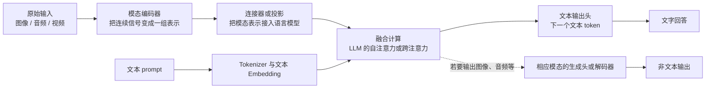

# “多模态模型：文字之外的信息怎样进入计算”章节调研

日期：2026-09-25。状态：调研结论；未修改书籍正文。

审查对象：[multimodal-models.md](../../book/chapters/part2-llm-internal/multimodal-models.md)。本笔记只采用原始论文或模型团队技术报告。目标是判断这一章怎样让后端工程师建立正确的多模态全局图，而不是提供具体模型的训练或部署配方。

## 结论

现有章节的三个边界判断是正确的：OCR/转写是可行路径而非多模态的定义；图像输入并不保证事实正确；看见、生成动作建议、实际执行和验证是不同层次。但它把这些判断写成了数个并列提醒，没有先说明一个典型多模态模型由什么组成、信息在哪一步从一种模态变成另一种可被语言模型使用的表示、训练又在哪一步建立跨模态联系。

因此读者能知道“不要把多模态想得太简单”，却难以回答以下核心问题：

1. 图片、音频或视频先经过什么，才会参与语言模型的计算？
2. 编码器、连接器、融合模块和输出解码器各自负责什么？
3. 为什么预训练好的视觉/音频模型接到 LLM 上，仍常需对齐和指令训练？
4. 为什么有的模型只能读图后输出文字，有的还能输出图像或声音？

建议保留其“输入路径—观察与动作边界”的案例，但将正文重写为一条**信号表示 → 连接与融合 → 训练对齐 → 输出与系统边界**的主线，并以一张全景图作为入口。篇幅可显著增加，但不应演变成各家模型结构罗列。

## 应先建立的全局结构

对“能接收图像、音频、视频并以文本回答”的典型多模态 LLM，可以先给出下图。它描述的是职责划分，**不是每个模型都包含完全相同的独立模块**。



这张图应逐项解释，而不是把模块名称当作答案：

| 组件 | 它解决的问题 | 不能由它单独保证什么 |
| --- | --- | --- |
| 模态编码器 | 将像素、声波或视频帧变成向量序列或特征 | 不保证这些向量已与用户问题或文本语义正确对应 |
| 连接器 / 投影 | 使不同来源的表示在维度、数量或接口上能被后续模型接收 | 不等于已经“理解图片”；它可能只是线性映射，也可能是带查询的复杂模块 |
| 融合计算 | 让文本上下文和模态表示在生成时互相影响 | 不等于所有架构都使用显式 cross-attention，或每个细节都被保留 |
| 输出头 / 解码器 | 把内部表示变成某种输出模态 | 文本输出头只能产生文本；输出图像、音频需要相应表示与生成过程 |

对图像问答，最小因果链可写成：**像素不是直接变成答案；视觉编码器先产出图块或区域表示，连接器把它们送进语言模型可处理的接口，融合后的隐藏状态才经文本输出头逐个预测回答 token。** 音频和视频遵循同一职责链，但输入切分、时间信息处理与编码器会不同。

## 原始资料显示的三类架构选择

不要把 LLaVA 的结构写成多模态模型的定义。适合用三个代表性选择说明“相同职责可以由不同结构承担”。

### 1. 双编码器：先建立可比较的跨模态表示

CLIP 分别编码图像和文本，用配对数据上的对比目标学习两者匹配关系。这适合说明“对齐”的最小含义：相关图文在共同表示空间中应更容易匹配；它天然适合图文检索或匹配，并不是一个会根据用户问题逐 token 写出长答案的视觉聊天 LLM。[Radford et al., *Learning Transferable Visual Models From Natural Language Supervision*](https://arxiv.org/abs/2103.00020)

这类架构应作为历史和概念对照，而不是本章的主要实现路线。它让读者理解：把两个向量放到同样维度，和通过训练形成有用的跨模态关系，都是不同事情。

### 2. 模态编码器加连接器，再接语言模型：当前常见的组合路线

LLaVA 连接视觉编码器与 LLM，并通过视觉指令微调获得基于图像和文字指令的回答能力；它是“视觉表示如何作为语言模型条件”的直观例子。[Liu et al., *Visual Instruction Tuning*](https://arxiv.org/abs/2304.08485)

但连接器有多种形态。BLIP-2 冻结预训练图像编码器和 LLM，以轻量的 Querying Transformer（Q-Former）弥合模态差距，并分两阶段完成视觉—语言表示学习和视觉到语言生成学习。[Li et al., *BLIP-2*](https://arxiv.org/abs/2301.12597) Flamingo 则用视觉编码器、Perceiver Resampler 和插入语言模型层间的 gated cross-attention，使模型处理交错的图像/视频和文本序列。[Alayrac et al., *Flamingo*](https://arxiv.org/abs/2204.14198)

本章只需用这一组例子得出三点：

- **连接器不是固定零件。** 它可能是线性投影、查询/重采样模块，或通过跨注意力在语言模型层内注入视觉信息。
- **融合也不是固定算法。** 有的路线把视觉表示当作语言模型输入序列的一部分，依赖既有 self-attention；有的路线显式加入 cross-attention。
- **冻结与端到端训练是训练选择，不是多模态定义。** BLIP-2 的冻结策略服务于复用已有模型和减少可训练参数；不能据此推断所有模型都应冻结编码器或语言模型。

音频可用同一图解释。SALMONN 将文本 LLM 与语音、通用音频编码器整合，说明“非文字输入”不必先被转写成文本才能进入后续计算；但这种直接路径是否保留说话人、环境声或韵律等线索，仍取决于编码器、训练任务和数据。[Tang et al., *SALMONN*](https://arxiv.org/abs/2310.13289)

### 3. 早期融合与混合模态生成：输入输出都不止文本

若模型不仅看图后回答文字，还要在同一序列中生成图像和文字，输出端不能只保留文本词表。Chameleon 是 token-based 的 early-fusion 例子：它能在任意交错的图像与文本序列中理解和生成两种模态。[Chameleon Team, *Chameleon*](https://arxiv.org/abs/2405.09818)

这一例子只用于建立输出边界：**多模态输入**与**多模态生成**是两项不同能力。前者只需让非文本信息影响语言输出；后者还需要能表示、预测并解码目标模态。不要在本章展开离散图像 token、扩散模型或编解码器细节，它们不是理解 LLM 多模态输入链的前置条件。

Gemini 技术报告也说明现代模型可以在图像、音频、视频和文本上联合处理，并将后训练与部署作为独立层次讨论；但报告没有公开足以把其内部连接器写成通用架构规范的细节。因此可用它说明“模态范围和系统能力”，不应用它为某个未公开的内部结构背书。[Gemini Team, *Gemini: A Family of Highly Capable Multimodal Models*](https://arxiv.org/abs/2312.11805)

## 训练：从“能接入”到“能按问题使用”

建议将训练写为常见的逻辑阶段，而非所有团队必须遵循的流水线：

```text
单模态预训练的编码器 / 已训练 LLM
                ↓
图文、音文或视频文本配对资料：学习连接与跨模态对应
                ↓
多模态指令样本：学习围绕给定输入和问题组织回答
                ↓
偏好、验证或安全信号：选择更符合所定义标准的行为
```

第一步解释“为什么常能复用已有组件”，第二步解释“为什么接口接通仍不够”，第三步解释“为什么能匹配图文不等于会回答用户问题”。BLIP-2 的两阶段训练明确区分了视觉—语言表示学习与视觉到语言生成学习；LLaVA 用视觉指令数据微调以取得通用视觉语言对话能力。这支持章节保留“编码、对齐、生成是不同职责”的中心判断。[Li et al., *BLIP-2*](https://arxiv.org/abs/2301.12597)，[Liu et al., *Visual Instruction Tuning*](https://arxiv.org/abs/2304.08485)

需要明确的边界是：这些阶段是**常见组织方式**。不同模型可选择冻结哪些组件、联合训练哪些参数、使用什么配对资料或反馈信号。把它们写成唯一的必经路线，会重复本书训练章节中需要避免的同类错误。

## 现有内容应保留，但要换到正确位置

| 现有段落主题 | 重写后的安放位置 | 原因 |
| --- | --- | --- |
| OCR/描述工具与直接模态表示两条路径 | 全景图之后的“外部转换与原生输入” | 先说明典型内部路径，读者才能理解两条路线比较的维度是信息保留、延迟、可审计性和能力边界，而不是“真多模态/假多模态”。 |
| 图像切块而非读取 JPEG 字节 | 模态编码器的必要细节 | 这是理解信号怎样进入计算所需的唯一图像底层细节；应继续强调切分和分辨率策略决定哪些细节可见。 |
| CLIP 匹配不等于生成 | 放在“训练与对齐”的开头 | 这是区分表示对齐和生成能力的最佳例子。 |
| 语音转写与直接音频表示 | 在图像主线之后作为同构例子 | 说明全景图不是视觉专用，避免把“多模态”误写成“视觉语言”。 |
| 看图、动作建议、工具执行、结果验证 | 结尾“模型边界与第三部分” | 这仍是把第二部分和外部系统分开的关键内容，且应链接工具调用、Agent 运行时与评测。 |

## 建议的新文章顺序

1. **定位：为什么文字 token 不足以承载截图、声音和视频**。用监控截图问题引出，而不是用“可选阅读”开头；说明本文只解释输入怎样进入模型和怎样影响输出。
2. **一张全景图：信号如何到达回答**。给出编码器、连接器、融合、输出头以及文本输入的关系图，逐项界定职责。
3. **从图片到文本回答的一次最小数据流**。补图块/特征序列、接入 LLM、融合、输出 token 的因果链；接着以音频和视频说明同构与差异。
4. **不同结构如何完成相同职责**。用 CLIP、LLaVA/BLIP-2/Flamingo、Chameleon 三类架构对比。重点是差异及适用边界，不是模型史。
5. **训练如何让连接变成可用能力**。用“编码器/LLM → 配对资料 → 指令样本 → 反馈与验证”的图，区分对齐、回答行为和评测。
6. **输入路径与系统边界**。比较 OCR/ASR 等外部转换和直接模态输入；最后重申观察、推断、执行、验证的边界，并链接第三部分。
7. **小结**。以“表示、连接、融合、训练、输出”复述：多模态不是给 LLM 附加感官名称，而是让不同信号以有训练依据的表示进入计算；它不会自动带来事实正确性、实时性或执行权限。

## 应明确修正的常见误解

1. **“多模态就是把图片先转成文字。”** 转写/OCR 是外部系统可采用的路径；直接模态编码是另一条路径。二者保留的信息、可观测性和误差模式不同，不能以名称判断优劣。
2. **“图片向量和文本向量维度相同，就已经对齐。”** 对齐是训练后在任务相关关系上可用，不是张量形状相同。CLIP 的对比学习恰恰说明需要配对信号。
3. **“所有多模态 LLM 都用 cross-attention。”** Flamingo 的确使用 gated cross-attention；LLaVA 一类也可以通过连接后的视觉 token 进入自回归 LLM。应写“可能使用”，不要写成定义。
4. **“能读图的模型都能生成图或视频。”** 理解输入和生成输出的表示、目标与解码过程不同。Chameleon 说明统一生成是可选架构路线，而非所有视觉语言模型必有能力。
5. **“模型看到截图，就获得了系统状态或操作权。”** 图像只是一次输入；实时信息需要查询工具，操作需要外部授权和执行，结果仍需验证。
6. **“原生/端到端多模态天然更准确。”** 不经 OCR 可能保留布局、颜色和非文字线索，但编码分辨率、帧采样、数据覆盖和训练目标仍限制可用信息。没有一种输入路线自动保证正确。

## 不适合纳入本章的内容

| 主题 | 处理 | 原因 |
| --- | --- | --- |
| ViT 卷积细节、频谱变换、视频时序网络、离散 tokenizer 算法 | 不展开 | 它们解释某类编码器如何实现，不改变本章的模块因果主线。 |
| 扩散采样、图像/音频生成的噪声过程 | 只说明需要单独生成头或解码器 | 属于另一条“生成非文本模态”的主线；加入会淹没本书以 LLM 为中心的解释。 |
| 多模态 benchmark 排名、具体厂商能力比较 | 不纳入 | 容易过期，且排行榜不能解释组件为什么工作。 |
| GPU 图像预处理、视频解码吞吐、流式音频调度 | 放第四部分 | 属于运行时和服务基础设施。 |
| GUI agent 坐标规划、机器人控制策略、权限策略 | 只在末尾链接第三部分 | 它们是观察之后的外部执行闭环，不能被表述成多模态模型内在能力。 |

## 原始资料

- Radford et al., [Learning Transferable Visual Models From Natural Language Supervision（CLIP）](https://arxiv.org/abs/2103.00020), 2021。
- Alayrac et al., [Flamingo: a Visual Language Model for Few-Shot Learning](https://arxiv.org/abs/2204.14198), 2022。
- Li et al., [BLIP-2: Bootstrapping Language-Image Pre-training with Frozen Image Encoders and Large Language Models](https://arxiv.org/abs/2301.12597), 2023。
- Liu et al., [Visual Instruction Tuning（LLaVA）](https://arxiv.org/abs/2304.08485), 2023。
- Tang et al., [SALMONN: Towards Generic Hearing Abilities for Large Language Models](https://arxiv.org/abs/2310.13289), 2023。
- Gemini Team, [Gemini: A Family of Highly Capable Multimodal Models](https://arxiv.org/abs/2312.11805), 2023。
- Chameleon Team, [Chameleon: Mixed-Modal Early-Fusion Foundation Models](https://arxiv.org/abs/2405.09818), 2024。
- Xu et al., [Qwen2.5-Omni Technical Report](https://arxiv.org/abs/2503.20215), 2025。
- Zhan et al., [AnyGPT: Unified Multimodal LLM with Discrete Sequence Modeling](https://arxiv.org/abs/2402.12226), 2024。
